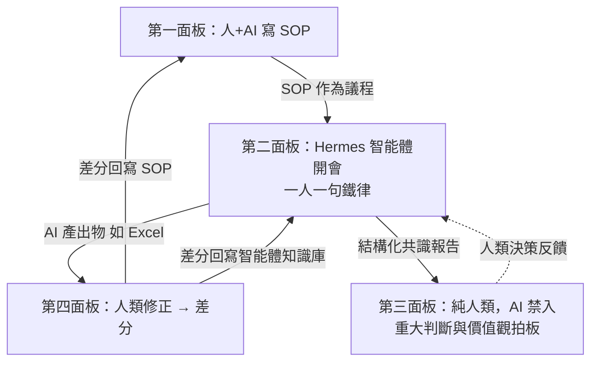

# 湛箴平台 · 產品與架構規格書（Specification）
[[我的代辦_簡述]]
## 文檔信息

| 項目 | 內容 |
|---|---|
| 產品名稱 | 湛箴（Zhanzhen / Zhanzhen Expert OS） |
| 文檔版本 | v3.0（規格化重寫，面向第三方可讀性） |
| 建立日期 | 2026-09-05 |
| 狀態 | 活文件（Living Document），隨進度更新 |
| 讀者 | 任何未參與前期討論的開發者、設計師、產品經理 |
| 維護者 | YanMing Cao（Ya-MiC） |
| 唯一性 | 本文件是湛箴所有決策的**單一真相源（SSOT）**；與之衝突的文檔一律以本文件為準 |
| 靈魂口號 | **Listen Important, More Than Speak.**（多聽關鍵實質，少作無效發散） |

---

## 0. 術語表（Glossary）

讀者必須先讀懂以下術語，才能理解後續章節。

| 術語 | 定義 |
|---|---|
| **湛箴** | 一個本地優先的跨領域專家智能體協作平台操作系統。不是單一工具，不是即時通訊軟件。 |
| **面板（Panel）** | 湛箴的四個核心工作區，每個有明確的參與者與職責邊界。四面板是湛箴的核心，缺一不可。 |
| **Hermes** | 用戶本地安裝的「專家智能體」。它在第二面板代表用戶參加 AI 會議。技術上是一個本地 LLM agent runtime（如 Ollama 跑 Qwen/DeepSeek/GLM）。 |
| **SOP** | Standard Operating Procedure，標準作業流程。第一面板的產出物，是第二面板會議的議程來源。 |
| **入口應用 / 產出物** | 從四面板核心架構派生的、可下載使用的具體軟件（如湛箴 OCR）。Tauri 封裝是產出手段，不是核心。 |
| **本地優先（Local-First）** | 下載即用、數據不出本機、零雲端依賴。可選雲端同步需用戶授權。 |
| **一人一句鐵律** | 第二面板的硬性規則：每個智能體對當前議題只能發一條訊息，等所有參會者發完才能發下一條。 |
| **差分反哺** | 第四面板記錄人工修正的差分（diff），自動回寫到第一面板的 SOP 與第二面板的智能體知識庫，使平台越用越聰明。 |
| **跨領域碰撞** | 不同專業的人類直接對話產生新見解。如服裝設計師與農民、會計師與政府人員。這是第三面板的核心價值。 |
| **ya-mic-os** | 一個獨立的 GitHub 倉庫資產治理面板，用於管理 Ya-MiC 的倉庫。不是湛箴核心，與四面板分開。 |

---

## 1. 產品概述

### 1.1 一句話定義

湛箴是一個**本地優先的跨領域專家智能體協作平台操作系統**，核心由四個面板組成，通過人機分離、SOP 驅動、一人一句、差分反哺四個機制，解決現有協作工具「人機混雜、無結構、長篇洗版、無法反哺」的根本問題。

### 1.2 要解決的問題

現有協作工具（Discord / 飛書 / Slack / Teams）有四個無法解決的缺陷：

1. **人機混雜**：AI 機器人變成另一個發言者，訊息更吵
2. **沒有結構**：100 人聊完，結論散落萬條訊息
3. **長篇洗版**：想講就講，最後沒人看完
4. **無法反哺**：說完即消失，下次 AI 還是犯同樣的錯

### 1.3 目標用戶

任何需要跨領域專家協作的場景：會計師、律師、醫療顧問、工程師、教師、設計師、農民、政府人員、調查員、鑑價師、稅務師、資安顧問等。

典型場景：醫院年報審計（會計師+律師+醫療顧問+稅務+資安）、工程履約爭議（律師+工程師+會計師）、考古研究（歷史學家+考古+地質+化學）、教學設計、政策制定。

### 1.4 與現有工具的差異

| 維度 | Discord / 飛書 / Slack | 湛箴 |
|---|---|---|
| 本質 | 即時通訊 + 外掛文檔 | 四面板協作操作系統 |
| 人機關係 | 人和 AI 混在同一頻道 | **人機分離**（見第 2 章） |
| 結構 | 聊完結論散落 | **SOP 驅動**（一面板產出議程） |
| 發言規則 | 想講就講 | **一人一句鐵律** |
| 跨領域 | 全混在一起 | **領域分離 + 議題驅動** |
| 反哺 | 說完即消失 | **差分反哺**，平台越用越聰明 |

---

## 2. 核心架構：四大面板

> **四面板是湛箴的全部核心。不可落下、不可降級、不可因「先做某功能」而省略。** 每個面板有明確的參與者、輸入、輸出、硬性約束。

### 2.1 第一面板：人 + AI 商量 → SOP / 工作流程圖 / 文字初稿

| 項目 | 內容 |
|---|---|
| **參與者** | 人類（用戶） + AI（輔助） |
| **職責** | 人類與 AI 一起把現有數據、表格、素材寫成工作流程圖（Mermaid）和文字初稿 |
| **輸入** | 用戶的領域知識、現有數據、表格、原始素材 |
| **輸出** | 可重用的 SOP、工作流程圖（Mermaid）、條例筆記、文字初稿 |
| **用途** | 沉澱用戶的專業知識為可被 AI 執行的 SOP；SOP 是第二面板會議的議程來源 |
| **硬性約束** | 產出的 SOP 必須明確標註「領域身份邊界」（如：這是會計師的審計實務 SOP，不是學術研究 SOP） |

**範例**：註冊會計師寫「醫院審計 SOP」流程圖（接受委託→風險評估→醫療業特殊性→內控測試→實質性程序→專家工作→彙總意見）。

### 2.2 第二面板：AI × AI 自治會議（Hermes 智能體）

| 項目 | 內容 |
|---|---|
| **參與者** | 每個用戶的 Hermes 智能體（**人類不直接參與，只由智能體代表**） |
| **Hermes 定義** | 用戶本地安裝的專家智能體。技術上是一個本地 LLM agent runtime（推薦 Ollama 跑 Qwen 2.5 / DeepSeek / GLM），用戶自選模型。 |
| **職責** | 跨地域、跨專長的智能體代表主人參會，就議題進行交叉驗證與推演 |
| **輸入** | 第一面板產出的 SOP（作為議程）+ 觸發議題 |
| **輸出** | 結構化共識報告（支持論據 / 分歧點 / 未解疑問）+ AI 產出物（如 Excel 表格，交第四面板） |
| **硬性約束** | ①「一人一句」鐵律 ② 禁絕套話（「+1」「同意樓上」「感謝分享」）③ 禁止連續發言（需等其他人都發完）④ 禁止跨領域越界（會計師智能體不發法律意見） |

**運行機制**：
1. 議題觸發 → 自動從用戶群中召喚對應領域的 Hermes 智能體
2. 每個智能體對當前議題只能發一條訊息
3. 等所有參會者都發完才能發下一條
4. 會議結束自動生成結構化共識報告

### 2.3 第三面板：純人類交流空間（禁止 AI）

| 項目 | 內容 |
|---|---|
| **參與者** | 只有人類。**任何 AI 一律禁止。** |
| **職責** | 人類與人類之間的跨領域碰撞、重大判斷、靈感碰撞、價值觀拍板 |
| **輸入** | 第二面板的共識報告（供人類決策參考）+ 人類的判斷與價值觀 |
| **輸出** | 最終決策、人類共識、重大判斷結論 |
| **硬性約束** | ① 完全禁止 AI 注入——任何頻道禁止智能體發言、禁止自動補全、禁止機器人轉發 ② 所有訊息需本地私鑰簽章才能發出（證明是人類） ③ 好友與專家認證體系 |

**核心價值**：跨領域碰撞是湛箴的靈魂。一個服裝設計師未必不能和一個農民碰撞出新東西，一個會計師未必不能和政府人員碰撞。這種人類直接對話的空間，AI 必須閉嘴。

### 2.4 第四面板：人工修正 → 反哺

| 項目 | 內容 |
|---|---|
| **參與者** | 人類（修正 AI 的產出） |
| **職責** | AI 沒做好 → 人類改 → 回 AI。記錄修正差分，回寫知識庫。 |
| **輸入** | 第二面板 AI 產出物（如 Excel 表格、文檔） |
| **輸出** | 修正後的成果物 + 修正差分（diff） |
| **硬性約束** | ① 修正差分必須自動記錄為金標準範本 ② 差分必須自動回寫到第一面板的 SOP 與第二面板的智能體知識庫 ③ 修正後的成果物回到第二面板（清爽、人類與 AI 都能看懂） |

**為什麼關鍵**：這是平台越用越聰明的機制。每一個人工修正都讓整個平台更聰明，下次同類問題 AI 不會再犯同樣的錯。

---

## 3. 四面板閉環數據流



**數據流向說明**：
1. 第一面板產出 SOP → 作為第二面板會議的議程
2. 第二面板 Hermes 智能體沿議程開會（一人一句）→ 產出 AI 成果物 + 共識報告
3. AI 成果物進入第四面板，人類修正 → 產生差分
4. 差分回寫到第一面板的 SOP 與第二面板的智能體知識庫（形成閉環，平台越用越聰明）
5. 第三面板是純人類空間，人類基於共識報告做重大判斷，決策反饋到第二面板

---

## 4. 產出物（入口應用）

> 產出物是從四面板核心架構派生的、可下載使用的具體軟件。Tauri 封裝是產出手段，不是核心。每個產出物獨立可插拔、獨立升級。

### 4.1 湛箴 OCR（第一個產出物，現在實作）

| 項目 | 內容 |
|---|---|
| 角色 | 第一個入口應用。Tauri 封裝的本地 OCR 桌面軟件 |
| 核心功能 | 上傳 PNG/JPG/PDF → 本地 OCR 試識別（前十頁）→ 確認 → 全文 → 校正 → 導出 |
| OCR 引擎 | PaddleOCR v1.6（本地推斷，零雲端） |
| 桌面殼 | Tauri 2.x |
| 前端 | React + Tailwind（注意：非 Vue，12 份舊手冊已過時） |
| 數據 | SQLite 本地存儲 |
| 現狀 | `feature/ocr-pilot` 分支已有 Tauri 殼 + React UI + OCR 引擎，骨架搭了 60-70% |
| 與核心關係 | OCR 識別結果可一鍵灌入未來的 Docs/Excel 平台（入口 C），並作為第四面板人工修正的輸入 |

### 4.2 湛箴 賬套（規劃中）

類鼎信諾的審計作業底稿與賬套管理工具。多企業/多年度賬套獨立建檔、科目餘額表導入、序時賬分析、憑證抽憑核對、審計底稿自動生成、風險指標預警。與 OCR 整合（憑證自動入賬）。

### 4.3 湛箴 Docs/Excel/PPT 新平台（規劃中）

| 項目 | 內容 |
|---|---|
| 訴求 | **不用** Univer、不用微軟 Office、不用飛書/釘釘。要你自己設計的全新平台：docs + excel + ppt 一體 |
| 公式兼容 | 必須兼容大家用了很久的 Excel 公式。用開源引擎 **HyperFormula**（MIT，400+ 函數，純前端可跑，可徹底重編） |
| 文檔核心 | Tiptap（MIT，基於 ProseMirror）或 Lexical（MIT，Meta 出品），可完全二開 |
| 試算表 UI | Luckysheet（MIT）或 Handsontable 社區版做單元格 UI，公式交 HyperFormula |
| 與核心關係 | 這個新平台就是四面板的承載體。第一面板寫 SOP 流程圖、第二面板 AI 開會產出表格、第四面板人類修正 Excel 公式，都在這個平台上發生 |
| 與 Discord/飛書差異 | 文檔/試算表/簡報為核心（非即時通訊外掛文檔）、人機分離、SOP 驅動、一人一句、可反哺 |

---

## 5. 模塊化架構

```
湛箴平台
│
├── 核心：四大面板（不可落下）
│   ├── [面板 1] 人+AI → SOP/工作流程圖/文字初稿
│   ├── [面板 2] AI×AI 會議（Hermes 智能體，一人一句）
│   ├── [面板 3] 純人類跨領域碰撞（禁止 AI）
│   └── [面板 4] 人工修正 → 差分反哺
│
├── 產出物：入口應用（從核心派生的具體軟件，可插拔）
│   ├── [入口 A] 湛箴 OCR（Tauri 封裝，現在產出）  ← 第一個產出物
│   ├── [入口 B] 湛箴 賬套（類鼎信諾）
│   └── [入口 C] 湛箴 Docs/Excel/PPT 新平台（自設計 UI + HyperFormula）
│
└── 共用層
    ├── Tauri 殼（跨平台 Windows/macOS/Linux、自動更新）
    ├── 設計系統（雙色彩系統，見第 6 章）
    └── GitHub Releases 自動更新
```

**設計原則**：
- 核心（四面板）定義好就不動，為所有產出物預留接口
- 每個產出物獨立可插拔、獨立升級（對應 `LOCAL_FIRST_DESIGN.md` 第 9 條「卡片化模塊」）
- 產出物從核心派生，核心架構不因「先做某產出物」而省略

---

## 6. 設計系統（雙色彩系統）

### 6.1 兩套色彩系統

**系統 A · 淺色系（主用）**

| 色 | 色碼 | 特性 |
|---|---|---|
| 藕粉 | `#E2A2AC` | 暖、柔和、點睛 |
| 深灰紫 | `#594C57` | 沉、穩、骨架 |
| 淺薄荷 | `#E0F0E9` | 清、透、底色 |

這三色是一個協調的品牌色系，一起用、形成由深到淺的柔和過渡，**不作機械的「強調/文字/背景」角色拆分**。界面中三色交織出現，保持柔和、低飽和、暖灰粉基調。整體氛圍是**柔和審美**，不是審計嚴謹黑灰。

**系統 B · 深色系（可選）**

用戶最早的銅色深色（深黑底 + 古銅金）。用戶明確不要深黑和古銅金，所以這套**僅作可選深色主題保留，不作主用**。如未來做深色主題，從系統 A 三色推導深色版本（深灰紫加深化作底、淺薄荷化作文字、藕粉作點睛），不回頭用銅色深黑。

### 6.2 雙主題

- 淺色主題（主用）= 系統 A 三色
- 深色主題（可選）= 由系統 A 三色推導的深色版本
- 用戶可手動切換、可系統跟隨（`prefers-color-scheme`）

### 6.3 字型

| 用途 | 字型 |
|---|---|
| 繁中/簡中 | Noto Sans TC（首選）、Microsoft JhengHei（Windows）、PingFang TC（macOS） |
| 英文/數字 | Inter |
| 等寬（OCR 原文本/代碼） | JetBrains Mono |
| 字級 | 標題 18-22px、正文 14px、註解 12px、行高 1.6 |

### 6.4 圖標

`audit-os-mobile/dist/icon-512.png`（象牙白+金+磚紅+炭黑）**僅作參考**，可從頭重做。新圖標應呼應系統 A 三色。

完整 CSS 變數定義見同目錄 `theme.css`。

---

## 7. 技術棧

| 層 | 技術 | 選型理由 |
|---|---|---|
| 桌面殼 | Tauri 2.x | 體積小、性能高、跨平台 |
| 前端 | React + Tailwind + Vite + TypeScript | 現有 `feature/ocr-pilot` 已用 React（非 Vue） |
| 後端 sidecar | Python + FastAPI | AI 生態完整 |
| 數據庫 | SQLite | 本地優先、零依賴 |
| 打包 | PyInstaller → Tauri sidecar | 用戶不需裝 Python |
| OCR | PaddleOCR v1.6（首選）+ 多引擎 | 本地推斷、零雲端 |
| 文檔/試算表 | 自研 UI + HyperFormula + Tiptap/Lexical | 可徹底重編、不依賴大公司 |
| 本地 LLM（Hermes） | Ollama + Qwen 2.5 / DeepSeek / GLM | 免費、本地、隱私 |

---

## 8. 數據模型（核心實體）

> 以下為湛箴平台核心實體的邏輯定義，供後續數據庫 schema 設計參考。

| 實體 | 說明 | 關鍵字段 |
|---|---|---|
| **User（用戶）** | 平台用戶，一個用戶對應一個 Hermes 智能體 | id, name, domain（領域身份）, created_at |
| **Hermes（智能體）** | 用戶本地安裝的專家智能體 | user_id, model（本地 LLM 型號）, knowledge_base（知識庫引用） |
| **SOP** | 第一面板產出的標準作業流程 | id, author_id, domain, mermaid（流程圖）, text（文字初稿）, version |
| **Meeting（會議）** | 第二面板的一次 AI 會議 | id, sop_id（議程來源）, topic（議題）, status, created_at |
| **Topic（議題）** | 會議中的具體議題 | meeting_id, content, triggered_domains（召喚的領域） |
| **Speech（發言）** | 一個智能體對一個議題的一條訊息 | topic_id, hermes_id, content, turn（第幾輪） |
| **ConsensusReport（共識報告）** | 會議結構化結論 | meeting_id, supports（支持論據）, disputes（分歧點）, open_questions（未解疑問） |
| **Correction（修正差分）** | 第四面板的人工修正記錄 | source_artifact_id, diff, gold_standard（金標準）, fed_back_to（回寫目標） |
| **Artifact（成果物）** | AI 產出或人類修正的文檔/表格 | id, type（excel/doc/...）, content, version, source_panel |

---

## 9. API 契約概覽（核心接口）

> 以下為四面板對外的關鍵接口定義，供前後端對接。

| 面板 | 接口 | 方法 | 說明 |
|---|---|---|---|
| 面板 1 | `/api/sop` | POST/GET | 創建/列出 SOP |
| 面板 1 | `/api/sop/{id}/mermaid` | PUT | 更新流程圖 |
| 面板 2 | `/api/meetings` | POST | 發起會議（指定 SOP 作議程） |
| 面板 2 | `/api/meetings/{id}/topics/{tid}/speeches` | POST | 智能體發言（服務端強制一人一句） |
| 面板 2 | `/api/meetings/{id}/consensus` | GET | 取結構化共識報告 |
| 面板 3 | `/api/human-channels/{id}/messages` | POST | 人類發訊息（需私鑰簽章，禁 AI） |
| 面板 4 | `/api/artifacts/{id}/corrections` | POST | 提交人工修正差分 |
| 面板 4 | `/api/corrections/{id}/feedback` | POST | 觸發差分回寫（回寫 SOP 與智能體知識庫） |
| 產出物 A | `/api/ocr/jobs` | POST | 啟動 OCR 識別任務 |
| 產出物 A | `/api/ocr/jobs/{id}` | GET | 查詢識別結果 |
| 產出物 A | `/api/exports` | POST | 導出 TXT/JSON/XLSX |

---

## 10. 倉庫與代碼位置

| 項目 | 位置 |
|---|---|
| 湛箴 OCR 產出物代碼 | `github.com/Ya-MiC/zhanzhen-server` 的 `feature/ocr-pilot` 分支 |
| 雲端 SaaS 母體 | `github.com/Ya-MiC/zhanzhen-server` 的 `main` 分支（FastAPI + PG + MinIO + Redis + Docker） |
| 倉庫資產治理面板 | `github.com/Ya-MiC/ya-mic-os`（獨立工具，非湛箴核心） |
| 舊手冊（已過時，Vue 版） | `uploaded_attachments/9b8d506b3b35406fb528170a6ce7e5be/` |
| 圖標（僅參考） | `github.com/Ya-MiC/audit-os-mobile/blob/main/dist/icon-512.png` |
| 工程依據 | `zhanzhen-server` 的 `docs/LOCAL_FIRST_DESIGN.md`、`docs/OCR_PILOT_GOVERNANCE.md` |
| 本規格書 | 項目文件庫 `projects/.../files/湛箴與ya-mic-os-主心骨.md` |
| 雙主題 CSS | 同目錄 `theme.css` |

### 10.1 湛箴 OCR 產出物現有代碼清單（`feature/ocr-pilot`）

| 模塊 | 路徑 | 說明 |
|---|---|---|
| Tauri 殼配置 | `frontend/src-tauri/tauri.conf.json` | 產品名「湛箴 OCR」、打包 msi/dmg/appimage |
| Rust 入口 | `frontend/src-tauri/src/main.rs` | Tauri 主進程 |
| React UI 入口 | `frontend/src/App.tsx` | 側欄 5 頁：工作台/上傳/排行/校正/設定 |
| 上傳組件 | `frontend/src/components/Upload.tsx` | 文件上傳 |
| 排行榜組件 | `frontend/src/components/Leaderboard.tsx` | HF 模型排行榜 |
| OCR 引擎 | `worker/ocr_engine.py` | PaddleOCR 封裝 |
| PDF 工具 | `worker/pdf_utils.py` | PDF 處理 |
| OCR 工作流 | `domain/ocr_workflow.py` | 試識別→確認→全文 |
| 本地數據層 | `core/ocr_database.py` | SQLite |
| 引導程序 | `core/onboarding.py` | 首次啟動配置 |
| 排行榜 API | `api/routes/leaderboard.py` | HF 排行榜後端 |

---

## 11. 倉庫盤點（75 個，只盤點不動手）

> ⚠️ 只列分類與建議，不執行任何 archive / delete / 改可見性。任何動作等用戶明確確認。

### A. 核心項目（保留，重點維護）
`zhanzhen-server`（湛箴母體+OCR 來源）、`ya-mic-os`（倉庫總控台）、`zhanzhen`（v1 框架）、`audit-os`/`audit-os-mobile`（審計 OS）、`action-tree`（戰略總綱）、`zhanzhen-handover`（業務移交）、`zhanzhen--audit-agent-blueprint`（審計×AI 藍圖）、`invoice-ocr-system`/`Invoice-Downloader`（發票 OCR）、`dsh`/`deepseek-harness`（AI 工具鏈）、`hermes`（GitHub 索引）、`ya-mic-growth-log`、`Ya-MiC`/`Yamic`（主頁）

### B. Fork 別人的（標示 Fork，不當核心）
代理訂閱面板：`CFBox` `CF-Workers-SUB` `BPB-Worker-Panel` `sublink-worker` `serv00-play` `dingyuebaohu` `proxy-github` `basedblocks-keepalive` `Ya-MIC-bbr` `winutil`
量化交易：`nautilus_trader` `ai_quant_trade_needchange` `FinceptTerminal` `awesome-systematic-trading` `trading-second-brain_needchange`
其他：`DeepTutor` `osiris` `the-book-of-secret-knowledge` `tv` `docformat-gui` `MarkWrite` `open-design` `awesome-dsh-plugin` `argo` `archify` `last30days-skill` `nie-grassroots-logic` `vibe-coding-cn` `openclaw-kugua-state` `openclawctljingxiang`

### C. 測試/垃圾（建議歸檔或刪除，等確認）
`q` `123` `-` `fofa-` `warp-` `yamic188` `Excel-Randomization-Process` `my-report-site` `for-love` `economics-11.29` `Secure-Edge-Access-...` `-GL.iNet-OpenWrt-DNS-` `Microsoft`（法律風險）

### D. 敏感/隱私（保持私有）
`hermes-private` `Global-Identity-Planning` `yanming` `yanming-cao` `IP-KR` `openclaw-longxia` `yamic188` `Microsoft`

---

## 12. 驗收標準（湛箴 OCR v0.1，第一個產出物）

| # | 驗收項 | 通過條件 |
|---|---|---|
| 1 | 安裝 | Windows MSI 雙擊安裝無錯誤，桌面出現圖示 |
| 2 | 啟動 | 雙擊 3 秒內看到首頁 Dashboard |
| 3 | 零依賴 | 不需要裝 Python、不需要裝 Docker |
| 4 | 上傳 | 可上傳 PNG / JPG / PDF |
| 5 | 試識別 | PDF 前十頁試識別完成 |
| 6 | 全文 | 確認後背景跑全文 OCR |
| 7 | 校正 | 識別結果可預覽、可校正 |
| 8 | 導出 | 可匯出 TXT / JSON / XLSX |
| 9 | 離線 | 模型首次下載後斷網仍能用 |
| 10 | 更新顯示 | 首頁顯示版本號、GitHub 倉庫連結、最新 Release |

---

## 13. 路線圖

| 階段 | 內容 | 狀態 |
|---|---|---|
| v0.1 | 湛箴 OCR 桌面版（第一個產出物，Tauri 封裝） | 現在實作 |
| v0.2 | 湛箴 Docs/Excel/PPT 新平台 MVP（HyperFormula + 自研 UI） | 規劃中 |
| v0.3 | 湛箴 賬套（類鼎信諾） | 規劃中 |
| v0.4+ | 四面板逐步接入新平台（一面板寫 SOP → 二面板 Hermes 開會 → 四面板修正 → 差分反哺） | 規劃中 |

> 路線圖說明：v0.1 先產出能用的 OCR 軟件，但核心架構（四面板）已在本規格書中完整定義並預留接口。後續版本逐步把四面板接入，核心架構不變。

---

## 14. 文件位置索引

| 文件 | 位置 |
|---|---|
| 本規格書（主心骨） | `projects/zheng-li-wo-de-github-1Up7IDZWRLG0mr801eYIUA/files/湛箴與ya-mic-os-主心骨.md` |
| 雙主題 CSS | `projects/.../files/theme.css` |
| 舊手冊（過時） | `uploaded_attachments/9b8d506b3b35406fb528170a6ce7e5be/` |
| OCR 產出物代碼 | `github.com/Ya-MiC/zhanzhen-server` 分支 `feature/ocr-pilot` |
| 圖標 | `github.com/Ya-MiC/audit-os-mobile/blob/main/dist/icon-512.png` |

---

## 15. 下一步行動清單

1. **核心架構定稿**：四面板接口已寫入本規格書（第 2、9 章）
2. **產出第一個入口應用**：克隆 `feature/ocr-pilot` 到沙箱
3. **接 OCR sidecar**：`worker/ocr_engine.py` 用 PyInstaller 打成 exe，接 Tauri sidecar
4. **套色彩系統 A**：把 `App.tsx` 的深黑 `slate-950` 換成系統 A 三色（藕粉/深灰紫/淺薄荷交織，柔和淺底）
5. **跑通核心閉環**：上傳 → 試識別 → 確認 → 全文 → 校正 → 導出
6. **打包**：`npm run tauri build` 出 Windows MSI（需 Windows 環境或 GitHub Actions CI）
7. **驗收**：對照第 12 章驗收清單逐項打勾

**現在就開始第 2 步。**
