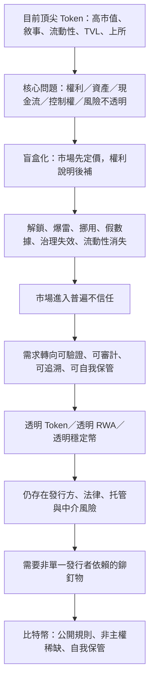
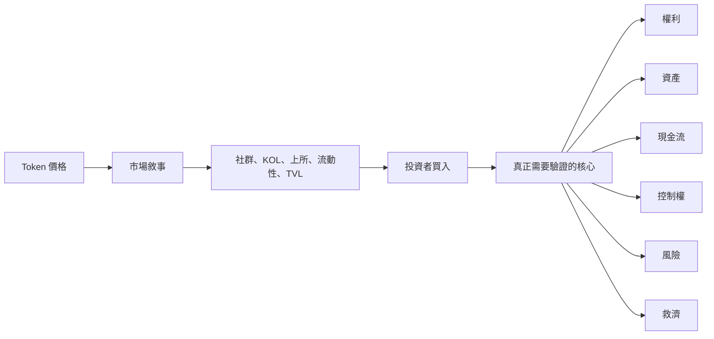
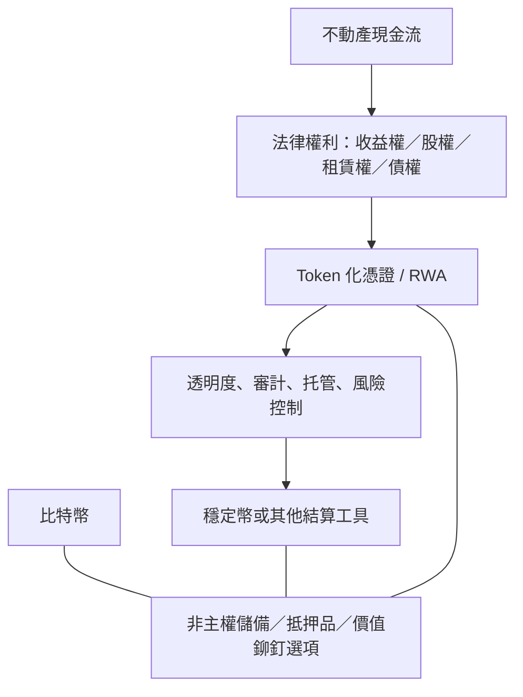
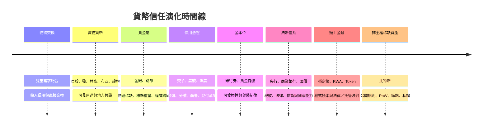
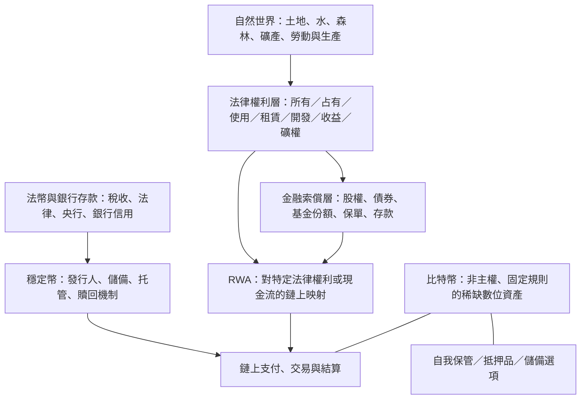

[[湛箴與ya-mic-os-注意力資產與四面板-總整合日記 (1)]]
# 比特幣、Token、貨幣史與信任結構——總整合研究母筆記

> [!abstract] 這篇筆記的核心
> 我今天真正認識到的不是「下一個會漲的 Token」，而是一個關於未來鏈上金融的結構性判斷：**目前頂尖 Token 幾乎全是盲盒；未來市場一定會走向透明；透明化的終點不是大家重新相信某個創辦人、基金會、交易所或平台，而是大家逐漸不信任任何單一承諾，轉而只接受可驗證、可審計、可追溯、可自我保管的規則。**
>
> 在這樣的 Token 世界裡，最好的「鉚釘物」不是另一個 Token，不是某個 RWA 平台，不是某家穩定幣發行商，也不是某個更會講故事的創辦人；我認為最可能成為鉚釘物的是 **比特幣**。它不是吞掉一切資產的容器，而是在多 Token、多鏈、多 RWA、多穩定幣、多中心化中介並存時，提供一個相對不依賴單一發行者、供給規則可公開驗證、可以自我保管的非主權稀缺錨點。

> [!warning] 範圍聲明
> 這是思想日記、研究母筆記與項目方向備忘錄，不是投資建議、價格預測或任何募集資金方案。文中「一定走向透明」是一個長期制度演化判斷，不是對某一日期、某一資產價格或任何個別項目結果的保證。

---

## 今天的核心認識

我以前會從技術、幣價、敘事、RWA、穩定幣、鏈上資料等角度理解加密世界；但今天我把問題往下挖了一層。

我發現真正的問題不是：

```text
哪一條鏈更快？
哪個 Token 敘事更熱門？
哪個項目 TVL 更高？
哪個幣可能漲？
```

真正的問題是：

```text
一個 Token 到底代表什麼？
它的價值依賴誰的承諾？
誰可以改規則？
誰可以增發、解鎖、暫停、升級或改變分配？
底層資產、儲備、收益、負債與風險是否能被外部人驗證？
如果發行方、交易所、基金會、做市商、托管人或核心團隊消失，持有人還剩下什麼？
```

我的答案是：**目前很多頂尖 Token 在這些問題上都無法給出充分、可驗證、可執行的回答。**

因此，它們即使市值很大、上了大交易所、有大量社群、有漂亮的白皮書、有複雜的代幣經濟學，也仍然可能是盲盒。盲盒不是指它們一定毫無用處，而是指普通持有人無法低成本確認：自己究竟買到了什麼權利、承擔了什麼風險、依賴了誰、最壞時會失去什麼。

---

## 一句話理論

> **貨幣史的主線不是物品替換史，而是信任技術演化史；Token 的未來不是敘事無限膨脹，而是在普遍不信任中走向可驗證透明；比特幣不是裝下所有價值的容器，而是未來 Token 世界最可能的非主權價值鉚釘。**

我不認為比特幣要取代黃金、股票、國債、房地產、土地、RWA 或穩定幣。不同資產有不同功能：房地產提供居住、使用與租金；股票代表企業的治理和剩餘索取；債券代表合約現金流；國債代表國家信用與稅收能力；RWA 是某類現實權利的數位化映射；穩定幣通常是對發行者、儲備和贖回安排的索償。

比特幣提供的不是企業收益權、土地租金、國債利息或法幣贖回承諾。它提供的是另一種東西：**一種由公開規則、分散式網路與私鑰所有權維持的非主權稀缺資產。**

---

## 思想主軸圖



這張圖不是說所有 Token 都會消失，也不是說透明化後就沒有風險。它要表達的是：透明化會讓市場更容易看見不同資產的真實信任來源，而不是把所有資產都假裝成同一種「去中心化資產」。

---

# 日記正文

## 2026-09-06：我開始把 Token 看成盲盒

今天我重新整理了自己對 Token、RWA、穩定幣與比特幣的想法。

我發現，不能只從「區塊鏈技術」或「幣價」理解比特幣。比特幣的價值問題，其實要放回一條更長的歷史裡：人類如何從物物交換，走到貝殼、金銀、紙幣、票號、中央銀行、信用貨幣、去金本位，再走向數位貨幣、穩定幣、RWA 與 Token。

比特幣不是憑空出現的一個投機符號。它是人類貨幣史中一個很特殊的回答：

> 當貨幣越來越依賴發行者信用、銀行信用、國家信用與制度信用時，是否存在一種可以由公開規則驗證、而不必依賴單一發行者承諾的價值載體？

我對比特幣的理解，不是「它會取代所有資產」，也不是「它會取代黃金」。

我認為它是貨幣演化走到高度數位化、全球化、可編程化之後，一個重新把「稀缺性、驗證性、不可隨意增發、非主權性」帶回貨幣系統的嘗試。

但我今天更明確的想法是：**現在頂尖 Token 的本質仍然是盲盒。**

它們看起來很大、很複雜、很先進，市場也會給它們很高估值；但在真正重要的地方，它們常常不透明：權利不透明、控制權不透明、解鎖不透明、做市關係不透明、資產與負債不透明、收入分配不透明、最壞情況下的救濟不透明。

我不想再把「上了交易所」「有 TVL」「有社群」「有白皮書」「有代碼」「有大 V 支持」當作可信的代名詞。這些最多是訊號，不是證據。

---

## 貨幣不是錢的外形

貨幣的本質不是紙張、金屬、數字或程式碼。

貨幣是一種讓陌生人可以跨時間、跨地點、跨群體交換價值的社會技術。不同時代的貨幣制度，其實都在回答同一組問題：

```text
1. 誰相信它？
2. 為什麼相信它？
3. 它能否被偽造？
4. 它是否稀缺？
5. 誰能增加它？
6. 出現爭議時，誰說了算？
7. 它能否在陌生人之間流通？
8. 它能否跨越時間保存購買力？
9. 承諾破裂時，誰承擔損失？
10. 持有人到底有什麼可執行權利？
```

不同時代，只是用不同材料、制度、法律和敘事來回答這些問題。

我理解貨幣至少有四種功能：

```text
價值尺度：讓不同商品可以標價、核算與比較。
交換媒介：降低搜尋、比價、交割與協調成本。
延期支付標準：讓今天的債務可以約定未來如何清償。
價值儲藏：讓勞動與資產能跨時間保存部分購買力。
```

沒有任何一種貨幣或資產在每一個維度都完美。高通膨法幣可能方便支付卻不適合長期儲值；黃金適合長期持有卻不方便小額網路支付；比特幣可跨境持有和轉移，但短期高波動限制了它作為穩定計價單位的能力；穩定幣方便鏈上結算，但持有人仍依賴發行方、儲備、銀行和法律結構。

---

## 從貝殼到黃金

早期社會不是先有一套完美貨幣理論，才挑選貨幣；而是在交易和交換中，逐漸選出一些更容易被共同接受的東西。

貝殼、鹽、布匹、牲畜、穀物、金銀，都曾經在不同社會被用作交換媒介或價值尺度。它們之所以能成為貨幣的一部分，不是因為有神秘力量，而是因為它們在當時符合某些條件：

```text
容易辨識
相對稀缺
不容易立刻大量生產
可以攜帶
可以計量或分割
在社群中被共同接受
具有用途、象徵性或取得成本
```

黃金與白銀後來在大型陌生人市場中更具優勢，原因不是它們有某種神祕的絕對內在價值，而是它們把材料稀缺、耐久、可分割、可熔化、相對容易驗證、單位價值高與跨文化共識結合得比較好。

黃金的貨幣性價值不只來自首飾和工業用途，更來自人類社會長期把它視為價值保存與最終清償資產的共同協議。

這給我的啟發是：

> 一種貨幣或儲值資產的價值，不只來自物質用途，也來自它是否能成為跨時間、跨群體、跨制度的共同信任協議。

---

## 從金屬到憑證

金屬貨幣有明顯限制：重、運輸成本高、跨地域結算慢、容易被削邊、需要驗成色。於是人類開始使用保管憑證、匯票與紙幣。

這是一個根本轉折：

```text
以前：人們主要相信貨幣本身的材料。
後來：人們開始相信一張憑證背後的兌付承諾。
```

紙幣最初常常不是獨立價值，而是一個可轉讓的承諾：

```text
我把金銀存進某個可信機構
        ↓
機構給我一張憑證
        ↓
其他人相信憑證可兌回金銀
        ↓
憑證開始流通
```

從這裡開始，貨幣的核心逐漸從「持有某種稀缺材料」轉向「相信某個機構、某本帳、某套法律與某個清償網路的承諾」。

紙張本身沒有價值，但它代表一個可以被要求履行的權利。問題也隨之出現：如果機構沒有儲備、帳簿造假、兌付停止、法律失效或發行方破產，憑證的價值會發生什麼？

這些古老問題今天仍然存在，只是換成了銀行存款、穩定幣、RWA 和 Token。

---

## 交子與票號

中國的交子與票號，是理解「貨幣不只是金屬」的重要歷史。

交子最初與商業交易、存款憑證和區域流通需求有關，之後逐步演變為官方管理的紙幣制度。它說明了以下路徑：

```text
交易規模擴大
→ 金屬錢幣攜帶困難
→ 商人與市場需要更高效率的憑證
→ 憑證因為可兌付、可流通而成為貨幣
→ 國家介入發行與管理
```

票號展示了另一種更成熟的信用網路。它不是單純印鈔，而是依靠總號與分號網路、匯兌、帳簿、密押、商譽、資本實力、長期客戶關係與違約成本，讓價值可以跨城市轉移。

一張匯票被接受，不是因為紙本身有價值，而是因為它背後有：

```text
商號信用
分支機構網路
帳目紀錄
兌付能力
商業聲譽
違約成本
地方社會關係
```

這和今天的銀行、支付網路、穩定幣發行方、RWA 托管結構具有結構上的相似性。今天一枚穩定幣之所以被接受，也不是因為鏈上的字串有價值，而是因為持有人相信：

```text
發行方真的有足額且合格的儲備
儲備資產可以被兌付
法律上存在贖回權或合理救濟
托管方與銀行可靠
審計、鑑證或儲備證明沒有造假
監管、制裁或銀行風險不會突然切斷機制
```

交子、票號、銀行、穩定幣與 RWA 都可以被理解為不同技術時代的信用憑證系統。效率提高了，但信任也更加集中在一些關鍵中介、帳簿、法律安排與兌付條件上。

---

## 金本位與法幣

當紙幣和銀行信用擴張後，社會自然會問：

> 發行方到底可以發多少？如果所有人同時要求兌付，是否真的能兌？貨幣的價值靠什麼限制？

金本位提供過一種答案：讓貨幣與黃金保持某種固定或制度化的兌換關係，用供給增長較慢、不可隨意印出的稀缺資產，對信用貨幣發行形成外部約束。

```text
紙幣可以發行
但不能完全無限制發行
因為背後有黃金兌付與儲備約束
```

金本位提供紀律，但也有代價：經濟成長、戰爭、銀行危機、國際支付與金融衰退可能需要更具彈性的貨幣供給；黃金儲備分布不均；固定兌換制度可能加大通縮與失業壓力；國家在危機中不願放棄貨幣政策自主性。

所以金本位不是被簡單地「證明錯誤」，而是現代國家在戰爭、危機、宏觀管理和金融發展中，選擇了更強的信用貨幣體系。

去金本位後，法幣的價值更多依賴：

```text
國家稅收能力
法律與法定清償地位
中央銀行政策
政府債務與財政信用
銀行體系與支付清算網路
一國生產能力、資源與貿易能力
制度穩定、軍事力量與地緣政治位置
市場對未來購買力與可兌換性的信心
```

這不表示法幣沒有價值。法幣有極強的稅收需求、法律地位、支付網路與社會網路效應。但它意味著：現代貨幣的稀缺性不再主要來自物理材料，而是來自制度自律、政治約束與市場對制度的信任。

---

## 比特幣的出現

比特幣不是黃金，也不應被一句「數位黃金」完全概括。它更像是把黃金貨幣性中的某些特徵，重新用公開程式規則、工作量證明與分散式網路表達出來：

```text
黃金：物理上難以在短期大量增產。
比特幣：規則上難以任意增發。

黃金：需要驗成色、重量與真偽。
比特幣：可由公開網路驗證交易和供給規則。

黃金：不依賴單一國家發行。
比特幣：不依賴單一國家、公司、銀行或基金會發行。

黃金：跨國持有，但搬運和驗證成本較高。
比特幣：可在數位網路中跨境轉移，但依賴網路、私鑰與市場基礎設施。
```

比特幣也有黃金沒有的問題：

```text
價格波動大
監管環境可能變化
自我保管有技術與操作門檻
使用者可能遺失私鑰或遭受詐騙
交易費用和確認時間受網路狀態影響
市場仍可能受到交易所、托管、槓桿與流動性事件影響
```

但它提供了一個不同於法幣、銀行負債、公司股權、平台 Token 或 RWA 發行承諾的選項：

> 一種不是由國家承諾、不是由銀行負債、不是由公司股權、不是由平台發行人擔保，而是由公開可驗證規則與分散網路共同維持的稀缺數位資產。

這是我理解比特幣價值的根本原因。不是因為它必然替代所有資產，而是因為在高度信用化、平台化、Token 化的世界裡，它提供了另一種較少依賴他人承諾的信任來源。

---

# Token 盲盒論

## 現在頂尖 Token 為什麼仍是盲盒

我的立場不是「部分 Token 像盲盒」，而是更強的判斷：**目前被市場視為頂尖的 Token，從普通持有人的可驗證權利角度看，基本仍屬於盲盒。**

它們可能有代碼、用戶、交易量、流動性、社群、基金、敘事、合作夥伴、治理投票和很高市值；但只要以下問題無法被低成本、持續、獨立地驗證，Token 本質上仍是盲盒：

```text
它到底代表什麼法律或經濟權利？
它是否代表股權、收益權、債權、使用權、治理權，還是什麼都不代表？
協議有收入時，收入是否會依法、按規則、可強制地流向持幣者？
誰能升級智能合約、暫停協議、改變費率、控制金庫、控制前端和商標？
團隊、投資人、做市商、交易所、基金會和關聯地址各自實際控制多少籌碼？
解鎖、增發、質押、回購、銷毀與空投是否能被持續驗證？
所謂 TVL、交易量、用戶數、收益與活躍地址中，多少是真實需求，多少來自補貼、循環、刷量或關聯方活動？
若平台關閉、核心團隊離開、交易所下架、流動性撤走、發行主體破產或監管介入，持有人可以向誰主張什麼？
```

市場常把以下內容當作價值證明：

```text
TVL
交易量
活躍地址
社群人數
代碼提交
高年化收益
大所上架
VC 投資
KOL 宣傳
白皮書
```

但它們都不直接等於持有人的權利與安全：

```text
TVL 可能是同一筆抵押物在多層協議中重複計算。
交易量可能被激勵、刷量、自成交或做市行為放大。
活躍地址不等於獨立真實用戶。
高收益可能主要來自 Token 補貼而非可持續現金流。
代碼開源不等於金庫、前端、公司帳戶、商標和法律安排去中心化。
上交易所不等於底層權利清晰。
VC 投資不等於散戶持幣者享有同樣的保障。
```

因此，Token 的盲盒性不是「完全看不見資料」，而是**看得見一部分鏈上資料，卻無法由此確認完整經濟實質、權利順序、最終控制人、鏈下資產、負債與救濟機制。**

---

## 盲盒不是技術問題

Token 的核心問題通常不是代碼寫得不夠炫，而是「權利—資產—現金流—治理—風險—救濟」沒有形成普通人也能驗證的透明鏈條。



在很多情況下，價格和敘事先跑在前面，權利說明與風險披露卻沒有跟上。持有人買入時，買到的常常不是已經可以清楚估值的權利，而是「未來可能有其他人願意用更高價格接手」的期待。

我不認為所有敘事都沒有價值。敘事可以協調人們採用新技術、參與新網路、投入開發與形成流動性。但如果敘事沒有被權利、現金流、控制權和風險披露約束，它就會把市場變成盲盒市場。

---

## 從盲盒到透明

我認為未來 Token 市場**一定**會走向透明。不是因為所有人突然變得善良，也不是因為監管、交易所或基金會突然變得完美，而是因為盲盒市場的長期成本太高。

當市場反覆經歷解鎖砸盤、資產挪用、虛假數據、治理失效、流動性消失、做市黑箱、發行方破產、儲備疑慮和贖回壓力後，參與者會逐漸改變提問方式。

```text
早期：相信敘事、相信創辦人、相信社群、相信交易所、相信白皮書。
        ↓
中期：經歷解鎖、暴雷、挪用、假數據、治理失效與流動性消失。
        ↓
後期：不再相信任何單一人、平台、基金會或中心化承諾。
        ↓
新需求：可驗證、可審計、可追溯、可自我保管、可執行的透明規則。
```

這就是我所說的「透明化走向大家都不信任的狀態」。

這不是悲觀主義，而是一種更成熟的制度狀態：

> 不是因為我相信你，所以接受你的 Token；而是因為即使我不信任你，我仍能驗證規則、資產、權利、權限與風險，所以我知道自己是否應該接受它。

真正成熟的市場，不應建立在「相信某個英雄、某個創辦人、某家大公司或某個交易所永遠不會作惡」之上；而應建立在即使人會犯錯、利益會衝突、機構會失敗，外部人仍能驗證與約束關鍵環節的制度上。

---

## Token 透明度九層

未來 Token 的透明化不是只公開錢包地址，也不是只做一次智能合約審計。真正的透明應至少包括九個層面：

| 層面 | 核心問題 | 需要看到的內容 |
|---|---|---|
| 權利透明 | Token 代表什麼？ | 使用權、治理權、收益權、債權、股權或無法律權利 |
| 資產透明 | 底層有什麼？ | 資產存在性、權屬、估值、優先級、是否重複質押 |
| 儲備透明 | 儲備能否覆蓋承諾？ | 資產構成、托管地、期限、流動性、負債匹配 |
| 現金流透明 | 價值如何產生與分配？ | 收入來源、成本、分配規則、回購與補貼來源 |
| 持倉透明 | 誰真正控制供給？ | 團隊、VC、做市商、國庫、關聯地址與解鎖表 |
| 治理透明 | 誰能改規則？ | 升級權、暫停權、金庫權、前端與商標控制權 |
| 風險透明 | 會在哪裡失效？ | 合約、預言機、槓桿、流動性、對手方、集中度與監管風險 |
| 司法透明 | 出事後能怎麼辦？ | 適用法律、爭議處理、破產隔離、贖回順序與救濟路徑 |
| 審計透明 | 如何持續驗證？ | 持續審計、儲備證明、負債證明、權限監控與資料可追溯性 |

鏈上資料透明不等於經濟實質透明。一個地址可見，不代表你知道最終受益人；一筆儲備在鏈上，不代表你知道它是否被質押給別處；一份合約開源，不代表鏈下公司、銀行帳戶、托管人與法院一定履約。

透明的目標應是：讓鏈上可見性與鏈下法律、審計、托管、財務資料形成互相校驗的閉環。

---

# RWA、土地與房地產

## RWA 不是答案本身

RWA 可以把國債、基金、股票、房地產收益權、私募信貸、商品或其他傳統金融權利映射到鏈上。它能提高登記、轉移、拆分、結算與程式化交割的效率，但它不會自動等於透明，也不會自動等於去中心化。

RWA 始終需要面對：

```text
法律權利確認
資產托管
發行主體
審計與鑑證
KYC / AML
贖回流程
法院與司法管轄
預言機與資料來源
破產隔離
稅務與監管要求
```

RWA 解決的是「讓現實世界的某些權利更容易被數位化、轉移、拆分與結算」；它不能消除人類社會中的法律、托管、欺詐、執行、政治與制度風險。

所以未來不是所有資產都變成同一種 Token，也不是所有價值都由比特幣或某一種貨幣承載。更可能的結構是：

```text
真實資產與現金流
        ↓
法律權利與托管結構
        ↓
RWA / Token 化憑證
        ↓
透明資料、審計、風險揭露、可驗證儲備
        ↓
穩定幣、代幣化存款、銀行貨幣等結算工具
        ↓
多種儲備資產共同存在
        ↓
比特幣作為非主權、可驗證的外部鉚釘選項
```

---

## 土地不是 Token

我認為，人類並不真正「擁有土地本體」。市場上可交易的，通常是社會通過法律界定、登記、承認並保護的一組權利。

所謂「擁有一塊地」，可能混合了：

```text
所有權
占有權
使用權
租賃權
開發權
通行權
地役權
礦權
收益權
轉讓權
```

一個人有地表使用權，不代表有地下礦產權；有住宅所有權，不代表可以無限制改變用途或任意開發；持有租賃權可獲得使用和收益，卻不等於永久的完整所有權。

土地價格是預期租金、區位、基礎設施、稀缺性、融資條件、規劃制度和投機需求的市場結果。它不等於水循環、土壤、森林、生物多樣性和氣候穩定性的全部價值。

因此，在 RWA 語境中，不應寫「把土地變成 Token」，更精確的說法是：

> 將某類可確權、可估值、可執行、可轉讓的不動產收益權、租賃權、項目公司股權、基金份額、債權或現金流份額進行數位化表示。

一個 Token 最多代表某份法律權利或收益索償，不代表山脈、河流、土地本體自動歸持幣人所有。

---

# 比特幣是鉚釘，不是容器

## 什麼是鉚釘物

我用「容器」與「鉚釘」區分兩種對比特幣的想像。

容器論會說：世界上所有土地、建築、企業利潤、國債現金流、黃金和財富最後都會被 BTC 吸收，所以可以把全球資產總值除以 2,100 萬，得到 BTC 的合理價格。

我不接受這種想像。它忽略了資產功能、使用價值、現金流、法律權利、風險偏好和制度差異。

```text
房地產提供居住、使用與租金。
股票對應企業治理權和剩餘索取權。
債券對應合約利息與本金償付。
國債對應國家信用、稅收和法定貨幣系統。
RWA 對應某份被數位化的現實法律權利。
穩定幣對應發行方、儲備與贖回機制。
```

這些東西不是因為有市值，就應被 BTC 吸收。

鉚釘不是容器。鉚釘不裝下整座建築，也不替代鋼筋、玻璃、地基、牆體、電力系統或人的居住需求。它的作用是把不同部件連接起來，並在結構承受壓力時提供一個固定、可靠、不容易被隨意改變的連結點。

我認為比特幣在未來金融網路中的可能角色更接近鉚釘：

```text
它不取代法幣，但提供法幣之外的選擇。
它不取代 RWA，但可作為 RWA 系統之外或之上的非主權儲備選項。
它不取代穩定幣，但可對沖穩定幣對發行方與法幣體系的依賴。
它不取代股票與房地產，但可作為不依附於特定企業、地產或國家的稀缺資產。
它不承載全部價值，但能在信任斷裂時提供一個可驗證的固定點。
```

---

## 為什麼是比特幣

在一個未來 Token 越來越多、RWA 越來越多、穩定幣越來越多、鏈與協議越來越多的世界裡，市場會更加需要區分：

```text
誰發行？
誰托管？
誰提供儲備？
誰管理法律主體？
誰能凍結？
誰能升級？
誰能改規則？
誰在最壞情況下負責？
```

大多數 Token、RWA 和穩定幣都無法逃離這些問題，因為它們往往包含某種發行主體、法律主體、托管方、銀行、預言機、公司、基金會、治理機制或中心化服務入口。

比特幣當然不是沒有風險，但其特殊性在於：它不依賴某一家公司、某一國家、某一基金會、某一銀行、某一 RWA 發行方或某一創辦人的兌付承諾。

它提供的不是收益權，而是一種相對單純、可驗證、供應規則明確、可由個人控制私鑰持有的非主權稀缺資產。

因此，我的核心判斷是：

> **未來 Token 世界最好的鉚釘物是比特幣。**

這不是說 BTC 必然上漲，也不是說任何人都應該買 BTC。它是一個關於金融結構與信任需求的命題：當人們越來越不願意相信中心化發行者、平台和不透明 Token 經濟學時，市場是否會增加對一種不依賴單一發行人的、公開可驗證的稀缺資產的需求？

我認為答案很可能是肯定的。

---

## 比特幣需求不是公式

比特幣的長期價值不應簡化為「全球所有財富除以 2,100 萬」。這種算法假設 BTC 會替代所有資產，並不符合現實。

更合理的問題是：

> 在一個 Token、RWA、穩定幣和數位金融資產規模都持續擴大，但人們對發行方與中介機構越來越不信任的世界中，有多少個人、企業、機構或跨境資本願意將 BTC 視為非主權儲備、抵押品、清算緩衝或長期價值錨點？

這不是固定比例，而取決於：

```text
全球法幣信用與財政信用的穩定性
穩定幣發行方與儲備的透明程度
RWA 的法律可執行性與托管可信度
BTC 的安全性、流動性、監管可用性與自我保管便利性
機構是否接受 BTC 作為抵押品或儲備資產
個人是否需要跨境、抗凍結、抗審查或長期儲值的選項
比特幣網路本身的安全、去中心化與規則穩定性
```

這個理論必須允許被反駁。若比特幣無法維持安全性、流動性、規則可信度與可用性，或者替代資產更好地滿足非主權儲值需求，它就未必能擔任鉚釘。鉚釘論是條件性的結構判斷，不是宗教信仰。

---

# 未來研究方向

## 我想研究的不是炒幣

我真正想研究的不是「哪個 Token 明天會漲」。我想研究的是：

```text
當 Token 越來越多時，什麼讓一個 Token 不再是盲盒？
當 RWA 越來越多時，如何證明它背後真的有資產與權利？
當穩定幣越來越大時，人們究竟信任的是美元、國債、銀行、發行方，還是程式碼？
當人們不再相信中心化機構時，哪種資產能成為跨系統的價值鉚釘？
比特幣能否成為這個鉚釘？它需要滿足哪些條件？
```

我想將這個方向做成一個可觀察、可量化、可視覺化的模型：

```text
全球 Token 透明度
+ RWA 可驗證程度
+ 穩定幣儲備品質
+ 鏈上金融規模
+ BTC 市場主導率或儲備採用度
+ 信任事件與風險事件
= 全球鏈上金融信任地圖
```

未來真正有價值的產品，可能不是再發一個 Token，而是幫人們看清：

```text
這個 Token 到底是不是盲盒？
它背後有什麼？
誰能改規則？
誰能凍結、升級或轉移資產？
出事時誰負責？
持有人在最壞情況下還有什麼權利？
它與比特幣這種非主權鉚釘之間存在什麼依賴關係？
```

---

## 研究產品：Crypto-RWA Trust Atlas

我可以把這個思想做成一個研究與決策支持工具，而不是金融產品或發幣平台。

暫定名稱：`Crypto-RWA Trust Atlas`。

可能功能：

```text
Token 透明度評分卡
RWA 權利結構與托管結構圖
穩定幣儲備、贖回與對手方風險儀表板
鏈上金融規模、TVL、交易量與重複計算風險提示
BTC 主導率、BTC 儲備使用與非主權錨定需求觀察
信任事件資料庫：脫錨、駭客、清算、解鎖、治理失效、儲備爭議、破產與監管事件
房地產與土地相關 RWA 的權利範圍、現金流與法律結構樣本
情景分析器：不同透明度、流動性、監管與宏觀壓力下的風險變化
```

核心不是預測價格，而是把「信任到底建立在哪裡」可視化。

---

# 開源研究路線

## 可研究的開源與公開項目

以下方向適合做平時研究、作品集、數據練習或未來產品原型；不應把它們直接當成正式金融產品，也不應用於真實公開募資。

| 項目／資料源 | 可研究內容 | 適合用途 |
|---|---|---|
| DeFiLlama | 穩定幣市值、DeFi TVL、DEX 交易量、鏈與協議資料 | 時間序列、鏈上金融地圖、透明度指標 |
| RWA.xyz | RWA 資產類別、鏈、發行方與平台樣本 | RWA 分類、樣本研究、可視化 |
| Chainstack RWA SDK | 從 EVM 鏈查詢 RWA Token 資料的 Python 工具 | Python 資料採集與分析 |
| RWA Tokenization Taxonomy | RWA 協議分類、研究分類框架 | 文獻回顧、分類體系與研究設計 |
| Quillhash RWA Handbook | RWA 開發、審計、預言機、托管與合規資源 | 建立風險清單與研究基礎 |
| Chainlink RWA Tokenization 示例 | 教學型 Token 化示例 | 學習智能合約與資料驗證流程 |
| Hedera RWA DeFi Accelerator | Token 化房地產資產管理與互動的參考前端 | 研究 UI、使用流程與展示層 |
| RWA Marketplace 原型 | 現實資產拆分與 Token 化的教學原型 | 學習市場設計與資料結構 |

這些項目可以作為「母項目」的資料來源、技術參考或案例庫。我的核心研究不是把它們拼成一個發幣網站，而是利用它們理解 RWA、Token 權利、透明度、流動性與風險結構。

---

# 數學建模競賽路線

## 國賽不應直接交 RWA 平台

如果我的目標是參加全國大學生數學建模競賽，不應直接把「RWA 平台」或「BTC 預測網站」當成參賽作品。正式競賽會在比賽開始後公布指定題目，核心在於：

```text
合理假設
問題分析
模型建立
模型求解
算法實現
結果檢驗
敏感性分析
論文表達
```

因此，RWA、比特幣和鏈上金融更適合作為我平時的訓練母題、個人作品集與方法論儲備。比賽題目公布後，再把訓練出的建模能力遷移到當年的指定題目。

---

## 最適合的母題

我最適合練習的題目不是「預測比特幣價格」，而是：

> # 《現實資產代幣化中不動產收益權的流動性—風險—發行規模多目標優化模型》

研究問題可以定義為：

> 若把某不動產項目的未來現金流權益拆分為可交易的數位化份額，如何在流動性、收益、風險、合規成本與投資者保護之間，確定合理的發行規模、最小投資單位、抵押率、集中度約束與風險準備金？

這個題目研究的是**模擬市場設計與風險定價**，不是實際發幣或真實融資。

---

## 模型一：不動產現金流

設第 \(t\) 期不動產項目的淨現金流為：

\[
CF_t = R_t - C_t - M_t - T_t
\]

其中：

```text
R_t：租金或經營收入
C_t：日常營運成本
M_t：維護、空置與維修成本
T_t：稅費、合規與管理成本
```

項目的基本價值可表示為：

\[
V_0 = \sum_{t=1}^{T} \frac{\mathbb{E}(CF_t)}{(1+r)^t}
\]

可使用的方法：

```text
ARIMA、Prophet 或回歸模型預測租金與收入。
蒙地卡羅模擬空置率、利率、維修成本與租金波動。
情景分析：經濟上行、平穩與衰退。
折現現金流與風險調整折現率。
```

---

## 模型二：收益權份額設計

假設項目價值為 \(V_0\)，發行 \(N\) 個代表收益權份額的數位化憑證，初始單位價格可表示為：

\[
P_{token,0} = \frac{V_0 \times (1-\eta)}{N}
\]

其中：

```text
N：發行份額數量。
η：發行、托管、審計、法律、平台與流動性折價成本。
```

這個模組可以研究：

```text
一個價值 1,000 萬的不動產項目，應拆成 1 萬、10 萬還是 100 萬份？
最小參與單位應設多大？
拆分越細是否一定提高流動性？
拆分越細是否增加管理、合規、投機與資訊不對稱成本？
```

---

## 模型三：流動性與風險

令：

```text
L：流動性得分
Q：交易活躍度
H：持有人集中度
σ：現金流或估值波動率
D：交易或估值折價率
LegalRisk：法律與執行風險得分
```

可建立示意回歸或結構模型：

\[
D = \beta_0 + \beta_1\sigma - \beta_2L + \beta_3H + \beta_4 LegalRisk + \epsilon
\]

模型邏輯是：

```text
拆分更細 → 小額投資門檻下降 → 潛在參與者增多 → 流動性可能提升。

但拆分更細 → 管理與合規成本提高 → 持有人協調成本增加 → 投機、資訊不對稱與集中持倉風險也可能提高。
```

---

## 模型四：多目標優化

最終可以建立多目標優化問題：

\[
\max \left[
 w_1 \cdot \text{融資效率}
+ w_2 \cdot \text{流動性}
+ w_3 \cdot \text{投資者覆蓋度}
- w_4 \cdot \text{風險}
- w_5 \cdot \text{合規成本}
\right]
\]

約束條件可包括：

\[
\text{投資者損失概率} \leq \epsilon
\]

\[
\text{單一持有人占比} \leq h_{max}
\]

\[
\text{風險準備金} \geq \rho \times \text{預期損失}
\]

\[
N \in \mathbb{Z}^{+}
\]

可練習的方法：

```text
熵權法
AHP
TOPSIS
蒙地卡羅模擬
線性規劃與整數規劃
遺傳算法
NSGA-II 多目標優化
敏感性分析
情景分析
```

---

## 為什麼這個方向適合我

| 我的能力或興趣 | 在模型中的用途 |
|---|---|
| 商務數據分析 | 現金流、風險、用戶分層、投資者覆蓋與市場結構 |
| Python 與 Excel | 資料清洗、模擬、最佳化、敏感性分析與圖表 |
| HTML Dashboard 經驗 | 作為結果展示層，而不是取代模型本身 |
| 會計、審計興趣 | 托管、審計軌跡、現金流驗證、儲備與風險準備金 |
| 加密貨幣與 RWA 興趣 | 把 Token 化視為市場設計與資訊透明問題 |
| 土地權利觀點 | 在背景中明確：建模對象是權利與收益，而不是土地本體 |

與直接預測 BTC 價格相比，這個題目有更穩定的數學對象、更清楚的現金流、更可定義的約束條件、更容易做模擬與優化，也更容易進行敏感性分析。

---

# 與比特幣鉚釘論的連結

不動產 RWA 模型和比特幣鉚釘論不是同一件事，但它們可以放在同一個更高層的信任結構裡。



RWA 的價值應來自可驗證的現金流、合法權利和可執行的救濟機制；它不需要也不應假裝成 BTC。

BTC 的價值不來自不動產租金、股票利潤或國債利息；它也不需要假裝成 RWA。

兩者能共存，是因為它們回答的不是同一個問題：

```text
RWA 回答：某份現實權利如何被數位化、拆分、交易與結算？
BTC 回答：當我不願依賴任何單一發行方時，是否存在可驗證的非主權稀缺資產？
```

未來越多 RWA、穩定幣與 Token 出現，越需要把這兩個問題分開。不要把 RWA 規模成長直接等同於 BTC 必然吸收其全部市值；但可以研究 RWA 與 Token 化擴張是否增加了對中立抵押品、非單一發行者儲備或自我保管資產的需求。

---

# 最終日記結論

今天我留下的不是一個短線交易觀點，而是一個長期研究方向。

1. 貨幣史不是材料替換史，而是信任技術演化史：從貝殼與金銀的可見稀缺，到交子、票號、銀行與法幣的信用網路，再到今天的數位帳本、穩定幣、RWA 和 Token。
2. 現代法幣不是毫無價值的紙，它建立在稅收、法律、央行、銀行、支付清算、國家能力和制度信用上；但它的稀缺性更依賴制度約束。
3. 比特幣不是黃金的簡單複製，也不是取代一切資產的萬能容器；它把稀缺與驗證規則數位化，提供一種不依賴單一發行者的信任來源。
4. 目前頂尖 Token 的本質仍是盲盒，因為持有人通常無法充分驗證權利、資產、現金流、控制權、持倉結構、解鎖機制、風險與救濟邊界。
5. Token 市場未來一定會走向透明，因為盲盒、爆雷、資訊不對稱與制度風險會不斷提高市場對驗證的需求。
6. 透明化的成熟狀態不是大家重新相信某一個人或平台，而是大家不再需要相信任何單一人、平台、基金會或發行方。
7. RWA 是現實權利數位化的工具，不是信任問題的終點；它仍然依賴法律、托管、審計、贖回和執行。
8. 土地本體不能被簡單 Token 化；真正可被 Token 化的，是可界定、可執行的使用權、租賃權、股權、債權、收益權或項目份額。
9. 在未來多 Token、多鏈、多 RWA、多穩定幣、多中介並存的金融世界中，比特幣最可能扮演的不是容器，而是非主權、可驗證、可自我保管、供給規則相對固定的價值鉚釘。
10. 我想做的長期研究與產品，不是再發一個 Token，而是建立一套可以判斷鏈上資產是否盲盒、其權利與風險是否透明、以及它與比特幣這種非主權鉚釘之間關係的系統。

> 未來最稀缺的不是 Token 本身，而是可被驗證的信任。
>
> 當所有人都學會不相信任何單一承諾時，真正有價值的不是最會說故事的 Token，而是最能經得起驗證的規則。
>
> 比特幣的價值也許不在於替代世界，而在於世界越複雜、越 Token 化、越不可信時，仍然提供一個不容易被隨意改寫的固定點。

---

#日記 #ya-mic-os #Crypto


# 比特幣、Token、貨幣史與信任結構

> [!abstract] 筆記定位
> 這是一篇持續生長的思想母筆記，而不是投資建議、價格預測或加密貨幣百科。我關心的核心不是「下一個會漲的幣」，而是：在人類把越來越多價值、權利、債務與承諾放進數位網路時，我們究竟憑什麼相信一項資產、一次清償或一份承諾？

## 一句話理論

**本節結論：**我認為，貨幣史的主線不是「某種物品逐步變成錢」，而是人類在不同技術、商業規模與政治制度下，不斷重組信任、記帳、清償和跨時間轉移價值的方式。從 [[貝殼貨幣]]、鹽、牲畜、布匹與穀物，到金銀、錢幣、[[交子]]、[[票號]]、銀行、[[金本位]]、[[法幣]]，再到 [[穩定幣]]、[[RWA]] 與 [[比特幣]]，每一種方案都在回答同一組問題：誰能發行？誰能驗證？誰承諾兌付？當承諾破裂時誰承擔損失？權利是否能執行？價值能否跨越空間、時間與政權而被帶走？我不把比特幣理解為一個要吞沒黃金、股票、房地產、國債、土地或一切現實資產的「萬能容器」。我的判斷是，在未來多 Token、多鏈、多穩定幣、多 RWA、也多中心化中介並存的金融世界裡，比特幣可能提供一個供給規則相對難被任意改寫、無須依賴單一發行人、可以由個人持有私鑰的非主權「價值鉚釘」。鉚釘不裝下整座建築；它的作用是把不同層次的結構在壓力中固定住。這個判斷是概率性的、制度性的與長期性的，不是會計恆等式，更不是「BTC 必然上漲」的口號。

## 概念地圖

**本節結論：**貨幣演化並非一條「落後到先進」的單線進步史，而是材料稀缺、商業網路、法律權利、國家能力與資訊技術相互替換、疊加的歷史。舊工具不會完全消失；黃金、現金、銀行存款與鏈上資產可以在不同場景同時存在。



在物物交換階段，信任主要嵌入熟人關係、物品用途與地方習俗；在金銀階段，信任部分轉移至可觸摸、可稱量、難以大量複製的材料；在錢幣、交子與票號階段，信任開始從材料遷往鑄印、帳簿、商號網路與兌付聲譽；在金本位中，銀行與國家發行的信用貨幣被外部的黃金兌換承諾約束；在現代法幣體系，信任集中到稅收能力、法律強制、央行制度、銀行資產負債表與國際政治經濟。鏈上金融並沒有消滅信任，它只是把一部分記帳、轉移與驗證機制公開化、程式化。[[穩定幣]]與 [[RWA]] 仍把大量關鍵信任留在鏈下；[[比特幣]]則試圖把供給規則與所有權轉移的核心驗證，盡可能放在公開網路本身。



這張圖的要點是分層，而不是把所有東西混成「鏈上資產」。自然世界不是一張資產負債表；法律權利也不是物體本身；RWA 不是現實資產本體，而是對某一份可界定、可轉讓、可執行權利的映射；穩定幣不是美元本身，而是對發行人及其儲備和贖回安排的索償；比特幣更不是對企業、國家或土地現金流的索償。市場價格可以把這些東西放在同一交易介面，卻不能抹去其信任來源完全不同的事實。

## 貨幣不是物，而是信任技術

**本節結論：**貨幣之所以有效，從來不是單憑材料、演算法或政府命令，而是技術可用性、社會共同接受與制度性清償能力的交集。任何只強調其中一項的貨幣敘事都不完整。

最原始的物物交換面對「雙重需求巧合」問題：我擁有米，想換布；但持有布的人不一定想要米，也不一定願意在我需要的時間、地點、比例成交。隨著社會分工增加，直接交換的搜尋成本、比價成本與交割風險迅速上升。貨幣於是成為一種共同接受的中介，讓人不必先找到剛好彼此需要對方物品的人。

我理解貨幣至少同時承擔四項功能：它是**價值尺度**，讓不同商品可以標價、核算與比較；它是**交換媒介**，降低交易搜尋與協調成本；它是**延期支付標準**，讓今天的債務可以約定未來如何清償；它也是某種**價值儲藏**，讓勞動成果有機會跨時間保存。現實中沒有一種貨幣在每個時期都完美完成四種功能：高通膨貨幣可能仍便於支付卻不適合儲值；黃金可儲值卻不便於小額網路支付；比特幣可跨境持有但短期價格波動會限制其作為計價單位的穩定性。

因此，錢既不是純粹物，也不是純粹故事。它有技術屬性：耐久、可分割、可驗證、低成本轉移；有社會屬性：足夠多的人預期別人會接受它；也有制度屬性：稅收、法律、法院、銀行、清算系統、執法與戰爭能力決定了許多債務究竟如何被最終清償。材料能降低偽造與供給膨脹的風險，政府命令能建立稅務和法定清償網路，公開程式規則能降低部分發行與驗證的不透明性；但三者都不能單獨保證長期信任。

## 從貝殼到金銀：可見稀缺性的時代

**本節結論：**早期貨幣不是人類任意挑選的裝飾品，而是各地社會在交易成本、可保存性與共同習俗下形成的協調結果。金銀後來勝出，不是因為它們具有神祕的「絕對內在價值」，而是物理特性與長期共識互相強化。

[[貝殼貨幣]]、鹽、牲畜、布匹、穀物之所以能在不同地區進入交換體系，通常因為它們具有可見用途、社會熟悉度或取得成本。牲畜能繁殖、提供勞力與食物；穀物是生活必需品；鹽與保存食物有關；布匹能穿用、也便於計量；某些稀有或遠距取得的貝殼既具有裝飾性，也因供應不易而便於作為社會地位與交換媒介。它們不是「愚昧時代的錯誤貨幣」，而是低資訊、地方化經濟中的可行解。

但可用不等於適合擴張。牲畜會死亡、疾病與品質差異很大；穀物會腐壞、體積大且收成波動；鹽在某些地方容易取得、受潮或難以高價運輸；貝殼一旦被外部貿易大量輸入，其稀缺性就會改變。大型陌生人市場需要更耐久、同質、可分割、可攜帶、可驗證、又不易突然增加供給的媒介。黃金與白銀在這些維度上較平衡：它們耐腐蝕、可熔鑄成標準重量、可切分、單位價值高、視覺和物理檢驗相對可行，且人類難以在短時間把存量成倍擴張。

我不接受「黃金因為有內在價值，所以天然注定是貨幣」這種過度簡化。黃金的工業與裝飾用途本身不足以推出其貨幣地位；真正重要的是物理稀缺、採掘成本、歷史累積存量、權力中心採用、商業網路與代際文化記憶共同形成的協調均衡。[[黃金]]是材料與共識相遇後的貨幣技術。[[比特幣]]不是黃金的替代複製品：它沒有金屬用途，也承受不同的技術與監管風險；但兩者都回答了一個古老問題——在沒有完全信任對手方時，稀缺性如何被比較廣泛地相信。黃金用物理世界的採掘約束，比特幣用公開規則、工作量證明與網路共識來表達數位稀缺。

## 錢幣、紙幣、交子與票號：從材料到信用憑證

**本節結論：**商業規模擴大後，價值轉移不得不從搬運材料轉向傳遞可信憑證。[[交子]]與 [[票號]]說明：信用可以大幅提高效率，但信用一旦離開可驗證的資產、帳簿、聲譽和兌付能力，也會成為脆弱點。

金屬幣相較金銀塊進步在於鑄印把重量、純度與權威背書打包，降低了每次交易重新稱量和驗金的成本。但大量零碎硬幣仍沉重、運輸昂貴、容易被削邊或摻雜；遠距大額貿易還要承擔劫掠、保管和清點風險。當商人需要跨城、跨區調度資金時，單靠搬運錢幣會阻塞商業。

[[交子]]出現的歷史背景正是商品經濟、跨區貿易與鐵錢攜帶不便。其最初的核心邏輯不是憑空創造財富，而是把存放或交付的金屬貨幣轉化為可持有、可轉讓、可兌付的紙面憑證。紙張本身價值很低，卻能因發行者的兌付承諾和市場接受而承載大額交易。這揭示了一個重要轉折：貨幣開始更明顯地從「材料價值」轉向「對某個資產、機構或清償網路的索償權」。

[[票號]]的價值尤其在於跨地區匯兌。它依靠總號與分號網路、密押與帳簿、商幫聲譽、資本實力、熟人資訊、長期客戶關係及高昂的違約代價，讓商人能在甲地交款、乙地兌付，而不必押運現銀。它不是靠區塊鏈運作，卻已是一種「分散地點、集中信譽」的帳本與清算制度。若總號資本不足、分號失聯、戰亂切斷通路或聲譽崩潰，票據就可能折價甚至無法兌付；效率與脆弱性從一開始就是信用貨幣的一體兩面。

票號、今天的銀行、支付網路、穩定幣發行方與 RWA 托管方有結構相似性：它們都把使用者對底層資產或跨地價值轉移的需求，濃縮為一張帳、一次贖回或一個代幣。但它們的差異也不能被抹平。銀行通常嵌入存款保險、資本監管、中央銀行流動性和司法體系；穩定幣和 RWA 的發行、託管、破產隔離、審計與贖回安排則需要逐案查驗。紙幣與信用貨幣讓經濟不再被金屬存量直接限制，能支持更快的分工與融資；同時，它們也把風險轉到發行紀律、期限錯配、擠兌與資訊不對稱。

## 金本位：信用貨幣的外部約束

**本節結論：**[[金本位]]的歷史作用，是讓快速擴張的信用貨幣受黃金儲備與兌換承諾約束；它帶來可預期性與紀律，但也在戰爭、銀行危機、國際失衡及通縮壓力下暴露剛性。它不是被簡單證偽，而是被國家對貨幣主權與政策彈性的選擇取代。

在金本位理想型中，貨幣單位與固定重量黃金相連，銀行券或法定貨幣有兌換承諾，黃金儲備對發行形成外部邊界。這種制度向持有人傳遞一個訊號：發行者不能無限擴張貨幣而完全不面對兌付壓力。跨國支付也可藉由黃金與匯率機制獲得一定可預期性。對厭惡任意貶值的人而言，黃金提供了政治權力以外的限制。

但金本位並非無成本的紀律裝置。當戰爭需要巨額財政支出，或銀行系統面對存款人集中提款，政府若堅持兌換，可能迅速耗盡儲備；若國際收支長期失衡，調整常落在國內價格、工資與失業上；當經濟成長、人口增加與信貸需求快於黃金供應，貨幣條件偏緊可能帶來通縮壓力。以黃金作錨並不會消失政治問題，只是把調整成本分配給不同群體。

我因此不把去金本位理解為「黃金沒有價值」或「政府終於發現自由印錢更好」。更準確的說法是，國家在危機和戰爭中選擇保留最後貸款人、財政融資與匯率調整的能力，從而接受貨幣約束更多轉到制度設計與政治自律。這一轉變也埋下了今天比特幣被部分人視為非主權稀缺資產的背景：當外部硬約束減弱，市場會尋找其他可信的約束來源。

## 去金本位與現代法幣：制度信用的時代

**本節結論：**[[法幣]]不是「毫無價值的紙」也不是單純騙局；它是一套以稅收、法律、央行、銀行、國家能力和國際秩序共同維持的制度信用。但與金屬約束相比，它的稀缺性和購買力更依賴制度是否自律、是否可被問責。

現代法幣之所以被廣泛接受，首先因為國家以其徵稅、繳費與法定清償地位創造了持有需求；其次因為法院、監管、支付基礎設施與銀行體系使合約、存款、工資和債務能在共同計價單位下運作；再者，央行透過利率、流動性工具與支付清算系統影響貨幣條件。更深層地，一國的生產能力、能源與糧食安全、人口、軍事實力、政治穩定、貿易網路與地緣政治地位，會決定外界對其貨幣長期購買力與可兌換性的判斷。

銀行信貸使貨幣供給不只是印鈔機的輸出。當銀行放貸，它通常同時形成一筆借款人的負債和一筆可支付的存款；貨幣、債務與銀行資產負債表因此交織。低利率、寬鬆流動性與信貸擴張可支持投資和危機救助，也會推高某些資產價格，並使槓桿和期限錯配累積。真正需要研究的不是抽象地問「印錢是否邪惡」，而是新增信用進入了哪些部門、由誰獲得、能否形成真實生產能力、風險由誰承擔、以及制度能否在壓力下維持規則。

我特別反對用「全球 GDP 減全球債務」來推算世界淨價值。GDP 是一段期間內的產出**流量**，債務是某一時點的合約**存量**，兩者量綱不同，不能直接相減；而且一方的債務通常是另一方的債權。分析財富應區分資產負債表上的資產與負債、部門間的淨頭寸、土地與資本等真實資產、以及對未來現金流的金融索償權。把同一棟房產、其按揭貸款、按揭支持證券和代幣化份額都加總為獨立「財富」，或把債務一概當作世界財富的消失，都是概念錯位。

## 土地、自然資本與人類權利

**本節結論：**我認為人類並不擁有土地本體；市場可交易的，是社會以法律界定並承認的權利束。土地價格更不是生態、水、土壤、森林與氣候穩定性全部價值的總和。[[RWA]] 能映射權利，不能把地球本身裝進 Token。

所謂「擁有一塊地」，在制度上可能混合所有權、占有權、使用權、租賃權、開發權、通行權、礦權、地役權與收益權。某人有地表使用權，未必有地下礦產權；有住宅所有權，未必能任意改變用途或無限制開發；租賃權可讓使用者獲益，卻不等於永久所有權。這些權利由地籍、合同、行政許可、法院判決、社區規則與國家強制力共同界定，因此不同法域、不同時間和不同政治情境下，其邊界可能改變。

土地價格是預期租金、區位、基礎設施、稀缺性、融資條件、規劃制度與投機需求的市場結果。它不等於土地的完整價值，更不包含所有無法由私人獨占的生態服務。水循環、土壤修復、森林碳匯、生物多樣性與氣候穩定性是自然資本的重要部分，卻常被市場低估或排除。把一切自然條件都說成可無限切分、交易、槓桿化的「資產」，容易把人類對自然的暫時利用權誤認成絕對所有權。

這也決定了我對 RWA 的邊界感。一個 Token 最多代表某份地產公司的股權、特定租金收益權、基金份額、債權或在某司法管轄下可執行的權益；它不代表山脈、河流或土地本體自動屬於持幣者。未來若建立「透明資產權利系統」，核心不應是把所有東西 Token 化，而是把權利範圍、期限、優先級、限制、托管、受益人、現金流、爭議處理與環境外部性如實揭示。這也是我希望 [[湛箴]] 未來知識資產循環能承接的倫理與研究邊界。

## 當前 Token 為什麼像盲盒

**本節結論：**大量 Token 的問題不在於它們使用了區塊鏈，而在於市場價格跑在權利說明之前。若持有人不知道自己究竟擁有什麼、誰能改規則、供給何時釋放、收入是否屬於自己、最壞情況能否救濟，Token 就更像盲盒，而非可估值的權利憑證。

Token 不天然等於股權：持有人未必有公司投票權、清算剩餘索取權或分紅權。Token 不天然等於現金流：協議有收入不代表收入會流向持幣者，回購、銷毀或質押獎勵也不必然等價於可主張的收益權。Token 不天然等於治理權：投票可能只針對有限參數，核心合約、商標、前端、金庫多簽或開發權仍受團隊及少數地址控制。Token 也不天然等於真實資產：即使名稱帶有「資產」或「收益」，也要問底層權利、法律載體與贖回程序在哪裡。

市場常把流動性、TVL、交易量、社群人數與「活躍地址」當成價值證明，但每一項都可能失真。流動性可能由項目方或做市商補貼；TVL 可能是同一筆抵押物在多層協議反覆計算；交易量可被激勵、刷量或自我交易放大；地址數不等於獨立用戶；短期高收益可能是代幣補貼而非可持續商業收入。VC 份額、團隊分配、做市協議、關聯地址、解鎖節奏、空投規則、質押鎖定、回購資金來源與銷毀權限，都會在價格形成中扮演比白皮書敘事更實際的角色。

我會反覆追問一個問題：**最壞情況下，持有人究竟剩下什麼？**如果團隊離開、交易所下架、流動性撤走、前端關閉、治理被少數人控制、發行主體破產或監管否定其安排，持有人能對誰主張什麼？傳統證券與銀行體系當然也會失敗、造假和監管套利，但至少已形成相對成熟的披露、審計、受託責任、破產程序與投資者救濟框架。大量 Token 尚未提供等價的權利清晰度與可執行性，卻要求市場先給出高估值，這就是盲盒結構。

## 未來 Token 的透明化方向

**本節結論：**未來 Token 市場真正稀缺的不是新敘事，而是「可驗證信任」：第三方能以足夠低成本確認權利、資產、現金流、供給、控制權、風險與救濟邊界，而非只能相信創辦人、KOL 或交易所。

我設想的透明化，不是把每個錢包地址都公開就結束，而是至少建立九個層面。第一是**權利透明**：Token 是否代表使用權、治理權、收益權、債權、股權或完全沒有法律權利。第二是**資產透明**：底層資產是什麼、是否存在、是否重複質押、優先級如何。第三是**儲備透明**：儲備構成、所在機構、隔離安排、期限與負債是否匹配。第四是**現金流透明**：收入來源、成本、分配規則、回購資金與可持續性。第五是**持倉與解鎖透明**：團隊、投資人、做市商、國庫與關聯地址的實際控制和時間表。

第六是**治理透明**：誰擁有升級權、暫停權、金庫權和品牌／前端控制權，投票是否真的能約束核心控制者。第七是**風險透明**：智能合約、預言機、流動性、槓桿、對手方、監管與集中度風險如何披露。第八是**司法與救濟透明**：適用法律、爭議解決、破產隔離、贖回順序與投資者可採取的行動。第九是**審計透明**：不只發布一次審計報告，也要能持續驗證資產、負債、權限與關鍵假設。

鏈上資料透明不等於經濟實質透明。一個地址可見，不代表你知道其最終受益人；一筆儲備在鏈上，不代表你知道它是否被質押給別處；一份智能合約已開源，不代表線下公司、銀行帳戶、法院與托管人一定履約。可驗證信任的目標，是讓鏈上可見性與鏈下法律、審計、托管、財務報表形成能互相校驗的閉環。這正是 [[Token 透明度評分模型]] 應該衡量的對象。

## RWA 與穩定幣：不是答案，但會改變金融結構

**本節結論：**[[RWA]] 和 [[穩定幣]] 不會自動解決金融信任問題，卻可能重塑支付、清算、資產發行與抵押方式。它們最可能改變的是法幣支付、跨境轉移、銀行存款和部分結算市場，而不是把比特幣或黃金消滅掉。

RWA 的現實作用，是把原本依賴券商、基金登記冊、票據系統或私有資料庫管理的某些權利與現金流，轉化為可以鏈上記錄、編程交割、細分持有與全天候轉移的憑證。國債基金份額、應收賬款、房地產收益權、私募信貸或碳權都可能提高登記與結算效率。但「上鏈」不是魔法：誰保管底層資產？誰確認其存在和無重複質押？預言機出錯時誰負責？Token 是否能法定轉讓？持有人是否有贖回權？司法凍結、發行人破產、跨境衝突時誰執行？這些問題不會因為鏈上轉帳不可篡改而消失。

穩定幣具有貨幣性，因為它追求相對穩定的計價、支付與結算；它也具有信用性，因為持有人依賴發行方的儲備、托管銀行、資產期限、法律結構、審計品質與贖回能力。法幣儲備型穩定幣若運作良好，可把既有法幣的可編程性、全球可達性和結算速度帶上鏈；算法或弱儲備結構則更需要嚴格檢查壓力情境下的兌付邏輯。穩定幣的競爭對手主要是支付機構、匯款通道、部分銀行存款和封閉式清算網路，而非「BTC 必須被淘汰」或「黃金必須失去儲值角色」。

RWA 加穩定幣可以形成一個實用組合：RWA 提供某項法律權利或收益來源，穩定幣提供鏈上報價、付款與結算媒介，智能合約協調抵押、交割和分配。但這個組合增加的往往是權利層與中介層，而非消除它們。因此，RWA 規模成長不意味 BTC 自動承載所有被 Token 化資產的市值；同一份國債或房產權益不會因為生成鏈上憑證就憑空多出一份經濟價值。需要分開問的是：鏈上金融規模是否提高了對中立抵押品、自我保管儲備或非單一發行者資產的需求？答案取決於制度和市場選擇，而不是必然公式。

## 比特幣：不是容器，而是價值鉚釘

**本節結論：**[[比特幣]]最值得研究的地方，不是它是否吞掉所有資產，而是它能否在複雜、分層、充滿發行方風險的金融網路中，長期成為一種非主權、可自我保管、供給規則可公開驗證的儲備選項與抵押品候選。它的價值主張有條件，也有明確風險。

我用「容器」與「鉚釘」區分兩種想像。容器的想像認為 BTC 應該裝下土地、建築、企業盈利、國債現金流與全球所有財富，因此只要用世界總資產除以 2,100 萬就能得到「應有價格」。這種想像忽略了資產用途、收益權、法律權利和風險偏好的差異。建築提供居住與租金，企業股票對應治理和剩餘索取，債券對應合約現金流，土地牽涉位置與權利束；它們不是因為有市值，就應被 BTC 吸收。

鉚釘的想像則更克制。複雜建築仍需要牆、梁、管線與不同材料，鉚釘不替代任何一種材料，卻在連接處承受拉力、限制結構鬆脫。比特幣若能持續運作，它提供的不是企業分紅或主權債利息，而是一種不依附特定企業現金流、不要求相信單一央行或穩定幣發行人、可以跨越部分金融中介而持有的數位稀缺資產。對某些個人、機構或地區而言，這可能是資產配置中的小比例儲備、極端情境下的可攜帶選項、或鏈上世界中的中立抵押品；對另一些人而言，它可能沒有足夠必要性。這正是其需求具有條件性的原因。

BTC 的價值邏輯由幾個相互依賴的環節構成：2,100 萬上限使供給規則相對清晰；公開帳本與全節點驗證讓參與者可檢查規則是否被遵守；工作量證明把重寫歷史的成本與現實資源投入連接起來；分布式節點與開放參與降低由單一中心修改記錄的可能；私鑰則讓個人能在技術上直接控制資產，而不必總是依賴銀行、券商或交易所。任何單一環節都不足夠，價值來自規則、網路、安全預算、流動性、持有者信念和法律可用性共同形成的系統。

我也必須保留反面：比特幣短期波動很大，不能假裝它已是穩定購買力單位；自我保管帶來私鑰遺失、詐騙與操作門檻；集中化交易所和託管人可能失敗；挖礦地理與產業集中度、能源政策和市場槓桿會影響網路與價格；監管限制、稅務規則、政策衝突和協議治理爭議都可能改變其可用性。比特幣不保證成功，也不能消除所有信任需求。它只是在特定信任維度上，提出了不同於黃金、銀行存款、法幣與 RWA 的組合。

## 為什麼 BTC 不能用「全球財富除以 2100 萬」定價

**本節結論：**用全球財富、GDP 或債務的某個總數直接除以 2,100 萬，最多是修辭，不是估值模型。BTC 的關鍵問題不是它是否承載世界一切，而是未來有多少資本願意在可選資產中配置它，以取得非主權錨定、自我保管或中立抵押的功能。

GDP 是期間流量，表示一年或一季生產了多少最終商品與服務；債務是存量，表示某個時點尚未清償的契約；股票、債券、房地產、土地和 RWA 分別對應不同的現金流、控制權、使用權與法律優先級。即使它們都可被標出市值，也不能視為一桶可隨意倒入 BTC 的同質液體。尤其 RWA 與穩定幣往往是既有國債、存款、基金份額或其他資產的鏈上映射，若把底層資產與其 Token 同時計入，再假設 BTC 承載兩者，會造成重複計算。

更有意義的問題是：在多資產、多結算工具、多發行方並存的未來，多少持有人認為比特幣提供了其他工具不能完全替代的功能？需求會受到法幣信用風險、資本管制與地緣政治、機構合規渠道、自我保管需求、抵押品接受度、網路安全、交易深度、稅務與監管可用性的共同影響。供給上限很重要，但有限供給不會自動創造需求；需求也不會在所有市場狀態下穩定不變。

以下公式是我用來組織研究的正式框架，而**不是價格預測**：

\[
BTC\ Demand
=
f(
\text{法幣信用風險},
\text{制度信任},
\text{鏈上金融規模},
\text{自我保管需求},
\text{抵押品接受度},
\text{監管可用性},
\text{BTC 安全性與流動性}
)
\]

[[BTC 價值鉚釘需求模型]]要做的，應是把這些變量拆成可觀察的代理指標與可被反駁的假設，而不是用一個漂亮公式掩蓋不確定性。例如，穩定幣結算量上升可能提高鏈上中立抵押品需求，也可能只增加對短期國債和美元儲備的需求；制度信任下降可能推高 BTC 興趣，也可能讓人更偏好現金、黃金或資本管制內的安全資產。研究必須容許多種結果。

## 我的研究方向：全球鏈上金融信任地圖

**本節結論：**我希望建立的不是炒幣推薦器，而是一套把鏈上可見資料、鏈下法律權利、發行方風險與信任事件放進同一張結構圖的研究系統。它的目的，是協助人們辨認自己究竟在相信什麼、承擔什麼、以及最壞情況下還剩下什麼。

```text
Token 透明度
+ RWA 可驗證性
+ 穩定幣儲備質量
+ 發行方風險
+ 權利可執行性
+ 鏈上金融規模
+ BTC 市場主導率
+ 信任事件與風險事件
= 全球鏈上金融信任地圖
```

[[全球鏈上金融信任地圖]]應把資產分成至少四個互相連接的視角：第一，**權利地圖**，標示 Token 或 RWA 究竟承諾何種法律與經濟權利；第二，**依賴地圖**，揭示其依賴哪些發行人、銀行、託管人、預言機、多簽地址、司法管轄與公鏈；第三，**透明地圖**，比較儲備、負債、解鎖、現金流、治理和審計的可驗證程度；第四，**壓力地圖**，記錄脫錨、擠兌、清算、凍結、黑客、監管處置、破產與贖回延遲等信任事件。

這個系統不回答「買哪個幣」，而回答更先行的問題：某項資產的市場價格建立在何種權利和何種信任上？這種信任是公開可驗證、依賴聲譽、依賴法律、依賴國家，還是依賴單一私鑰和開源網路？當一個穩定幣聲稱有 1:1 儲備，該看儲備品質、托管、負債和贖回；當一個 RWA 聲稱代表房產，該看法律載體和現金流優先級；當一個 Token 聲稱去中心化，該看實際控制權；當 BTC 聲稱是價值鉚釘，該看安全性、流動性、持有分布、制度可用性與市場是否真的把它當作這種選項。

我希望它未來能成為 [[湛箴]] 知識資產循環中的金融研究模組：把概念筆記、資料管道、事件資料庫、評分模型、案例復盤與公開方法論連接起來。比起預言價格，這是一個更慢、卻更可累積的方向。

## 結論

**本節結論：**未來真正稀缺的不是 Token 的數量，也不是更響亮的敘事，而是可驗證、可執行、可審計的信任。BTC 的潛在價值不在於取代世界，而可能在於當權利層、資產層、結算層與發行方越來越複雜時，提供一個較不容易被任意改寫的非主權固定點。

我不把 [[黃金]]、[[法幣]]、[[穩定幣]]、[[RWA]] 與 [[比特幣]] 寫成你死我活的單選題。黃金保留跨世代的物理稀缺與文化記憶；法幣支撐日常計價、稅收與國家級經濟協作；穩定幣可能改善鏈上支付與跨境結算；RWA 可以讓部分現實權利的登記、交割與分配更有效率；比特幣則提出非主權、公開規則與自我保管的稀缺資產方案。它們服務的功能、承擔的風險、依賴的信任來源不同，因此可以競爭，也可以共存。

我真正要防止的是概念混淆：把物理稀缺誤當法律權利，把法律權利誤當經濟價值，把鏈上可見性誤當完整透明，把市場價格誤當真實價值，把法幣信用誤當必然騙局，把 BTC 上限誤當必然價格保證。只有把這些層次分開，我們才能在信任危機中不陷入盲目崇拜，也不因為看見風險就否定一切新制度。這份筆記將持續修訂：我的目標不是替某項資產辯護，而是建立一套能更誠實描述信任結構的語言。

## 相關筆記

- [[比特幣]]
- [[黃金]]
- [[貝殼貨幣]]
- [[交子]]
- [[票號]]
- [[金本位]]
- [[法幣]]
- [[穩定幣]]
- [[RWA]]
- [[Token 經濟學]]
- [[Token 透明度評分模型]]
- [[全球鏈上金融信任地圖]]
- [[BTC 價值鉚釘需求模型]]
- [[湛箴]]

## 待驗證命題

- [ ] 隨著鏈上結算規模上升，市場對非單一發行者抵押品的需求是否同步提高，而非只增加穩定幣與短債需求？
- [ ] Token 的權利、解鎖、關聯地址與收入透明度，能否對其長期流動性、波動和存活率形成可重複驗證的解釋力？
- [ ] 更高頻、可驗證的穩定幣儲備與負債披露，是否能降低脫錨與贖回壓力中的資訊不對稱？
- [ ] RWA 的法律可執行性與托管品質，是否比鏈選擇或 Token 介面更能決定其長期信用？
- [ ] BTC 是否在特定制度壓力事件中表現出「非主權價值鉚釘」需求，而不是僅作為高波動風險資產？

## 待研究問題

- [ ] 如何建立 [[Token 透明度評分模型]]，並避免把「披露多」誤判為「風險低」？
- [ ] 如何用圖資料庫呈現 RWA、穩定幣、銀行、托管人、預言機與公鏈之間的依賴關係？
- [ ] 如何區分鏈上地址可見性、最終受益權透明度與法律控制權透明度？
- [ ] 如何為土地與自然資本建立不把生態價值完全金融化的權利披露框架？
- [ ] 如何為 [[BTC 價值鉚釘需求模型]] 選擇公開、長期、可更新且不過度擬合的代理指標？
- [ ] 如何把全球監管、擠兌、脫錨、黑客與破產事件做成可比較的信任事件資料庫？

## 下一步

- [ ] 為本筆記每個核心概念建立獨立原子筆記，優先完成 [[Token 經濟學]]、[[穩定幣]]、[[RWA]] 與 [[BTC 價值鉚釘需求模型]]。
- [ ] 設計 Token 透明度的第一版欄位：權利、供給、解鎖、持倉、現金流、治理、審計、法律與救濟。
- [ ] 蒐集 10 個 Token、5 個穩定幣、5 個 RWA 案例，對照填寫透明度與依賴關係矩陣。
- [ ] 建立「信任事件」標準化表格，記錄日期、主體、事件類型、受影響權利、損失傳導、救濟結果與資料來源。
- [ ] 將這篇母筆記與 [[湛箴]] 的知識資產循環、資料庫設計和研究儀表板需求連結。

# 日記：從貝殼、黃金、交子、票號到比特幣——Token 透明化、信用演化與價值鉚釘

日期：2026-09-06  
主題：貨幣信任的歷史、盲盒 Token 的問題，以及比特幣作為未來價值鉚釘的理解

---

今天我重新整理了自己對 Token、RWA、穩定幣與比特幣的想法。

我發現，不能只從「區塊鏈技術」或「幣價」理解比特幣。比特幣的價值問題，其實要放回一條更長的歷史裡：人類如何從物物交換，走到貝殼、金銀、紙幣、票號、中央銀行、信用貨幣、去金本位，再走向數位貨幣、穩定幣、RWA 與 Token。

比特幣不是憑空出現的一個投機符號。它是人類貨幣史中一個很特殊的回答：

> 當貨幣越來越依賴發行者信用、銀行信用、國家信用與制度信用時，是否存在一種可以由公開規則驗證、而不必依賴單一發行者承諾的價值載體？

我對比特幣的理解，不是「它會取代所有資產」，也不是「它會取代黃金」。

我認為它是貨幣演化走到高度數位化、全球化、可編程化之後，一個重新把「稀缺性、驗證性、不可隨意增發、非主權性」帶回貨幣系統的嘗試。

---

## 一、貨幣不是錢的外形，而是信任的技術

貨幣的本質不是紙張、金屬、數字或程式碼。

貨幣是一種讓陌生人可以跨時間、跨地點、跨群體交換價值的社會技術。

它至少要解決幾件事：

```text
1. 誰相信它？
2. 為什麼相信它？
3. 它能否被偽造？
4. 它是否稀缺？
5. 誰能增加它？
6. 出現爭議時，誰說了算？
7. 它能否在陌生人之間流通？
8. 它能否跨越時間保存購買力？
```

不同時代，只是用不同的材料、制度與敘事來回答這些問題。

---

## 二、從貝殼到黃金：早期貨幣依靠可見的稀缺性

早期社會不是先有「貨幣理論」，才選擇貨幣；而是在交易和交換中，逐漸選出一些更容易被共同接受的東西。

貝殼、鹽、布匹、牲畜、穀物、金銀，都曾在不同社會被用作交換媒介或價值尺度。

以貝殼為例，它之所以能在某些地區成為貨幣，不是因為它本身具有神秘力量，而是因為它具有幾種特徵：

```text
容易辨識
相對稀缺
不容易立刻大量生產
可以攜帶
可以分割或按數量計算
在社群中被共同接受
```

黃金和白銀後來更強，是因為它們在物理性質上更適合承擔貨幣功能：

```text
耐久
可分割
可熔化
容易驗證
密度高
便於攜帶較高價值
供給增長慢
跨文化具有長期共識
```

但黃金並不是因為「絕對有內在價值」才成為貨幣，而是因為它把材料稀缺、工藝可驗證、歷史共識和社會信任結合得很好。

黃金的貨幣性價值，從來不只來自首飾和工業用途；更來自人類社會長期把它作為價值保存與最終清償資產的共同協議。

這給我的啟發是：

> 一種貨幣的價值，不只來自物質用途，也來自它是否能成為跨時間、跨群體的共同信任協議。

---

## 三、從金屬錢幣到紙幣：信任開始從物質轉向憑證

金屬貨幣有明顯限制：重、運輸成本高、跨地域結算慢、容易被削邊、需要驗成色。

於是人類開始使用保管憑證、匯票、紙幣等工具。

這是一個根本轉折：

```text
以前：人們主要相信貨幣本身的材料。
後來：人們開始相信一張憑證背後的兌付承諾。
```

紙幣一開始往往不是獨立價值，而是：

```text
我把金銀存進某個可信機構
        ↓
機構給我一張憑證
        ↓
其他人相信這張憑證可以兌回金銀
        ↓
憑證開始流通
```

這時候，貨幣系統的核心開始從「持有某種稀缺物」變成「相信某個機構的承諾」。

紙張本身沒有價值，但它代表一個可被要求履行的權利。

---

## 四、交子與票號：中國貨幣史中的信用技術

中國的交子與票號，是理解「貨幣不只是金屬」的重要歷史。

交子出現在北宋時期。它最初與商業交易、存款憑證和區域流通需求有關，後來逐步演變為由官方管理的紙幣制度。

交子的歷史說明：

```text
交易規模擴大
→ 金屬錢幣攜帶困難
→ 商人與市場需要更高效率的憑證
→ 憑證因為可兌付、可流通而成為貨幣
→ 國家介入發行與管理
```

票號則展示了另一種更成熟的信用網路。

票號不是單純印鈔，而是靠分號網路、匯兌、帳簿、商譽、資本實力和長期聲譽，讓不同城市之間可以轉移價值。

一張匯票能被接受，不是因為紙本身有價值，而是因為背後有一整套：

```text
商號信用
分支機構網路
帳目紀錄
兌付能力
商業聲譽
違約成本
地方社會關係
```

這和今天的銀行、支付網路、穩定幣發行方、RWA 托管結構有相似之處。

今天一枚穩定幣之所以被接受，也不是因為鏈上的字串有價值，而是因為持有人相信：

```text
發行方真的有足額儲備
儲備資產可以被兌付
法律上存在贖回權
托管方可靠
審計或證明沒有造假
監管不會突然切斷它
```

交子、票號、銀行、穩定幣，其實都是不同技術時代的「信用憑證系統」。

---

## 五、金本位：把信用貨幣重新拴在稀缺物上

當紙幣和銀行信用擴張後，社會自然會問：

> 發行方到底可以發多少？
> 如果所有人同時要求兌付，是否真的能兌？
> 紙幣的價值靠什麼限制？

金本位提供了一種答案：讓貨幣與黃金保持某種固定或制度化的兌換關係。

它的本質不是說黃金完美，而是把信用貨幣的發行能力，部分約束在一個供給增長較慢、不可隨意印出的稀缺資產上。

```text
紙幣可以發行
但不能無限制發行
因為背後有黃金兌付與儲備約束
```

金本位提供了紀律，但也帶來限制：

```text
經濟成長、戰爭、金融危機與跨國支付
可能需要更彈性的貨幣供給
黃金儲備分布不均
固定兌換制度可能放大通縮壓力
國家在危機時不願放棄貨幣政策自主性
```

所以金本位不是單純被「證明錯誤」後淘汰，而是現代國家在戰爭、危機、金融發展和宏觀管理需求中，逐步選擇了更強的信用貨幣體系。

---

## 六、去金本位後：貨幣進入純信用時代

布雷頓森林體系瓦解後，美元與其他主要貨幣不再由黃金固定兌換所約束。

現代法幣的價值，更多依賴：

```text
國家稅收能力
法律規定與法定清償地位
中央銀行政策
政府債務與財政信用
銀行體系
生產能力
軍事、制度與地緣政治力量
市場對未來購買力的信心
```

這並不表示法幣「沒有價值」。法幣有非常強的網路效應、稅收需求、法律地位和支付基礎設施。

但它確實意味著：

> 現代貨幣的稀缺性，不再主要來自物理材料，而來自制度自律與市場對制度的信任。

一旦市場懷疑發行方會過度擴張貨幣、財政無法持續、銀行體系不穩、資本可能被限制或帳戶可能被凍結，貨幣的信任結構就會受到壓力。

這也是我理解比特幣的起點。

---

## 七、比特幣不是回到黃金，而是把稀缺規則數位化

比特幣不是黃金，也不應被簡化成「數位黃金」後就停止思考。

它更像是把黃金貨幣性中的某些特徵，用公開程式規則重新實現：

```text
黃金：物理上難以大量增產。
比特幣：規則上難以任意增發。

黃金：需要驗成色、重量與真偽。
比特幣：可由公開網路驗證交易與供給規則。

黃金：不依賴單一國家發行。
比特幣：不依賴單一國家、公司或銀行發行。

黃金：跨國持有，但轉移成本較高。
比特幣：可在數位網路中跨境轉移，但依賴網路、私鑰與市場基礎設施。
```

當然，比特幣也有黃金沒有的問題：

```text
價格波動大
監管環境不確定
自我保管門檻高
使用者容易犯錯
交易速度與費用受網路狀態影響
市場結構仍受交易所、托管與槓桿影響
```

但比特幣提供了一個新的可能：

> 一種不是由國家承諾、不是由銀行負債、不是由公司股權、不是由平台發行人擔保，而是由公開可驗證規則與分散網路共同維持的稀缺數位資產。

這是我認為比特幣有價值的根本原因。

不是因為它能替代世界全部資產，而是因為在現代信用貨幣高度發達的世界裡，它提供了一個不同類型的貨幣信任來源。

---

## 八、現在很多頂尖 Token 仍像盲盒

我認為，現在很多頂尖 Token 本質上仍像盲盒。

人們看到的是價格、敘事、KOL、交易所上架、白皮書、社群熱度、鎖倉數字與各種看似複雜的代幣經濟學；但真正重要的問題往往沒有被透明回答：

- 這個 Token 到底代表什麼權利？
- 它背後是否有真實資產、現金流、抵押品或可執行的法律請求權？
- 發行方、做市商、早期投資者、團隊和關聯地址各自持有多少？
- 解鎖、增發、質押、回購、銷毀是否可驗證？
- 所謂 TVL、交易量、收益、用戶數中，有多少是真實需求，有多少是補貼、循環交易或關聯方活動？
- 如果平台、基金會、交易所、托管方或核心團隊消失，持幣者還剩下什麼？

目前市場上很多 Token 的問題，不是技術不夠炫，而是「權利—資產—現金流—治理—風險」之間沒有形成讓普通人也能驗證的透明鏈條。

因此它像盲盒：買入時，人們主要買的是未來可能有人用更高價格買走的期待，而不是一個已被清楚驗證、可追溯、可計算的權利。

這和早期紙幣、票號、銀行信用的問題有相似性，但又更複雜：

```text
票號至少有商號、分支機構、帳簿、兌付能力與地方商譽。
銀行至少有牌照、監管、資本要求、存款制度與央行支持。

許多 Token 則可能只有白皮書、代碼、流動性池、交易所價格與不透明的利益相關方。
```

因此，未來 Token 市場不會永遠停留在敘事和盲盒狀態。

隨著更多人進入市場、更多資產上鏈、更多詐騙與爆雷事件出現，市場會越來越走向一個「普遍不信任」的狀態。

這不是單純的悲觀，而是一種制度演化：

```text
早期：相信敘事、相信創辦人、相信社群、相信交易所
        ↓
中期：經歷解鎖、暴雷、挪用、假數據、治理失效與流動性消失
        ↓
後期：不再相信任何單一人、平台、基金會或中心化承諾
        ↓
需求轉向：可驗證、可審計、可追溯、可自我保管的透明規則
```

未來的關鍵不只是「資產上鏈」，而是：

> Token 必須逐漸從敘事商品，變成可以被驗證的權利憑證。

真正有價值的 Token，必須能回答：

```text
我代表什麼？
我依賴什麼？
我如何被驗證？
誰能改規則？
我在最壞情況下還有什麼權利？
```

---

## 九、RWA 不是答案本身

RWA 可以把國債、基金、股票、房地產收益權、私募信貸或商品等傳統金融權利映射到鏈上。

但 RWA 並不自動等於透明，也不自動等於去中心化。

因為 RWA 仍然需要：

- 法律權利確認
- 資產托管
- 發行主體
- 審計
- KYC／AML
- 贖回流程
- 法院與司法管轄
- 預言機或資料證明

RWA 解決的是「讓現實中的權利更容易被數位化、轉移、拆分與結算」；但它無法消除人類社會中關於信任、法律、托管和執行的問題。

所以，未來不是所有資產都變成同一種 Token，也不是所有價值都由一種貨幣承載。

更可能的結構是：

```text
真實資產與現金流
        ↓
法律權利與托管結構
        ↓
RWA / Token 化憑證
        ↓
透明資料、審計、風險揭露、可驗證儲備
        ↓
多種結算與儲備資產共同存在
```

---

## 十、比特幣的角色：不是取代一切，而是價值鉚釘

我認為，比特幣不需要取代黃金、股票、房地產、土地、國債或 RWA。

它也不需要承載世界上全部財富。

因為每一種資產都有不同的功能：

```text
房地產提供居住、使用與租金。
股票代表企業未來利潤與控制權。
債券代表利息與債權。
國債代表國家信用與稅收能力。
RWA 代表特定現實資產或收益權的鏈上映射。
穩定幣代表對法幣、存款或短期國債儲備的請求權。
```

比特幣的特殊之處在於，它不依賴某一家公司、某一國家、某一基金會、某一銀行、某一 RWA 發行方或某一創辦人承諾。

它提供的不是某個現實資產的收益權，而是一種相對單純、可驗證、供應規則明確的非主權稀缺資產。

因此，我把比特幣理解為未來 Token 世界的「鉚釘物」。

不是把一切資產都變成比特幣，而是在一個越來越多 Token、越來越多 RWA、越來越多穩定幣、越來越多鏈與協議的世界中，提供一個相對不依賴發行人信用的錨點。

```text
RWA / 股票 / 國債 / 房地產權益
→ 各自保有自己的現金流與法律權利

穩定幣 / 代幣化存款 / CBDC
→ 承擔日常計價與支付

各類公鏈 Token
→ 承擔區塊空間、質押、安全、治理或應用效用

比特幣
→ 承擔部分非主權儲值、跨主權抵押、可信稀缺性與長期價值錨定功能
```

比特幣的價值不在於它會「吞掉全部資產」，而在於當人們對發行方、平台、Token 經濟學、鏈上數據與金融中介越來越不信任時，它仍然提供一種較少依賴他人承諾的選項。

---

## 十一、為什麼說比特幣是鉚釘，而不是容器

鉚釘的作用不是取代整棟建築。

鉚釘不能替代鋼筋、玻璃、地基、牆、電力系統或人的居住需求；但它能把不同部件連接在一起，並在結構承受壓力時提供一個固定、可靠、不容易隨意改變的連結點。

比特幣在未來金融網路中的角色可能也是如此：

```text
它不取代法幣，但提供法幣之外的選擇。
它不取代 RWA，但可作為 RWA 世界之外或之上的非主權儲備。
它不取代穩定幣，但可對沖穩定幣對發行方與法幣體系的依賴。
它不取代股票與房產，但可作為不依附於特定企業、地產與國家的稀缺資產。
它不必承載全部價值，但能在信任斷裂時提供一個可驗證的固定點。
```

因此，比特幣的長期價值不應用「全球所有財富除以 2,100 萬」來計算。

那種算法假設 BTC 取代了所有資產，這不符合現實。

更合理的問題是：

> 在一個 Token 越來越多、RWA 越來越多、穩定幣越來越多，但人們對發行方與中介機構越來越不信任的世界中，有多少資本願意持有 BTC 作為非主權的長期錨點？

這個比例不是固定的，它取決於：

- 全球法幣信用與財政信用的穩定程度
- 穩定幣發行方與儲備的透明程度
- RWA 的法律可執行性與托管可信度
- BTC 的安全性、流動性、監管可用性與自我保管便利性
- 機構是否接受 BTC 作為抵押品或儲備資產
- 個人是否需要跨境、抗審查、抗凍結或長期儲值的選項

---

## 十二、我想研究的不是炒幣，而是信任結構

我真正想研究的不是「哪個 Token 明天漲」。

我想研究的是：

```text
當 Token 越來越多時，什麼讓一個 Token 不再是盲盒？
當 RWA 越來越多時，如何證明它背後真的有資產與權利？
當穩定幣越來越大時，人們究竟信任的是美元、國債、銀行、發行方，還是程式碼？
當人們不再相信中心化機構時，哪種資產能成為跨系統的價值錨？
比特幣能否成為這個錨點？它需要滿足哪些條件？
```

我想把這個方向做成一個可觀察、可量化、可視覺化的模型：

```text
全球 Token 透明度
+ RWA 可驗證程度
+ 穩定幣儲備品質
+ 鏈上金融規模
+ BTC 市場主導率
+ 信任事件與風險事件
= 全球鏈上金融信任地圖
```

未來真正有價值的產品，可能不是再發一個 Token，而是幫人們看清：

```text
這個 Token 到底是不是盲盒？
它背後有什麼？
誰能改規則？
出事時誰負責？
它與比特幣這種非主權錨點之間的依賴關係是什麼？
```

---

## 今天的結論

1. 貨幣史不是材料替換史，而是信任技術演化史：從貝殼和金銀的可見稀缺，到交子、票號、銀行與法幣的信用網路，再到今天的數位帳本。
2. 金本位曾用黃金限制信用擴張；去金本位後，現代貨幣更依賴國家、銀行、稅收、法律與制度信用。
3. 比特幣不是簡單回到黃金，也不是取代黃金；它是把稀缺性與驗證規則數位化，提供一種不依賴單一發行者的貨幣信任來源。
4. Token 市場目前有大量盲盒式資產，問題在於權利、資產、現金流、治理與風險沒有形成透明鏈條。
5. 未來市場會因爆雷、資訊不對稱與制度風險，走向更強的透明化、可驗證與可審計需求。
6. RWA 是資產權利數位化的工具，不是信任問題的終點。
7. 穩定幣可能逐步擴張法幣在鏈上世界的支付與結算範圍，但仍依賴發行方、儲備與法律體系。
8. 比特幣不需要取代黃金、房地產、股票或 RWA；它最重要的可能是在多 Token、多資產、多結算工具的未來，成為一種非主權、可驗證、供應規則固定的價值鉚釘。
9. 我想做的長期研究與產品方向，是建立一套判斷鏈上資產透明度、可信度、權利結構與比特幣錨定需求的系統。

> 未來最稀缺的不是 Token 本身，而是可被驗證的信任。
>
> 比特幣的價值，也許不在於替代世界，而在於世界越複雜、越不可信時，仍然提供一個不容易被隨意改寫的固定點。
