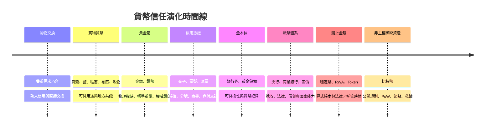
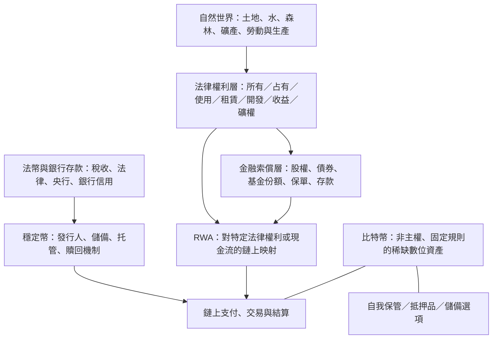

# 比特幣、Token、貨幣史與信任結構

> [!abstract] 筆記定位
> 這是一篇持續生長的思想母筆記，而不是投資建議、價格預測或加密貨幣百科。我關心的核心不是「下一個會漲的幣」，而是：在人類把越來越多價值、權利、債務與承諾放進數位網路時，我們究竟憑什麼相信一項資產、一次清償或一份承諾？

## 一句話理論

**本節結論：**我認為，貨幣史的主線不是「某種物品逐步變成錢」，而是人類在不同技術、商業規模與政治制度下，不斷重組信任、記帳、清償和跨時間轉移價值的方式。從 [[貝殼貨幣]]、鹽、牲畜、布匹與穀物，到金銀、錢幣、[[交子]]、[[票號]]、銀行、[[金本位]]、[[法幣]]，再到 [[穩定幣]]、[[RWA]] 與 [[比特幣]]，每一種方案都在回答同一組問題：誰能發行？誰能驗證？誰承諾兌付？當承諾破裂時誰承擔損失？權利是否能執行？價值能否跨越空間、時間與政權而被帶走？我不把比特幣理解為一個要吞沒黃金、股票、房地產、國債、土地或一切現實資產的「萬能容器」。我的判斷是，在未來多 Token、多鏈、多穩定幣、多 RWA、也多中心化中介並存的金融世界裡，比特幣可能提供一個供給規則相對難被任意改寫、無須依賴單一發行人、可以由個人持有私鑰的非主權「價值鉚釘」。鉚釘不裝下整座建築；它的作用是把不同層次的結構在壓力中固定住。這個判斷是概率性的、制度性的與長期性的，不是會計恆等式，更不是「BTC 必然上漲」的口號。

## 概念地圖

**本節結論：**貨幣演化並非一條「落後到先進」的單線進步史，而是材料稀缺、商業網路、法律權利、國家能力與資訊技術相互替換、疊加的歷史。舊工具不會完全消失；黃金、現金、銀行存款與鏈上資產可以在不同場景同時存在。



在物物交換階段，信任主要嵌入熟人關係、物品用途與地方習俗；在金銀階段，信任部分轉移至可觸摸、可稱量、難以大量複製的材料；在錢幣、交子與票號階段，信任開始從材料遷往鑄印、帳簿、商號網路與兌付聲譽；在金本位中，銀行與國家發行的信用貨幣被外部的黃金兌換承諾約束；在現代法幣體系，信任集中到稅收能力、法律強制、央行制度、銀行資產負債表與國際政治經濟。鏈上金融並沒有消滅信任，它只是把一部分記帳、轉移與驗證機制公開化、程式化。[[穩定幣]]與 [[RWA]] 仍把大量關鍵信任留在鏈下；[[比特幣]]則試圖把供給規則與所有權轉移的核心驗證，盡可能放在公開網路本身。



這張圖的要點是分層，而不是把所有東西混成「鏈上資產」。自然世界不是一張資產負債表；法律權利也不是物體本身；RWA 不是現實資產本體，而是對某一份可界定、可轉讓、可執行權利的映射；穩定幣不是美元本身，而是對發行人及其儲備和贖回安排的索償；比特幣更不是對企業、國家或土地現金流的索償。市場價格可以把這些東西放在同一交易介面，卻不能抹去其信任來源完全不同的事實。

## 貨幣不是物，而是信任技術

**本節結論：**貨幣之所以有效，從來不是單憑材料、演算法或政府命令，而是技術可用性、社會共同接受與制度性清償能力的交集。任何只強調其中一項的貨幣敘事都不完整。

最原始的物物交換面對「雙重需求巧合」問題：我擁有米，想換布；但持有布的人不一定想要米，也不一定願意在我需要的時間、地點、比例成交。隨著社會分工增加，直接交換的搜尋成本、比價成本與交割風險迅速上升。貨幣於是成為一種共同接受的中介，讓人不必先找到剛好彼此需要對方物品的人。

我理解貨幣至少同時承擔四項功能：它是**價值尺度**，讓不同商品可以標價、核算與比較；它是**交換媒介**，降低交易搜尋與協調成本；它是**延期支付標準**，讓今天的債務可以約定未來如何清償；它也是某種**價值儲藏**，讓勞動成果有機會跨時間保存。現實中沒有一種貨幣在每個時期都完美完成四種功能：高通膨貨幣可能仍便於支付卻不適合儲值；黃金可儲值卻不便於小額網路支付；比特幣可跨境持有但短期價格波動會限制其作為計價單位的穩定性。

因此，錢既不是純粹物，也不是純粹故事。它有技術屬性：耐久、可分割、可驗證、低成本轉移；有社會屬性：足夠多的人預期別人會接受它；也有制度屬性：稅收、法律、法院、銀行、清算系統、執法與戰爭能力決定了許多債務究竟如何被最終清償。材料能降低偽造與供給膨脹的風險，政府命令能建立稅務和法定清償網路，公開程式規則能降低部分發行與驗證的不透明性；但三者都不能單獨保證長期信任。

## 從貝殼到金銀：可見稀缺性的時代

**本節結論：**早期貨幣不是人類任意挑選的裝飾品，而是各地社會在交易成本、可保存性與共同習俗下形成的協調結果。金銀後來勝出，不是因為它們具有神祕的「絕對內在價值」，而是物理特性與長期共識互相強化。

[[貝殼貨幣]]、鹽、牲畜、布匹、穀物之所以能在不同地區進入交換體系，通常因為它們具有可見用途、社會熟悉度或取得成本。牲畜能繁殖、提供勞力與食物；穀物是生活必需品；鹽與保存食物有關；布匹能穿用、也便於計量；某些稀有或遠距取得的貝殼既具有裝飾性，也因供應不易而便於作為社會地位與交換媒介。它們不是「愚昧時代的錯誤貨幣」，而是低資訊、地方化經濟中的可行解。

但可用不等於適合擴張。牲畜會死亡、疾病與品質差異很大；穀物會腐壞、體積大且收成波動；鹽在某些地方容易取得、受潮或難以高價運輸；貝殼一旦被外部貿易大量輸入，其稀缺性就會改變。大型陌生人市場需要更耐久、同質、可分割、可攜帶、可驗證、又不易突然增加供給的媒介。黃金與白銀在這些維度上較平衡：它們耐腐蝕、可熔鑄成標準重量、可切分、單位價值高、視覺和物理檢驗相對可行，且人類難以在短時間把存量成倍擴張。

我不接受「黃金因為有內在價值，所以天然注定是貨幣」這種過度簡化。黃金的工業與裝飾用途本身不足以推出其貨幣地位；真正重要的是物理稀缺、採掘成本、歷史累積存量、權力中心採用、商業網路與代際文化記憶共同形成的協調均衡。[[黃金]]是材料與共識相遇後的貨幣技術。[[比特幣]]不是黃金的替代複製品：它沒有金屬用途，也承受不同的技術與監管風險；但兩者都回答了一個古老問題——在沒有完全信任對手方時，稀缺性如何被比較廣泛地相信。黃金用物理世界的採掘約束，比特幣用公開規則、工作量證明與網路共識來表達數位稀缺。

## 錢幣、紙幣、交子與票號：從材料到信用憑證

**本節結論：**商業規模擴大後，價值轉移不得不從搬運材料轉向傳遞可信憑證。[[交子]]與 [[票號]]說明：信用可以大幅提高效率，但信用一旦離開可驗證的資產、帳簿、聲譽和兌付能力，也會成為脆弱點。

金屬幣相較金銀塊進步在於鑄印把重量、純度與權威背書打包，降低了每次交易重新稱量和驗金的成本。但大量零碎硬幣仍沉重、運輸昂貴、容易被削邊或摻雜；遠距大額貿易還要承擔劫掠、保管和清點風險。當商人需要跨城、跨區調度資金時，單靠搬運錢幣會阻塞商業。

[[交子]]出現的歷史背景正是商品經濟、跨區貿易與鐵錢攜帶不便。其最初的核心邏輯不是憑空創造財富，而是把存放或交付的金屬貨幣轉化為可持有、可轉讓、可兌付的紙面憑證。紙張本身價值很低，卻能因發行者的兌付承諾和市場接受而承載大額交易。這揭示了一個重要轉折：貨幣開始更明顯地從「材料價值」轉向「對某個資產、機構或清償網路的索償權」。

[[票號]]的價值尤其在於跨地區匯兌。它依靠總號與分號網路、密押與帳簿、商幫聲譽、資本實力、熟人資訊、長期客戶關係及高昂的違約代價，讓商人能在甲地交款、乙地兌付，而不必押運現銀。它不是靠區塊鏈運作，卻已是一種「分散地點、集中信譽」的帳本與清算制度。若總號資本不足、分號失聯、戰亂切斷通路或聲譽崩潰，票據就可能折價甚至無法兌付；效率與脆弱性從一開始就是信用貨幣的一體兩面。

票號、今天的銀行、支付網路、穩定幣發行方與 RWA 托管方有結構相似性：它們都把使用者對底層資產或跨地價值轉移的需求，濃縮為一張帳、一次贖回或一個代幣。但它們的差異也不能被抹平。銀行通常嵌入存款保險、資本監管、中央銀行流動性和司法體系；穩定幣和 RWA 的發行、託管、破產隔離、審計與贖回安排則需要逐案查驗。紙幣與信用貨幣讓經濟不再被金屬存量直接限制，能支持更快的分工與融資；同時，它們也把風險轉到發行紀律、期限錯配、擠兌與資訊不對稱。

## 金本位：信用貨幣的外部約束

**本節結論：**[[金本位]]的歷史作用，是讓快速擴張的信用貨幣受黃金儲備與兌換承諾約束；它帶來可預期性與紀律，但也在戰爭、銀行危機、國際失衡及通縮壓力下暴露剛性。它不是被簡單證偽，而是被國家對貨幣主權與政策彈性的選擇取代。

在金本位理想型中，貨幣單位與固定重量黃金相連，銀行券或法定貨幣有兌換承諾，黃金儲備對發行形成外部邊界。這種制度向持有人傳遞一個訊號：發行者不能無限擴張貨幣而完全不面對兌付壓力。跨國支付也可藉由黃金與匯率機制獲得一定可預期性。對厭惡任意貶值的人而言，黃金提供了政治權力以外的限制。

但金本位並非無成本的紀律裝置。當戰爭需要巨額財政支出，或銀行系統面對存款人集中提款，政府若堅持兌換，可能迅速耗盡儲備；若國際收支長期失衡，調整常落在國內價格、工資與失業上；當經濟成長、人口增加與信貸需求快於黃金供應，貨幣條件偏緊可能帶來通縮壓力。以黃金作錨並不會消失政治問題，只是把調整成本分配給不同群體。

我因此不把去金本位理解為「黃金沒有價值」或「政府終於發現自由印錢更好」。更準確的說法是，國家在危機和戰爭中選擇保留最後貸款人、財政融資與匯率調整的能力，從而接受貨幣約束更多轉到制度設計與政治自律。這一轉變也埋下了今天比特幣被部分人視為非主權稀缺資產的背景：當外部硬約束減弱，市場會尋找其他可信的約束來源。

## 去金本位與現代法幣：制度信用的時代

**本節結論：**[[法幣]]不是「毫無價值的紙」也不是單純騙局；它是一套以稅收、法律、央行、銀行、國家能力和國際秩序共同維持的制度信用。但與金屬約束相比，它的稀缺性和購買力更依賴制度是否自律、是否可被問責。

現代法幣之所以被廣泛接受，首先因為國家以其徵稅、繳費與法定清償地位創造了持有需求；其次因為法院、監管、支付基礎設施與銀行體系使合約、存款、工資和債務能在共同計價單位下運作；再者，央行透過利率、流動性工具與支付清算系統影響貨幣條件。更深層地，一國的生產能力、能源與糧食安全、人口、軍事實力、政治穩定、貿易網路與地緣政治地位，會決定外界對其貨幣長期購買力與可兌換性的判斷。

銀行信貸使貨幣供給不只是印鈔機的輸出。當銀行放貸，它通常同時形成一筆借款人的負債和一筆可支付的存款；貨幣、債務與銀行資產負債表因此交織。低利率、寬鬆流動性與信貸擴張可支持投資和危機救助，也會推高某些資產價格，並使槓桿和期限錯配累積。真正需要研究的不是抽象地問「印錢是否邪惡」，而是新增信用進入了哪些部門、由誰獲得、能否形成真實生產能力、風險由誰承擔、以及制度能否在壓力下維持規則。

我特別反對用「全球 GDP 減全球債務」來推算世界淨價值。GDP 是一段期間內的產出**流量**，債務是某一時點的合約**存量**，兩者量綱不同，不能直接相減；而且一方的債務通常是另一方的債權。分析財富應區分資產負債表上的資產與負債、部門間的淨頭寸、土地與資本等真實資產、以及對未來現金流的金融索償權。把同一棟房產、其按揭貸款、按揭支持證券和代幣化份額都加總為獨立「財富」，或把債務一概當作世界財富的消失，都是概念錯位。

## 土地、自然資本與人類權利

**本節結論：**我認為人類並不擁有土地本體；市場可交易的，是社會以法律界定並承認的權利束。土地價格更不是生態、水、土壤、森林與氣候穩定性全部價值的總和。[[RWA]] 能映射權利，不能把地球本身裝進 Token。

所謂「擁有一塊地」，在制度上可能混合所有權、占有權、使用權、租賃權、開發權、通行權、礦權、地役權與收益權。某人有地表使用權，未必有地下礦產權；有住宅所有權，未必能任意改變用途或無限制開發；租賃權可讓使用者獲益，卻不等於永久所有權。這些權利由地籍、合同、行政許可、法院判決、社區規則與國家強制力共同界定，因此不同法域、不同時間和不同政治情境下，其邊界可能改變。

土地價格是預期租金、區位、基礎設施、稀缺性、融資條件、規劃制度與投機需求的市場結果。它不等於土地的完整價值，更不包含所有無法由私人獨占的生態服務。水循環、土壤修復、森林碳匯、生物多樣性與氣候穩定性是自然資本的重要部分，卻常被市場低估或排除。把一切自然條件都說成可無限切分、交易、槓桿化的「資產」，容易把人類對自然的暫時利用權誤認成絕對所有權。

這也決定了我對 RWA 的邊界感。一個 Token 最多代表某份地產公司的股權、特定租金收益權、基金份額、債權或在某司法管轄下可執行的權益；它不代表山脈、河流或土地本體自動屬於持幣者。未來若建立「透明資產權利系統」，核心不應是把所有東西 Token 化，而是把權利範圍、期限、優先級、限制、托管、受益人、現金流、爭議處理與環境外部性如實揭示。這也是我希望 [[湛箴]] 未來知識資產循環能承接的倫理與研究邊界。

## 當前 Token 為什麼像盲盒

**本節結論：**大量 Token 的問題不在於它們使用了區塊鏈，而在於市場價格跑在權利說明之前。若持有人不知道自己究竟擁有什麼、誰能改規則、供給何時釋放、收入是否屬於自己、最壞情況能否救濟，Token 就更像盲盒，而非可估值的權利憑證。

Token 不天然等於股權：持有人未必有公司投票權、清算剩餘索取權或分紅權。Token 不天然等於現金流：協議有收入不代表收入會流向持幣者，回購、銷毀或質押獎勵也不必然等價於可主張的收益權。Token 不天然等於治理權：投票可能只針對有限參數，核心合約、商標、前端、金庫多簽或開發權仍受團隊及少數地址控制。Token 也不天然等於真實資產：即使名稱帶有「資產」或「收益」，也要問底層權利、法律載體與贖回程序在哪裡。

市場常把流動性、TVL、交易量、社群人數與「活躍地址」當成價值證明，但每一項都可能失真。流動性可能由項目方或做市商補貼；TVL 可能是同一筆抵押物在多層協議反覆計算；交易量可被激勵、刷量或自我交易放大；地址數不等於獨立用戶；短期高收益可能是代幣補貼而非可持續商業收入。VC 份額、團隊分配、做市協議、關聯地址、解鎖節奏、空投規則、質押鎖定、回購資金來源與銷毀權限，都會在價格形成中扮演比白皮書敘事更實際的角色。

我會反覆追問一個問題：**最壞情況下，持有人究竟剩下什麼？**如果團隊離開、交易所下架、流動性撤走、前端關閉、治理被少數人控制、發行主體破產或監管否定其安排，持有人能對誰主張什麼？傳統證券與銀行體系當然也會失敗、造假和監管套利，但至少已形成相對成熟的披露、審計、受託責任、破產程序與投資者救濟框架。大量 Token 尚未提供等價的權利清晰度與可執行性，卻要求市場先給出高估值，這就是盲盒結構。

## 未來 Token 的透明化方向

**本節結論：**未來 Token 市場真正稀缺的不是新敘事，而是「可驗證信任」：第三方能以足夠低成本確認權利、資產、現金流、供給、控制權、風險與救濟邊界，而非只能相信創辦人、KOL 或交易所。

我設想的透明化，不是把每個錢包地址都公開就結束，而是至少建立九個層面。第一是**權利透明**：Token 是否代表使用權、治理權、收益權、債權、股權或完全沒有法律權利。第二是**資產透明**：底層資產是什麼、是否存在、是否重複質押、優先級如何。第三是**儲備透明**：儲備構成、所在機構、隔離安排、期限與負債是否匹配。第四是**現金流透明**：收入來源、成本、分配規則、回購資金與可持續性。第五是**持倉與解鎖透明**：團隊、投資人、做市商、國庫與關聯地址的實際控制和時間表。

第六是**治理透明**：誰擁有升級權、暫停權、金庫權和品牌／前端控制權，投票是否真的能約束核心控制者。第七是**風險透明**：智能合約、預言機、流動性、槓桿、對手方、監管與集中度風險如何披露。第八是**司法與救濟透明**：適用法律、爭議解決、破產隔離、贖回順序與投資者可採取的行動。第九是**審計透明**：不只發布一次審計報告，也要能持續驗證資產、負債、權限與關鍵假設。

鏈上資料透明不等於經濟實質透明。一個地址可見，不代表你知道其最終受益人；一筆儲備在鏈上，不代表你知道它是否被質押給別處；一份智能合約已開源，不代表線下公司、銀行帳戶、法院與托管人一定履約。可驗證信任的目標，是讓鏈上可見性與鏈下法律、審計、托管、財務報表形成能互相校驗的閉環。這正是 [[Token 透明度評分模型]] 應該衡量的對象。

## RWA 與穩定幣：不是答案，但會改變金融結構

**本節結論：**[[RWA]] 和 [[穩定幣]] 不會自動解決金融信任問題，卻可能重塑支付、清算、資產發行與抵押方式。它們最可能改變的是法幣支付、跨境轉移、銀行存款和部分結算市場，而不是把比特幣或黃金消滅掉。

RWA 的現實作用，是把原本依賴券商、基金登記冊、票據系統或私有資料庫管理的某些權利與現金流，轉化為可以鏈上記錄、編程交割、細分持有與全天候轉移的憑證。國債基金份額、應收賬款、房地產收益權、私募信貸或碳權都可能提高登記與結算效率。但「上鏈」不是魔法：誰保管底層資產？誰確認其存在和無重複質押？預言機出錯時誰負責？Token 是否能法定轉讓？持有人是否有贖回權？司法凍結、發行人破產、跨境衝突時誰執行？這些問題不會因為鏈上轉帳不可篡改而消失。

穩定幣具有貨幣性，因為它追求相對穩定的計價、支付與結算；它也具有信用性，因為持有人依賴發行方的儲備、托管銀行、資產期限、法律結構、審計品質與贖回能力。法幣儲備型穩定幣若運作良好，可把既有法幣的可編程性、全球可達性和結算速度帶上鏈；算法或弱儲備結構則更需要嚴格檢查壓力情境下的兌付邏輯。穩定幣的競爭對手主要是支付機構、匯款通道、部分銀行存款和封閉式清算網路，而非「BTC 必須被淘汰」或「黃金必須失去儲值角色」。

RWA 加穩定幣可以形成一個實用組合：RWA 提供某項法律權利或收益來源，穩定幣提供鏈上報價、付款與結算媒介，智能合約協調抵押、交割和分配。但這個組合增加的往往是權利層與中介層，而非消除它們。因此，RWA 規模成長不意味 BTC 自動承載所有被 Token 化資產的市值；同一份國債或房產權益不會因為生成鏈上憑證就憑空多出一份經濟價值。需要分開問的是：鏈上金融規模是否提高了對中立抵押品、自我保管儲備或非單一發行者資產的需求？答案取決於制度和市場選擇，而不是必然公式。

## 比特幣：不是容器，而是價值鉚釘

**本節結論：**[[比特幣]]最值得研究的地方，不是它是否吞掉所有資產，而是它能否在複雜、分層、充滿發行方風險的金融網路中，長期成為一種非主權、可自我保管、供給規則可公開驗證的儲備選項與抵押品候選。它的價值主張有條件，也有明確風險。

我用「容器」與「鉚釘」區分兩種想像。容器的想像認為 BTC 應該裝下土地、建築、企業盈利、國債現金流與全球所有財富，因此只要用世界總資產除以 2,100 萬就能得到「應有價格」。這種想像忽略了資產用途、收益權、法律權利和風險偏好的差異。建築提供居住與租金，企業股票對應治理和剩餘索取，債券對應合約現金流，土地牽涉位置與權利束；它們不是因為有市值，就應被 BTC 吸收。

鉚釘的想像則更克制。複雜建築仍需要牆、梁、管線與不同材料，鉚釘不替代任何一種材料，卻在連接處承受拉力、限制結構鬆脫。比特幣若能持續運作，它提供的不是企業分紅或主權債利息，而是一種不依附特定企業現金流、不要求相信單一央行或穩定幣發行人、可以跨越部分金融中介而持有的數位稀缺資產。對某些個人、機構或地區而言，這可能是資產配置中的小比例儲備、極端情境下的可攜帶選項、或鏈上世界中的中立抵押品；對另一些人而言，它可能沒有足夠必要性。這正是其需求具有條件性的原因。

BTC 的價值邏輯由幾個相互依賴的環節構成：2,100 萬上限使供給規則相對清晰；公開帳本與全節點驗證讓參與者可檢查規則是否被遵守；工作量證明把重寫歷史的成本與現實資源投入連接起來；分布式節點與開放參與降低由單一中心修改記錄的可能；私鑰則讓個人能在技術上直接控制資產，而不必總是依賴銀行、券商或交易所。任何單一環節都不足夠，價值來自規則、網路、安全預算、流動性、持有者信念和法律可用性共同形成的系統。

我也必須保留反面：比特幣短期波動很大，不能假裝它已是穩定購買力單位；自我保管帶來私鑰遺失、詐騙與操作門檻；集中化交易所和託管人可能失敗；挖礦地理與產業集中度、能源政策和市場槓桿會影響網路與價格；監管限制、稅務規則、政策衝突和協議治理爭議都可能改變其可用性。比特幣不保證成功，也不能消除所有信任需求。它只是在特定信任維度上，提出了不同於黃金、銀行存款、法幣與 RWA 的組合。

## 為什麼 BTC 不能用「全球財富除以 2100 萬」定價

**本節結論：**用全球財富、GDP 或債務的某個總數直接除以 2,100 萬，最多是修辭，不是估值模型。BTC 的關鍵問題不是它是否承載世界一切，而是未來有多少資本願意在可選資產中配置它，以取得非主權錨定、自我保管或中立抵押的功能。

GDP 是期間流量，表示一年或一季生產了多少最終商品與服務；債務是存量，表示某個時點尚未清償的契約；股票、債券、房地產、土地和 RWA 分別對應不同的現金流、控制權、使用權與法律優先級。即使它們都可被標出市值，也不能視為一桶可隨意倒入 BTC 的同質液體。尤其 RWA 與穩定幣往往是既有國債、存款、基金份額或其他資產的鏈上映射，若把底層資產與其 Token 同時計入，再假設 BTC 承載兩者，會造成重複計算。

更有意義的問題是：在多資產、多結算工具、多發行方並存的未來，多少持有人認為比特幣提供了其他工具不能完全替代的功能？需求會受到法幣信用風險、資本管制與地緣政治、機構合規渠道、自我保管需求、抵押品接受度、網路安全、交易深度、稅務與監管可用性的共同影響。供給上限很重要，但有限供給不會自動創造需求；需求也不會在所有市場狀態下穩定不變。

以下公式是我用來組織研究的正式框架，而**不是價格預測**：

\[
BTC\ Demand
=
f(
\text{法幣信用風險},
\text{制度信任},
\text{鏈上金融規模},
\text{自我保管需求},
\text{抵押品接受度},
\text{監管可用性},
\text{BTC 安全性與流動性}
)
\]

[[BTC 價值鉚釘需求模型]]要做的，應是把這些變量拆成可觀察的代理指標與可被反駁的假設，而不是用一個漂亮公式掩蓋不確定性。例如，穩定幣結算量上升可能提高鏈上中立抵押品需求，也可能只增加對短期國債和美元儲備的需求；制度信任下降可能推高 BTC 興趣，也可能讓人更偏好現金、黃金或資本管制內的安全資產。研究必須容許多種結果。

## 我的研究方向：全球鏈上金融信任地圖

**本節結論：**我希望建立的不是炒幣推薦器，而是一套把鏈上可見資料、鏈下法律權利、發行方風險與信任事件放進同一張結構圖的研究系統。它的目的，是協助人們辨認自己究竟在相信什麼、承擔什麼、以及最壞情況下還剩下什麼。

```text
Token 透明度
+ RWA 可驗證性
+ 穩定幣儲備質量
+ 發行方風險
+ 權利可執行性
+ 鏈上金融規模
+ BTC 市場主導率
+ 信任事件與風險事件
= 全球鏈上金融信任地圖
```

[[全球鏈上金融信任地圖]]應把資產分成至少四個互相連接的視角：第一，**權利地圖**，標示 Token 或 RWA 究竟承諾何種法律與經濟權利；第二，**依賴地圖**，揭示其依賴哪些發行人、銀行、託管人、預言機、多簽地址、司法管轄與公鏈；第三，**透明地圖**，比較儲備、負債、解鎖、現金流、治理和審計的可驗證程度；第四，**壓力地圖**，記錄脫錨、擠兌、清算、凍結、黑客、監管處置、破產與贖回延遲等信任事件。

這個系統不回答「買哪個幣」，而回答更先行的問題：某項資產的市場價格建立在何種權利和何種信任上？這種信任是公開可驗證、依賴聲譽、依賴法律、依賴國家，還是依賴單一私鑰和開源網路？當一個穩定幣聲稱有 1:1 儲備，該看儲備品質、托管、負債和贖回；當一個 RWA 聲稱代表房產，該看法律載體和現金流優先級；當一個 Token 聲稱去中心化，該看實際控制權；當 BTC 聲稱是價值鉚釘，該看安全性、流動性、持有分布、制度可用性與市場是否真的把它當作這種選項。

我希望它未來能成為 [[湛箴]] 知識資產循環中的金融研究模組：把概念筆記、資料管道、事件資料庫、評分模型、案例復盤與公開方法論連接起來。比起預言價格，這是一個更慢、卻更可累積的方向。

## 結論

**本節結論：**未來真正稀缺的不是 Token 的數量，也不是更響亮的敘事，而是可驗證、可執行、可審計的信任。BTC 的潛在價值不在於取代世界，而可能在於當權利層、資產層、結算層與發行方越來越複雜時，提供一個較不容易被任意改寫的非主權固定點。

我不把 [[黃金]]、[[法幣]]、[[穩定幣]]、[[RWA]] 與 [[比特幣]] 寫成你死我活的單選題。黃金保留跨世代的物理稀缺與文化記憶；法幣支撐日常計價、稅收與國家級經濟協作；穩定幣可能改善鏈上支付與跨境結算；RWA 可以讓部分現實權利的登記、交割與分配更有效率；比特幣則提出非主權、公開規則與自我保管的稀缺資產方案。它們服務的功能、承擔的風險、依賴的信任來源不同，因此可以競爭，也可以共存。

我真正要防止的是概念混淆：把物理稀缺誤當法律權利，把法律權利誤當經濟價值，把鏈上可見性誤當完整透明，把市場價格誤當真實價值，把法幣信用誤當必然騙局，把 BTC 上限誤當必然價格保證。只有把這些層次分開，我們才能在信任危機中不陷入盲目崇拜，也不因為看見風險就否定一切新制度。這份筆記將持續修訂：我的目標不是替某項資產辯護，而是建立一套能更誠實描述信任結構的語言。

## 相關筆記

- [[比特幣]]
- [[黃金]]
- [[貝殼貨幣]]
- [[交子]]
- [[票號]]
- [[金本位]]
- [[法幣]]
- [[穩定幣]]
- [[RWA]]
- [[Token 經濟學]]
- [[Token 透明度評分模型]]
- [[全球鏈上金融信任地圖]]
- [[BTC 價值鉚釘需求模型]]
- [[湛箴]]

## 待驗證命題

- [ ] 隨著鏈上結算規模上升，市場對非單一發行者抵押品的需求是否同步提高，而非只增加穩定幣與短債需求？
- [ ] Token 的權利、解鎖、關聯地址與收入透明度，能否對其長期流動性、波動和存活率形成可重複驗證的解釋力？
- [ ] 更高頻、可驗證的穩定幣儲備與負債披露，是否能降低脫錨與贖回壓力中的資訊不對稱？
- [ ] RWA 的法律可執行性與托管品質，是否比鏈選擇或 Token 介面更能決定其長期信用？
- [ ] BTC 是否在特定制度壓力事件中表現出「非主權價值鉚釘」需求，而不是僅作為高波動風險資產？

## 待研究問題

- [ ] 如何建立 [[Token 透明度評分模型]]，並避免把「披露多」誤判為「風險低」？
- [ ] 如何用圖資料庫呈現 RWA、穩定幣、銀行、托管人、預言機與公鏈之間的依賴關係？
- [ ] 如何區分鏈上地址可見性、最終受益權透明度與法律控制權透明度？
- [ ] 如何為土地與自然資本建立不把生態價值完全金融化的權利披露框架？
- [ ] 如何為 [[BTC 價值鉚釘需求模型]] 選擇公開、長期、可更新且不過度擬合的代理指標？
- [ ] 如何把全球監管、擠兌、脫錨、黑客與破產事件做成可比較的信任事件資料庫？

## 下一步

- [ ] 為本筆記每個核心概念建立獨立原子筆記，優先完成 [[Token 經濟學]]、[[穩定幣]]、[[RWA]] 與 [[BTC 價值鉚釘需求模型]]。
- [ ] 設計 Token 透明度的第一版欄位：權利、供給、解鎖、持倉、現金流、治理、審計、法律與救濟。
- [ ] 蒐集 10 個 Token、5 個穩定幣、5 個 RWA 案例，對照填寫透明度與依賴關係矩陣。
- [ ] 建立「信任事件」標準化表格，記錄日期、主體、事件類型、受影響權利、損失傳導、救濟結果與資料來源。
- [ ] 將這篇母筆記與 [[湛箴]] 的知識資產循環、資料庫設計和研究儀表板需求連結。
