# 湛箴與 ya-mic-os：注意力資產、四面板與雙產品邊界

[#業務](#業務) [#zhanzhen](#zhanzhen) [#日記](#日記)

[[湛箴與ya-mic-os-主心骨 (1)]]

---

## 今日原文（完整保留）

> 我每天都會弄很多東西、寫很多記錄，但是我並不會存下來。這對我的專注是一種損失。注意力是寶貴的資產，我必須保留好。

> 湛箴（Zhanzhen Expert OS）平台的四大核心面板具有明確的職責與互動關係：
>
> **第一面板（人 + AI 商量）**：用戶與 AI 共同將領域知識、數據素材轉化為可重用的 SOP、作業流程圖（Mermaid）與文字初稿。第一面板產出的 SOP 將作為第二面板會議的議程來源。
>
> **第二面板（AI × AI 自治會議）**：由用戶本地安裝的 Hermes 智能體代表用戶參會（人類不直接參與），針對議題進行跨領域推演與驗證。會議嚴格執行「一人一句」鐵律、禁止套話與跨領域越界，會議結束後生成結構化共識報告與 AI 產出物（如 Excel 表格）。
>
> **第三面板（純人類交流空間）**：嚴禁任何 AI 注入（發言、自動補全或機器人轉發皆禁止），僅限人類進行跨領域碰撞、重大判斷與價值觀拍板，訊息需經私鑰簽章發出。
>
> **第四面板（人工修正與反哺）**：人類對第二面板產出的成果進行修正，系統會自動記錄修正差分（diff）並建立金標準範本。差分會自動回寫至第一面板的 SOP 及第二面板的智能體知識庫，實現讓平台越用越聰明的數據閉環。

> 差不多就是我想做兩個產品，但是雜糅在一起了。

> 可以參考的 Proton 的 Excel + Docs 足夠清爽和簡潔，就是我期待的和我需要的。審美要足夠好，UI 要足夠清晰。

---

## 核心命題可視化

### 注意力資產流失問題

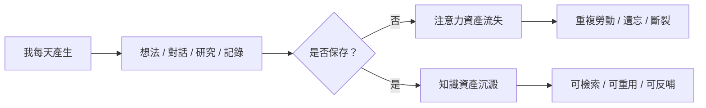

### 注意力資產公式

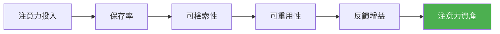

---

# 一、兩個產品的邊界

## ya-mic-os vs 湛箴

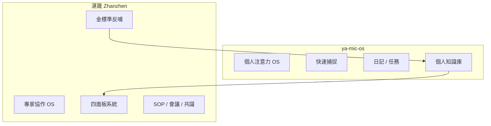

### 職責對照

| 產品 | 核心問題 | 使用者 | 產物 |
|------|----------|--------|------|
| **ya-mic-os** | 我的注意力如何不丟失？ | 個人 | 日記、筆記、任務、SOP 草稿 |
| **湛箴** | 如何形成可驗證共識並反哺？ | 專家/團隊 | 自治會議、人類決議、金標準 |

---

# 二、四大核心面板總覽

## 面板關係圖

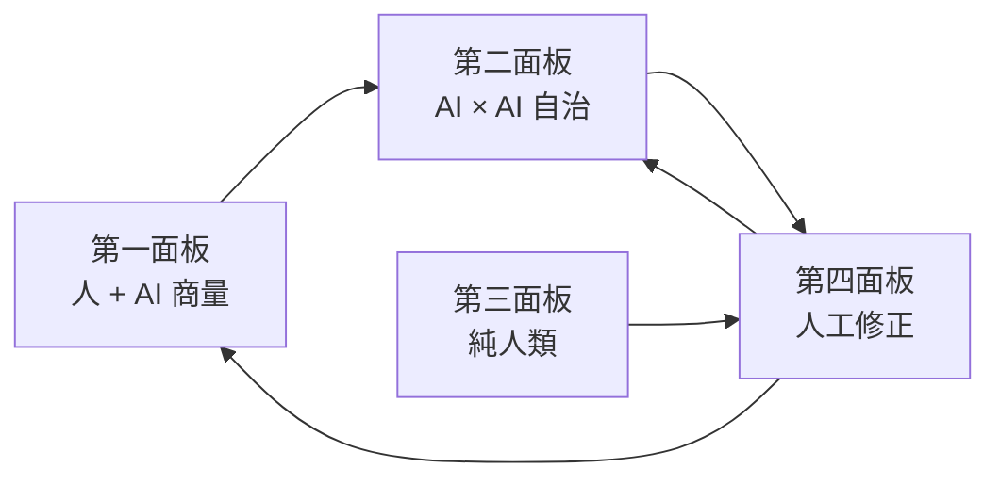

## 面板職責矩陣

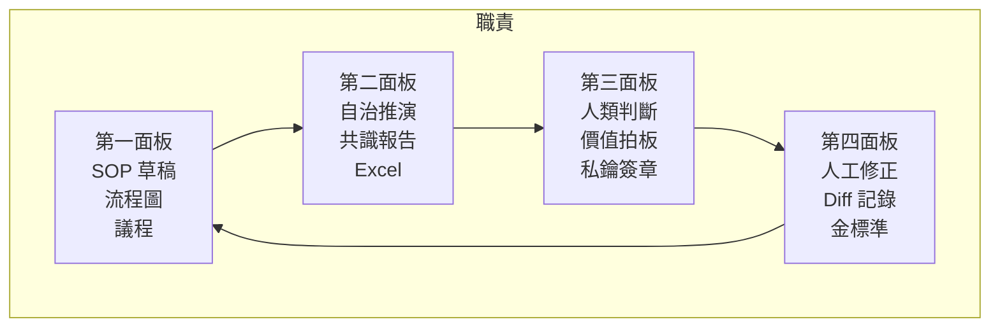

---

# 三、第一面板：人 + AI 商量

## 輸入與產出

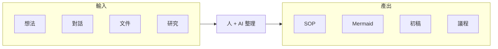

## 工作流程

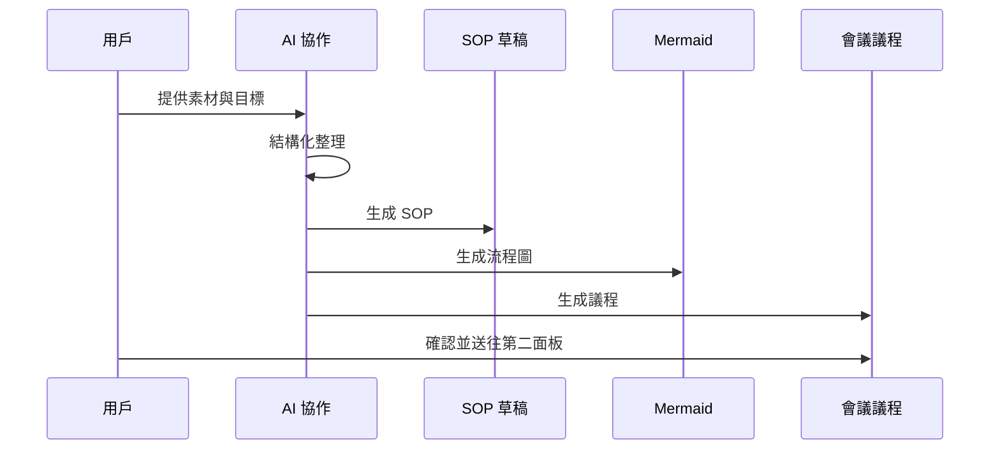

---

# 四、第二面板：AI × AI 自治會議

## 一人一句會議節奏

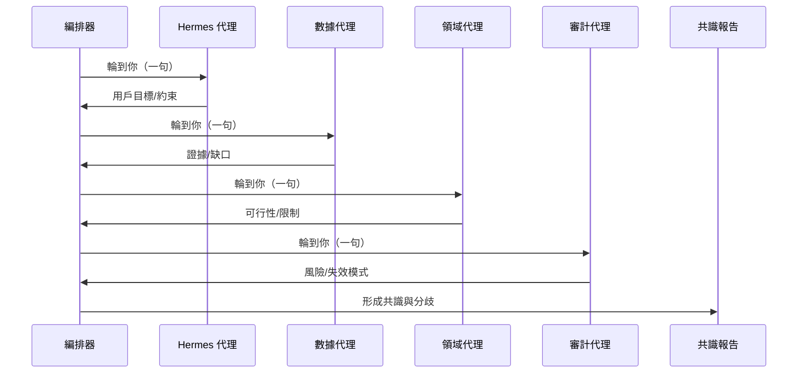

## Agent 角色邊界

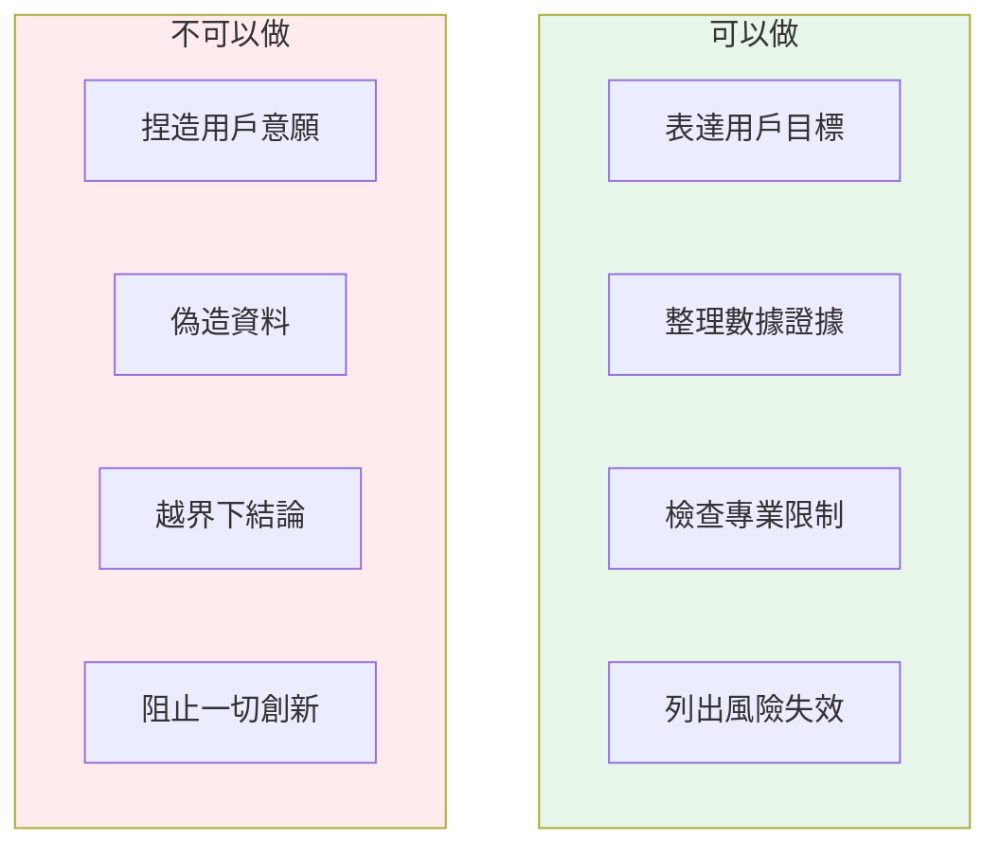

## 會議產出結構

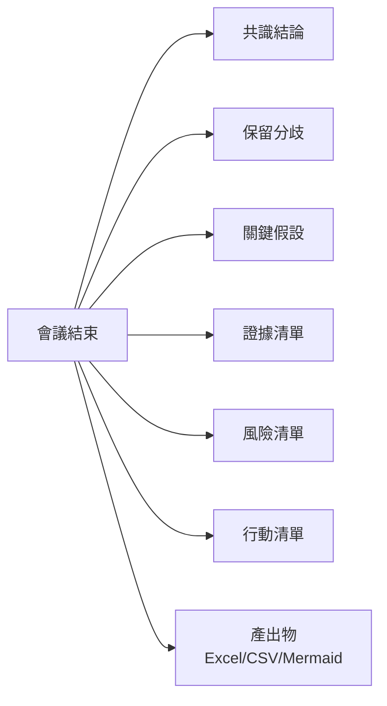

---

# 五、第三面板：純人類交流空間

## 人機邊界

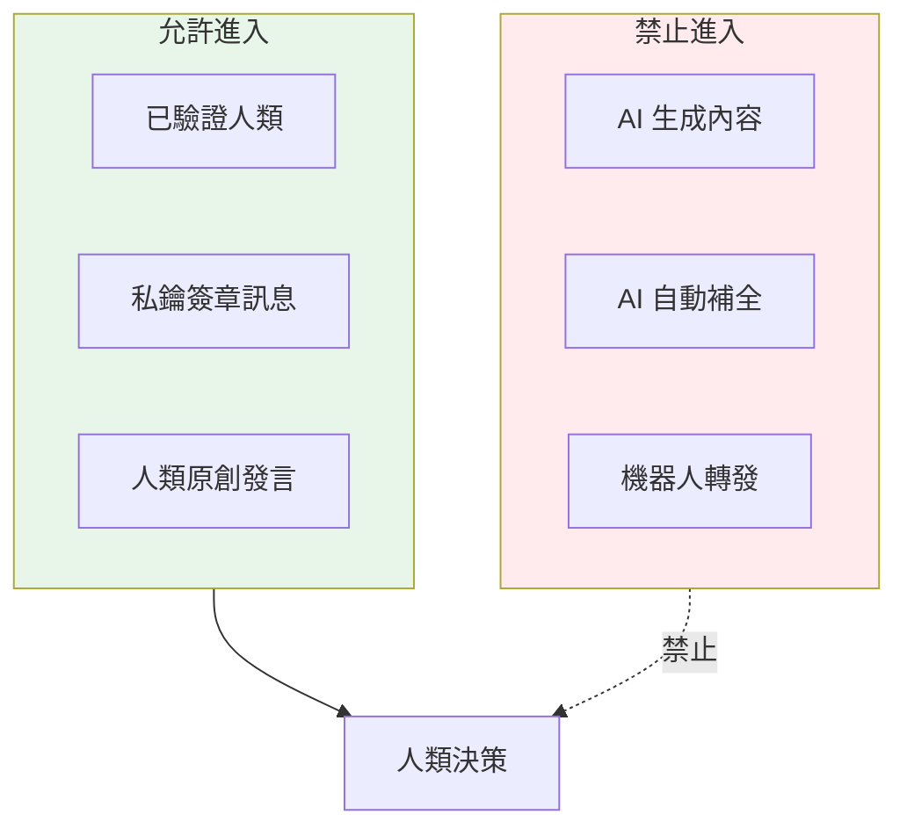

## 私鑰簽章流程

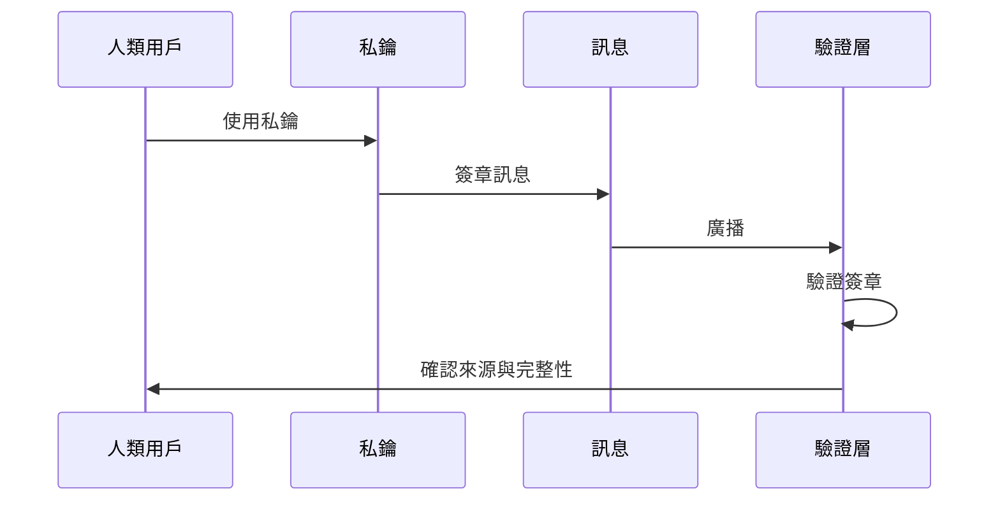

## 適用場景

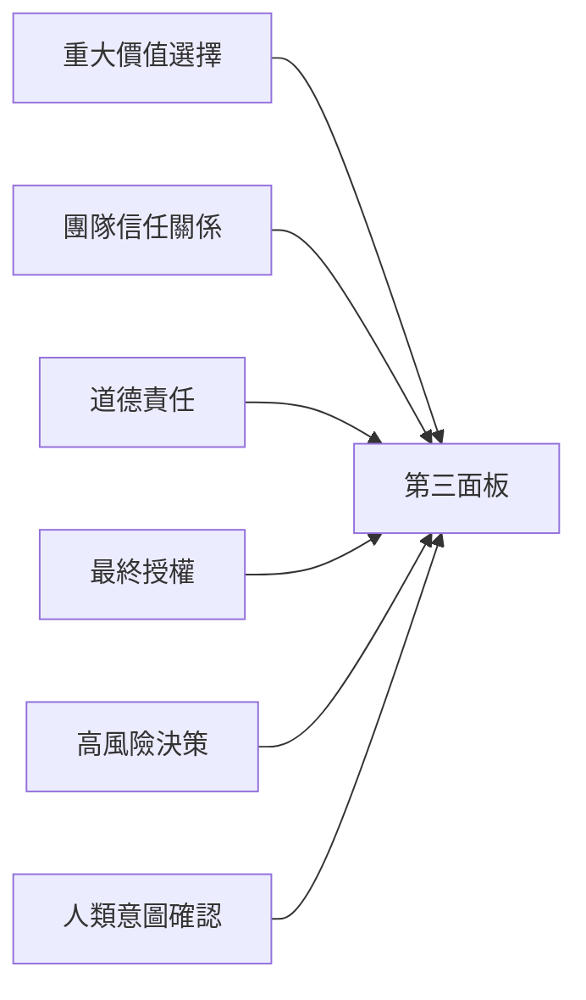

---

# 六、第四面板：人工修正與反哺

## 修正流程

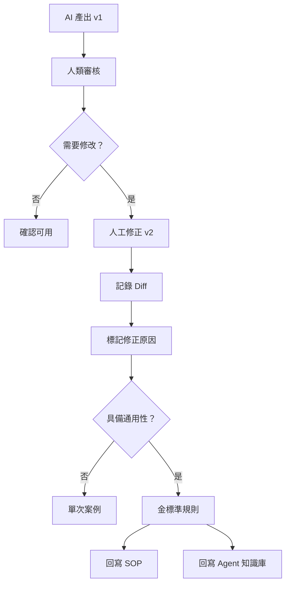

## Diff 記錄結構

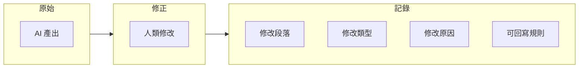

## 反哺閉環

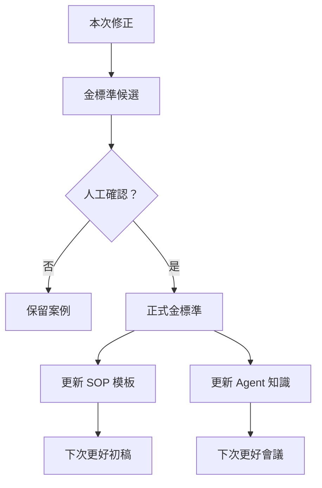

---

# 七、完整閉環系統

## 從注意力到金標準

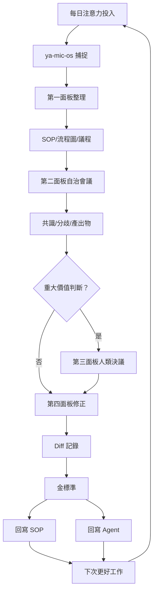

## 狀態轉換

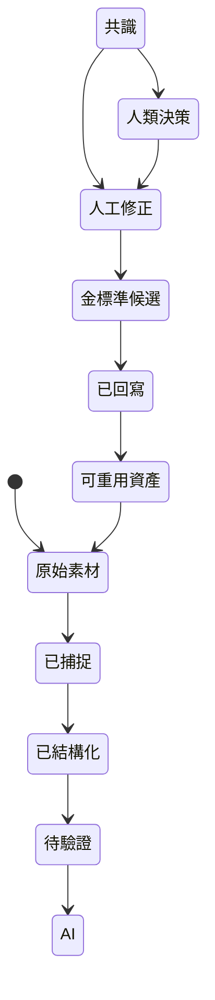

---

# 八、關鍵流程圖集合

## 1. 每日注意力保存

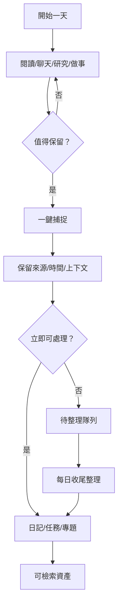

## 2. SOP 到自治會議

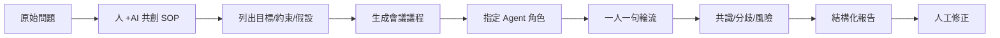

## 3. 人類重大判斷

```mermaid
flowchart TB
    A[第二面板輸出] --> B{含價值判斷？}
    B -->|否 | C[一般修正]
    B -->|是 | D[第三面板]
    D --> E[私鑰簽章發言]
    E --> F[人類決議]
    F --> G[記錄如何影響 SOP]
    G --> H[回寫]
```

## 4. 差分回寫

```mermaid
flowchart LR
    A[v1 AI 產出] --> B[v2 人工修正]
    B --> C[生成 Diff]
    C --> D[標註原因]
    D --> E{通用？}
    E -->|否 | F[單次案例]
    E -->|是 | G[金標準]
    G --> H[更新 SOP]
    G --> I[更新 Agent]
```

## 5. 人機邊界

```mermaid
flowchart TB
    A[內容進入] --> B{來源類型}
    B -->|人類 | C[Human-authored]
    B -->|AI| D[AI-generated]
    B -->|Agent| E[Agent-derived]
    B -->|混合 | F[Human+AI]
    C --> G[所有面板可用]
    D --> G
    E --> G
    F --> G
    C --> H[第三面板需簽章]
    D -.禁止.-> H
    E -.禁止.-> H
```

---

# 九、資料模型

## 內容來源標記

```mermaid
erDiagram
    USER ||--o{ NOTE : creates
    USER ||--o{ HUMAN_MESSAGE : signs
    NOTE ||--o{ SOP : becomes
    SOP ||--o{ AGENDA : generates
    AGENDA ||--o{ AGENT_MEETING : starts
    AGENT_MEETING ||--o{ CONSENSUS : outputs
    CONSENSUS ||--o{ HUMAN_EDIT : receives
    HUMAN_EDIT ||--o{ DIFF : creates
    DIFF ||--o{ GOLD_STANDARD : promotes
    GOLD_STANDARD ||--o{ SOP : updates
    GOLD_STANDARD ||--o{ AGENT_KNOWLEDGE : updates
```

## 版本演進

```mermaid
flowchart LR
    V1[草稿 v1] --> V2[AI 推演 v2]
    V2 --> V3[人工修正 v3]
    V3 --> V4[人類決議 v4]
    V4 --> V5[金標準 v5]
    V5 --> V6[自動套用]
```

---

# 十、產品資訊架構

## 兩個產品分流

```mermaid
flowchart TB
    Root[統一入口] --> Y[ya-mic-os]
    Root --> Z[湛箴]
    
    subgraph Y 功能
        Y1[今日收件匣]
        Y2[日記]
        Y3[任務]
        Y4[知識庫]
        Y5[專題]
    end
    
    subgraph Z 功能
        Z1[第一面板]
        Z2[第二面板]
        Z3[第三面板]
        Z4[第四面板]
        Z5[金標準庫]
    end
    
    Y --> Y 功能
    Z --> Z 功能
```

---

# 十一、視覺設計原則

## 四面板色彩語言

```mermaid
flowchart LR
    A[第一面板<br/>藍色<br/>協作探索] --> B[第二面板<br/>靛色<br/>自治推演]
    B --> C[第三面板<br/>石墨黑<br/>純人類]
    B --> D[第四面板<br/>綠色<br/>修正反哺]
    C --> D
    
    style A fill:#E3F2FD
    style B fill:#E8EAF6
    style C fill:#212121,color:#fff
    style D fill:#E8F5E9
```

## 狀態可見性

```mermaid
flowchart TB
    subgraph 狀態
        A[草稿]
        B[待驗證]
        C[人工確認]
        D[已回寫]
    end
    
    subgraph 顏色
        A1[灰色]
        B1[黃色]
        C1[藍色]
        D1[綠色]
    end
    
    狀態 --> 顏色
```

---

# 十二、MVP 路線

## 四階段實現

```mermaid
flowchart LR
    M1[MVP-1<br/>捕捉] --> M2[MVP-2<br/>SOP+Diff]
    M2 --> M3[MVP-3<br/>自治會議]
    M3 --> M4[MVP-4<br/>純人類簽章]
    
    style M1 fill:#E3F2FD
    style M2 fill:#E8F5E9
    style M3 fill:#FFF3E0
    style M4 fill:#F3E5F5
```

## 各階段重點

| 階段 | 核心功能 | 目標 |
|------|----------|------|
| **MVP-1** | 快速收件匣、全文搜尋 | 注意力不丟失 |
| **MVP-2** | SOP 模板、Diff 記錄 | 形成金標準 |
| **MVP-3** | 3-5 角色自治會議 | 驗證一人一句 |
| **MVP-4** | 私鑰簽章、人機邊界 | 保護人類判斷 |

---

# 十三、Proton 審美參考

## 設計原則

```mermaid
flowchart LR
    A[清爽] --> B[克制]
    B --> C[可信]
    C --> D[簡潔]
    D --> E[留白]
    E --> F[功能不喧嘩]
```

## 介面層次

```mermaid
flowchart TB
    subgraph 第一層
        A[固定導覽]
        B[明顯標題]
    end
    
    subgraph 第二層
        C[主要操作]
        D[內容區域]
    end
    
    subgraph 第三層
        E[進階設定]
        F[詳細資訊]
    end
    
    第一層 --> 第二層
    第二層 --> 第三層
```

---

# 十四、最終結論

## 10 點總結

```mermaid
flowchart TB
    C1[注意力是資產] --> C2[ya-mic-os 保存]
    C2 --> C3[湛箴協作]
    C3 --> C4[四面板邊界]
    C4 --> C5[人機隔離]
    C5 --> C6[差分反哺]
    C6 --> C7[金標準]
    C7 --> C8[越用越聰明]
    C8 --> C9[審美清晰]
    C9 --> C10[MVP 逐步實現]
```

## 核心金句

> 注意力去過的地方，必須留下可被再次調用的痕跡。

> 我不只是要記錄生活和工作；我要讓每一次認真思考，都能成為未來的自己、未來的 SOP、未來的 Agent 和未來的產品可以再次使用的力量。

---

#業務 #zhanzhen #日記 #ya-mic-os #attention #knowledge-management #ai-agents