[[01_2026_09 _06]]
[[02_2026_09 _06]]
[[湛箴與ya-mic-os-注意力資產與四面板-可視化爆炸版]]
# 湛箴與 ya-mic-os：注意力資產、四面板與雙產品邊界——總整合日記

[#業務](#業務) [#zhanzhen](#zhanzhen) [#日記](#日記)

[[湛箴與ya-mic-os-主心骨 (1)]]

> [!abstract] 今日核心
> 我每天都會做很多事情、寫很多記錄、產生很多想法、嘗試很多工具與流程，但我並不總是把它們保存下來。這不是小習慣問題，而是對專注力與注意力資產的流失。
>
> **注意力是寶貴的資產。**我付出時間、情緒、思考、搜尋、試錯和決策，才換來一段有價值的認識；如果它沒有被可靠保存、整理、沉澱、回看與反哺，這段注意力就像沒有入帳的資產，會在下一次工作切換、下一天睡醒或下一輪資訊流裡消失。
>
> 我想做的不是一個普通筆記工具，也不只是 AI 聊天工具。我想把自己的工作、想法、知識、SOP、自治會議、人類判斷與修正差分，做成一個能夠累積、回流、變得越用越聰明的系統。這個系統暫時由兩個雜糅在一起的產品構成：**湛箴（Zhanzhen Expert OS）**與 **ya-mic-os**。

> [!quote] 注意力資產原則
> 注意力不是被消耗後就不存在的燃料；只要被保存、結構化、索引、回看和再利用，它就可以轉變為知識資產、流程資產、決策資產與產品資產。

---

# 一、注意力是資產

## 我每天正在失去什麼

我每天會：

```text
讀很多內容
和 AI 對話
想很多問題
嘗試很多軟體、模型、工作流與配置
研究金融、Token、RWA、數據分析、產品、審計、AI Agent
寫下零散觀點
解決一些當下很具體的問題
做出一些有價值的判斷
```

但其中相當一部分沒有被保存下來，或只是散落在聊天記錄、瀏覽器分頁、臨時文件、截圖、下載目錄、草稿、不同設備與不同平台裡。

這意味著：

```text
已經投入的注意力沒有形成可回收資產。
已經做過的研究可能被重複做。
已經得到的結論可能在幾天後忘掉。
已經完成的流程不能快速重用。
已經修正過的錯誤沒有變成下一次的防錯機制。
```

我不能再把注意力只當成「今天用掉的時間」。它應該被視為我最重要的長期資本之一。

## 注意力資產的公式

我暫時把注意力資產理解為：

\[
\text{注意力資產} = \text{投入的注意力} \times \text{保存率} \times \text{可檢索性} \times \text{可重用性} \times \text{反饋增益}\
]

其中：

```text
投入的注意力：閱讀、思考、溝通、試錯、決策和創作所花費的心智成本。
保存率：重要內容是否被捕捉，而不是隨會話、頁面或記憶消失。
可檢索性：未來能否在需要時迅速找到。
可重用性：能否轉為 SOP、模板、表格、流程圖、提示詞或程式。
反饋增益：下一次使用時，系統能否因為歷史修正而做得更好。
```

如果只投入注意力但不保存，後面幾項接近零，投入的價值會快速衰減。

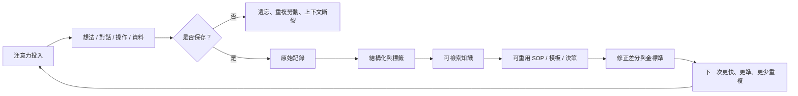

這個循環就是我想讓 ya-mic-os 和湛箴共同承接的東西。

## Attention Is All You Need 的個人解讀

我看到「Attention Is All You Need」這句話時，不只想到 Transformer，也想到我自己的工作系統。

在 AI 模型裡，注意力機制決定模型在大量資訊中把計算資源放在哪些關係上；在人的工作與知識系統裡，注意力決定我把生命時間放在哪些問題、資料、判斷與創造上。

如果我不能保存注意力曾經停留過的地方，我的生活與工作就會不斷從零開始。

參考：

- [Attention Is All You Need 中文導讀](https://www.xuanyuancode.com/ai-llm/lessons/appendix-attention-paper)
- [Attention Is All You Need 論文原文](https://proceedings.neurips.cc/paper_files/paper/2017/file/3f5ee243547dee91fbd053c1c4a845aa-Paper.pdf)

我對這句話的產品化翻譯是：

> **注意力去過的地方，必須留下可被再次調用的痕跡。**

---

# 二、我其實有兩個產品

## 雜糅在一起的問題

我目前想做的東西其實包含兩個不同層次的產品，但它們正在我的腦中混在一起：

| 產品 | 核心問題 | 主要使用者 | 最終產物 |
|---|---|---|---|
| ya-mic-os | 我個人每天產生的注意力、資料、記錄與工作流如何不丟失？ | 我自己，之後可能是個人知識工作者 | 日記、筆記、任務、素材、SOP、個人記憶、可檢索工作台 |
| 湛箴 Zhanzhen Expert OS | 人與 AI、AI 與 AI、人與人如何在邊界清楚的空間中形成可驗證共識並持續改進？ | 專家、研究者、團隊、跨領域協作者 | SOP、自治會議共識、人工修正、金標準與可回寫知識庫 |

它們關係很近，但不應被硬做成一個混亂產品。

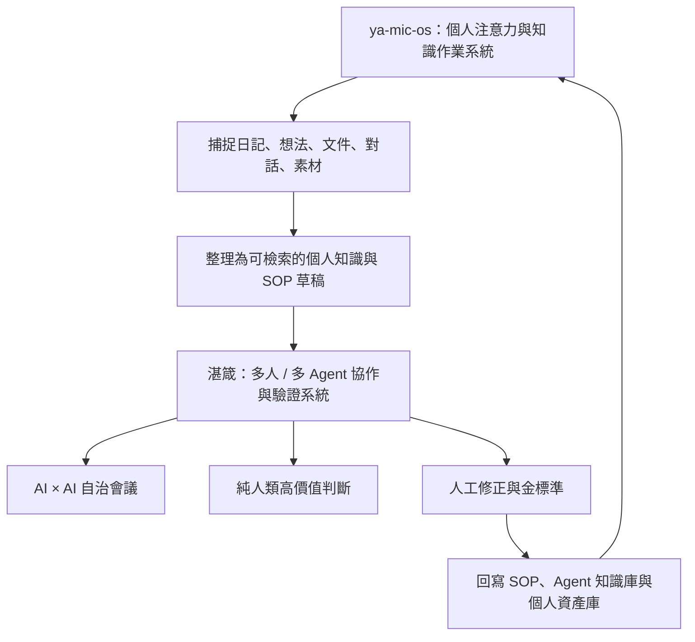

## 邊界不是切斷

ya-mic-os 是「我的注意力資產庫和個人工作台」，重點是低摩擦地把每天產生的東西留下來。

湛箴是「把高價值問題送進不同協作模式，產生共識、分歧、修正與可回流知識的專家系統」，重點是明確區分：什麼該由人和 AI 商量、什麼可以交給 AI 自治會議、什麼必須只由人類決定、什麼修正後要成為未來的金標準。

兩者可以共用資料、帳戶、搜索、設計語言與部分底層能力；但首頁、使用流程、權限模型和精神定位不應混為一談。

---

# 三、湛箴的四大面板

## 面板總覽

湛箴（Zhanzhen Expert OS）平台的四大核心面板具有明確職責與互動關係。

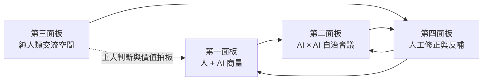

四個面板不是四個頁面而已，而是四種不同的認知制度與權限邊界。

| 面板 | 名稱 | 誰可以參與 | 核心功能 | 主要產出 | 絕對邊界 |
|---|---|---|---|---|---|
| 第一面板 | 人 + AI 商量 | 人類與 AI | 把素材、資料、經驗變成初步 SOP 和議題 | SOP 草稿、Mermaid、文字初稿、會議議程 | AI 是協作者，不是最終價值裁判 |
| 第二面板 | AI × AI 自治會議 | 用戶本地 Hermes Agent 與指定 Agent | 跨領域推演、反駁、驗證和結構化共識 | 共識報告、分歧清單、Excel、待人工確認事項 | 人類不直接參與會議過程 |
| 第三面板 | 純人類交流空間 | 經私鑰簽章的人類 | 跨領域碰撞、重大判斷、價值觀拍板 | 人類共識、簽章決議、不可由 AI 代寫的意見 | 嚴禁任何 AI 注入 |
| 第四面板 | 人工修正與反哺 | 人類審核者 | 修正 AI 產出、記錄差分、建立金標準 | Diff、金標準範本、回寫規則、品質指標 | 人類修正具有最高優先級 |

---

## 第一面板：人 + AI 商量

第一面板是人與 AI 共同工作的地方。它不是普通聊天窗，而是一個「把原始注意力轉為可重用知識」的工作台。

輸入可以是：

```text
零散想法
聊天記錄
文件
表格
圖片 OCR 結果
研究材料
市場資料
日記
任務描述
現有 SOP
失敗案例
人工經驗
```

AI 與人共同把輸入變成：

```text
SOP
流程圖 Mermaid
問題定義
假設清單
研究框架
文字初稿
表格模板
待驗證清單
第二面板的自治會議議程
```

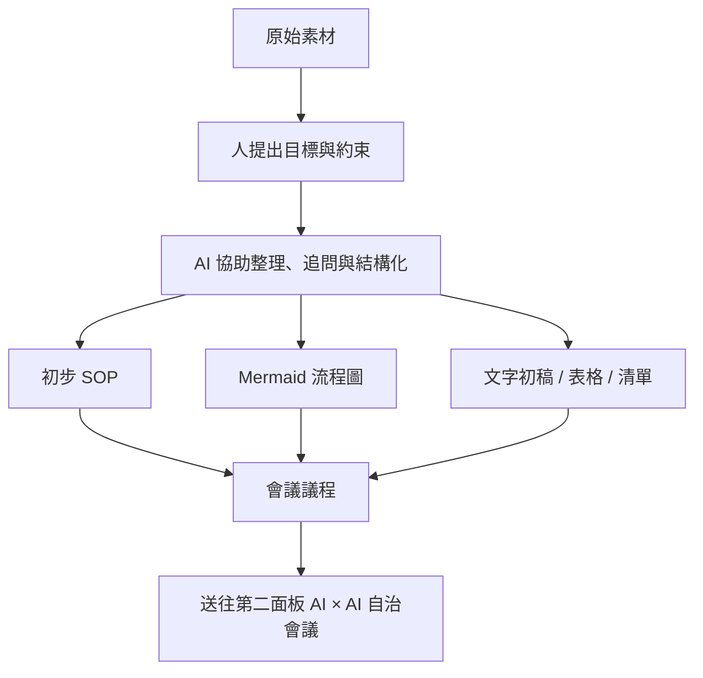

第一面板的主要原則：

```text
先保存，再整理。
先保留原始上下文，再提煉結論。
允許不完整，但要清楚標記不確定性。
AI 可以幫忙，但不能偷偷替人做重大價值判斷。
每次工作都應留下可被再次調用的產物。
```

第一面板本質上是 ya-mic-os 與湛箴最自然的交界：ya-mic-os 提供我的原始注意力資產，湛箴把重要內容升級為可協作的 SOP 與議題。

---

## 第二面板：AI × AI 自治會議

第二面板的定位不是「很多 AI 一起說話」，而是由多個具有明確角色、知識邊界與發言規則的 Agent，針對第一面板輸出的議題進行自治推演與驗證。

用戶本地安裝的 Hermes 智能體代表用戶參會，人類不直接參與會議過程。

第二面板嚴格執行：

```text
一人一句鐵律。
禁止套話。
禁止重複他人已說內容。
禁止跨領域越界。
要求每句話標明：結論、依據、假設、風險或待驗證點之一。
不確定時必須說不確定，不能假裝知道。
出現價值判斷或高風險決策時，必須升級到第三或第四面板。
```

### 一人一句會議節奏

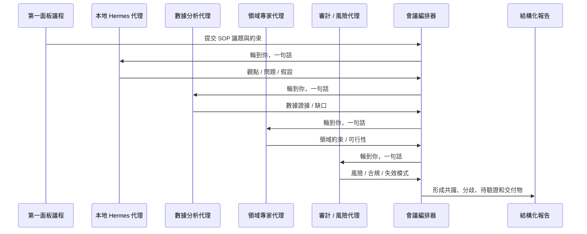

### Agent 角色邊界

| Agent | 可以做什麼 | 不可以做什麼 | 輸出格式 |
|---|---|---|---|
| Hermes 用戶代理 | 表達用戶既有目標、偏好、約束與授權範圍 | 捏造用戶意願、替用戶做未授權重大決策 | 目標、約束、優先級、待確認問題 |
| 數據代理 | 整理資料、提出模型、檢查指標與數據缺口 | 把相關性當因果、偽造資料 | 證據、假設、樣本限制、計算結果 |
| 領域代理 | 檢查行業常識、專業流程與可行性 | 跨越專業邊界下最終結論 | 規則、限制、案例、待驗證點 |
| 審計風險代理 | 找錯、找控制缺口、列出失效模式 | 為了保守而阻止一切創新 | 風險、控制項、審計軌跡、升級條件 |
| 反方代理 | 系統性挑戰主流結論 | 為反對而反對、製造空洞懷疑 | 反例、替代解釋、反證條件 |
| 會議編排器 | 控制輪次、去重、執行一人一句、整理結論 | 直接改寫實質觀點或掩蓋分歧 | 議程狀態、發言紀錄、共識矩陣 |

### 第二面板輸出

第二面板結束後，不應只生成一篇看似完整但無法追溯的總結，而應生成結構化產物：

```text
共識結論：哪些結論獲得多角色支持。
保留分歧：哪些問題尚無共識，以及各方理由。
關鍵假設：結論依賴哪些尚未驗證條件。
證據清單：哪些資料已支持，哪些仍缺失。
風險清單：可能的失效模式、合規與倫理邊界。
行動清單：可以自動執行、需要人工確認、必須由純人類決定的事項。
產出物：Excel、CSV、Mermaid、SOP 建議稿、模型草案、報告草稿。
```

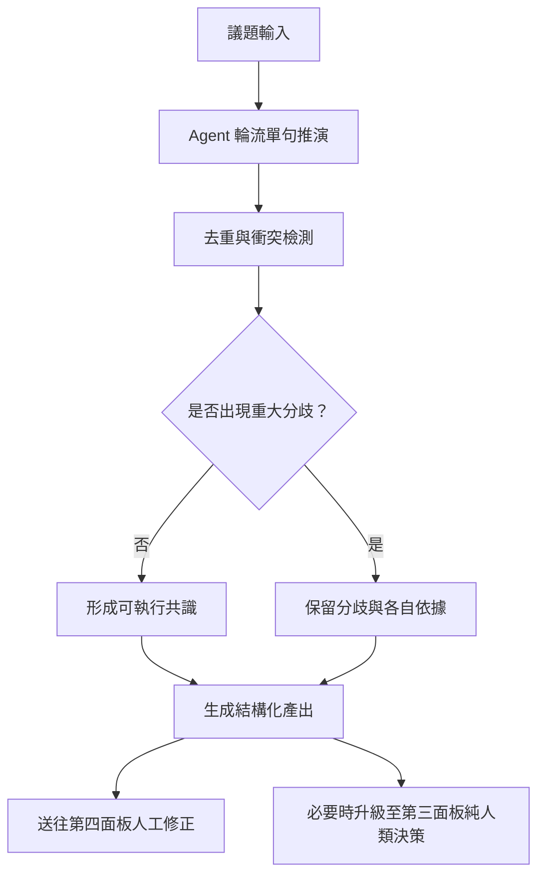

---

## 第三面板：純人類交流空間

第三面板是整個系統最重要、也最不能被 AI 污染的區域。

它不是因為 AI 沒有能力整理資訊，而是因為有些事情本來就不應由 AI 代替人類發言、決定、暗示或操控：

```text
重大價值選擇
團隊關係與信任
道德責任
最終授權
高風險商業決策
人類身份與意圖
跨領域衝突的最終拍板
```

第三面板必須遵循鐵律：

```text
嚴禁 AI 發言。
嚴禁 AI 自動補全。
嚴禁 AI 代寫、潤色後偽裝成人類原話。
嚴禁機器人轉發或替人投票。
嚴禁基於聊天內容的 AI 情緒操控、排序操控或隱性建議。
每一條訊息必須由人類以私鑰簽章發出。
```

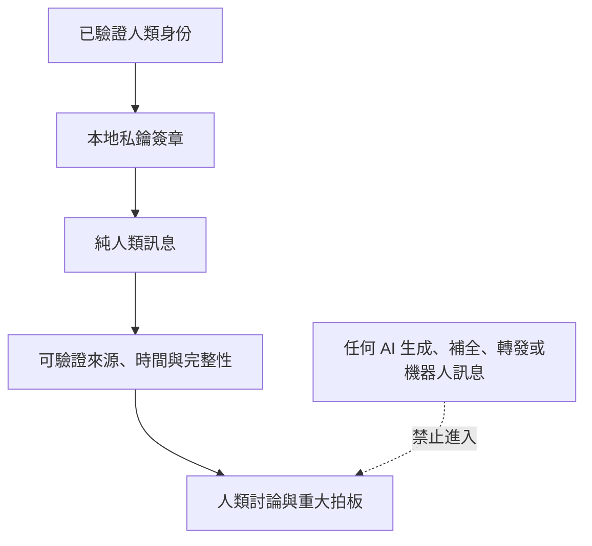

第三面板的價值不是效率最大化，而是保存人類判斷的真實性、責任歸屬與不可替代性。

如果第二面板的核心是「不用人直接參與也能進行跨領域推演」，第三面板的核心就是「任何 AI 都不能偷偷混入人類價值判斷」。

### 為什麼要私鑰簽章

私鑰簽章不是裝飾。它至少要提供：

```text
誰說了這句話的可驗證性。
內容在傳輸後沒有被竄改的完整性。
發言者不能輕易否認自己已簽發的責任軌跡。
人類與 AI 內容之間的來源隔離。
對重大決策建立可追溯審計紀錄。
```

當然，私鑰簽章不能天然證明「當下操作的人一定是本人」或「發言一定完全沒有受到外部工具幫助」。因此系統還需要裝置安全、身份驗證、權限管理與清楚的人機邊界提示。但私鑰簽章是重要底座。

---

## 第四面板：人工修正與反哺

第四面板是整個平台的品質核心。

第一面板可以產生草稿，第二面板可以產生自治會議結果，第三面板可以形成人類決斷；但只有第四面板能把「這次做錯了什麼、怎麼改、為什麼這樣改」變成系統未來可使用的能力。

第四面板由人類對第二面板或第一面板的成果進行修正。系統不只保存修正後的最終稿，還必須保存差分：

```text
原始 AI 產出是什麼。
人類改成了什麼。
修改了哪一段。
修改類型是事實錯誤、邏輯錯誤、風格問題、風險補充、價值判斷還是格式調整。
為什麼要改。
這次修正是否可以抽象為未來規則。
誰有權確認它成為金標準。
```

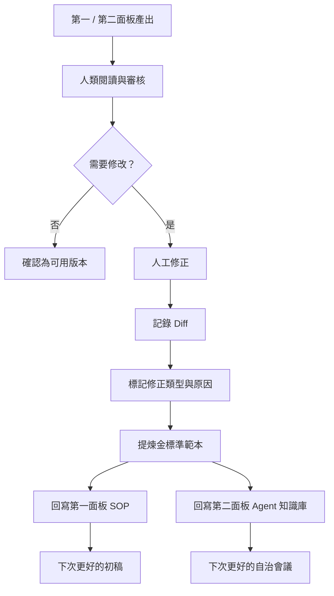

### 修正差分範例

```diff
- 結論：該方案可以直接落地。
+ 結論：該方案僅在資料來源可驗證、權限已獲授權、且人工審核通過後，才可進入試點。

修正類型：風險與授權邊界補充
修正原因：原結論忽略資料權限與人工審核條件
可回寫規則：涉及外部資料、財務、法律、醫療或真實用戶決策時，不得輸出「可直接落地」；必須列出授權、風險和人工確認條件。
```

第四面板讓平台真正形成閉環，而不是每次都像第一次使用 AI。

---

# 四、四面板的完整閉環

## 從注意力到金標準

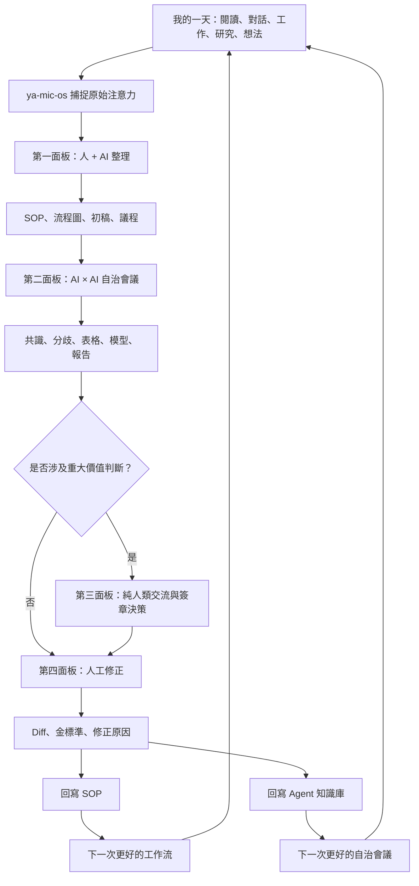

這個閉環的重點是：

> 任何一次我投入注意力得到的成果，都不應只是一段消失的聊天，而應該有機會變成下一次更快、更準、更可靠的系統能力。

## 狀態轉換

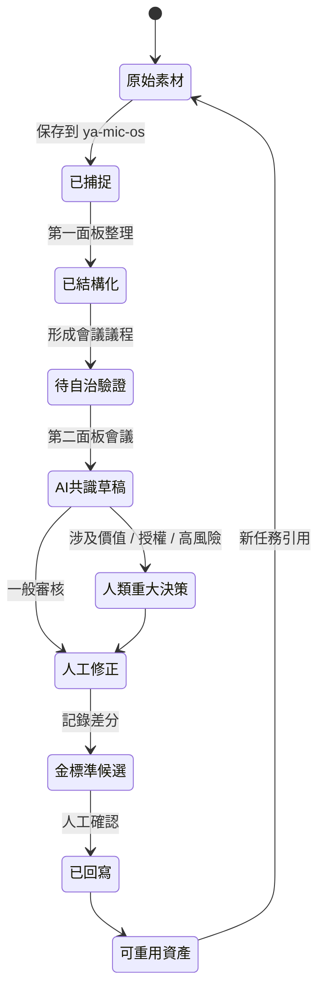

---

# 五、ya-mic-os 的角色

## ya-mic-os 不是另一個筆記軟體

ya-mic-os 對我來說不是單純的筆記工具，也不是只有資料庫、標籤和 Markdown 的知識庫。

它應該是我的注意力資產操作系統：

```text
我今天看了什麼。
我今天想到什麼。
我正在做什麼。
哪些內容只是臨時素材。
哪些已經變成結論。
哪些值得轉成 SOP。
哪些問題仍未解決。
哪些工作可以交給 AI。
哪些決策必須由我自己或純人類空間決定。
```

它的最小閉環是：

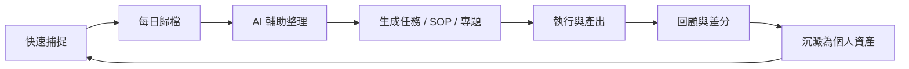

## 最小輸入原則

我每天容易不保存，不一定是因為我不重視記錄，而是因為保存步驟太重、分類成本太高、介面不夠清楚、每次都要先想「應該放哪裡」。

所以 ya-mic-os 的第一原則應是：

> **先收進來，之後再整理。**

可以有一個極簡收件匣：

```text
一條想法
一段文字
一個網址
一張圖片
一個文件
一段語音轉文字
一個待辦
一個問題
一段 AI 對話摘要
```

輸入時不強迫填十個欄位；系統可以先保留原始內容、時間、來源和最少標籤，稍後再由人或 AI 整理。

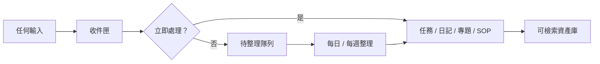

這能保護我的注意力：我不需要因為害怕分類麻煩，而選擇不保存。

---

# 六、產品資訊架構

## 兩個產品的首頁不要混亂

我需要清楚地區分入口。

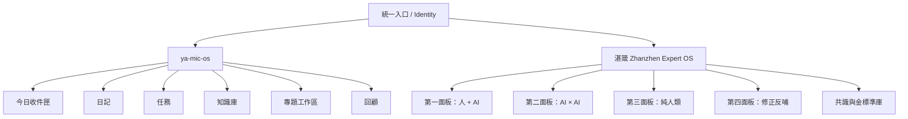

### ya-mic-os 首頁

適合是一個平靜、日常、低壓、快速保存的個人工作檯。首頁只需要回答：

```text
我現在要記什麼？
今天還有什麼？
最近沉澱了什麼？
哪幾件事值得我重新看？
```

### 湛箴首頁

適合是一個更嚴肅、結構化、可追溯的專家協作控制台。首頁應回答：

```text
有哪些 SOP 草稿等待討論？
有哪些自治會議正在進行？
有哪些共識仍有分歧？
哪些事項必須由人類拍板？
哪些人工修正尚未回寫為金標準？
```

---

# 七、介面與審美

## Proton 的參考不是複製

我喜歡 Proton 的 Excel + Docs 那種感覺：清爽、克制、可信、簡潔、留白足夠、功能不喧嘩，但在真正需要時又足夠強。

我想要的不是複製 Proton 的視覺，而是吸收它的設計精神：

```text
畫面要安靜。
資訊層級要清楚。
預設不要塞滿功能。
複雜能力應在需要時展開，而不是一開始壓迫使用者。
資料狀態要一眼看懂。
隱私、權限、來源與人機邊界要明確可見。
```

## 視覺原則

| 原則 | 含義 | UI 實作方向 |
|---|---|---|
| 清晰勝過炫技 | 使用者一眼知道目前在哪裡、下一步做什麼 | 固定導覽、明顯標題、少量主操作 |
| 安靜勝過擁擠 | 減少干擾，保護注意力 | 大留白、低飽和中性色、避免過度卡片化 |
| 狀態可見 | 草稿、待驗證、人工確認、已回寫不可混淆 | 色彩與標籤固定映射、全流程狀態條 |
| 邊界可見 | 人類、AI、Agent、簽章內容必須明確區分 | 明顯來源徽章、鎖定標識、不可偽裝 |
| 漸進式複雜度 | 新手先完成基本操作，專家再展開細節 | 預設簡潔，進階設定折疊 |
| 內容優先 | 文字、流程、證據、差分比裝飾重要 | 高可讀性排版、寬內容區、良好表格 |

## 四面板的色彩語言

色彩不是裝飾，而是認知提示。

```text
第一面板：柔和藍色，代表協作、探索、草稿。
第二面板：紫色或靛色，代表自治推演、Agent 與結構化會議。
第三面板：深石墨 / 黑色配金色簽章點，代表純人類、責任與高價值決策。
第四面板：綠色與琥珀色，代表修正、確認、金標準與回寫。
```

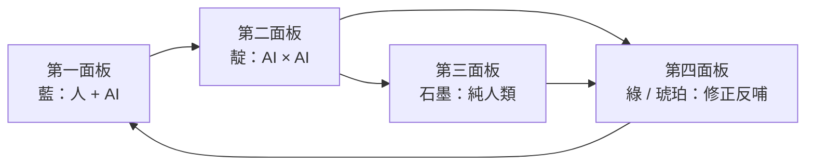

## 每個面板都要有清楚的頂部狀態列

建議固定顯示：

```text
面板名稱。
參與者類型：人類 / AI / Agent。
目前資料來源與權限。
輸出狀態：草稿、待驗證、已確認、已回寫。
是否允許 AI 生成內容。
是否需要私鑰簽章。
```

尤其第三面板應該強烈顯示：

> **Human-only：本區域不允許 AI 生成、補全、轉發或代寫。**

這不是一句小字提示，而是整個產品信任模型的一部分。

---

# 八、關鍵流程圖

## 1. 每日注意力保存流程

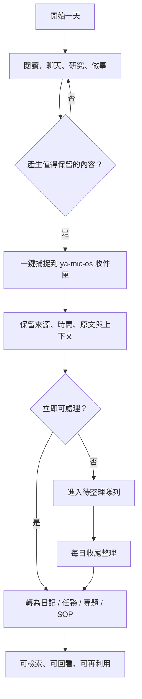

## 2. SOP 到自治會議流程

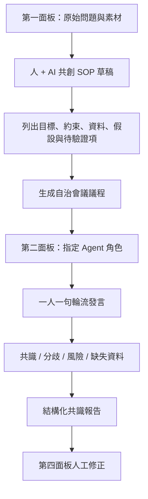

## 3. 人類重大判斷流程

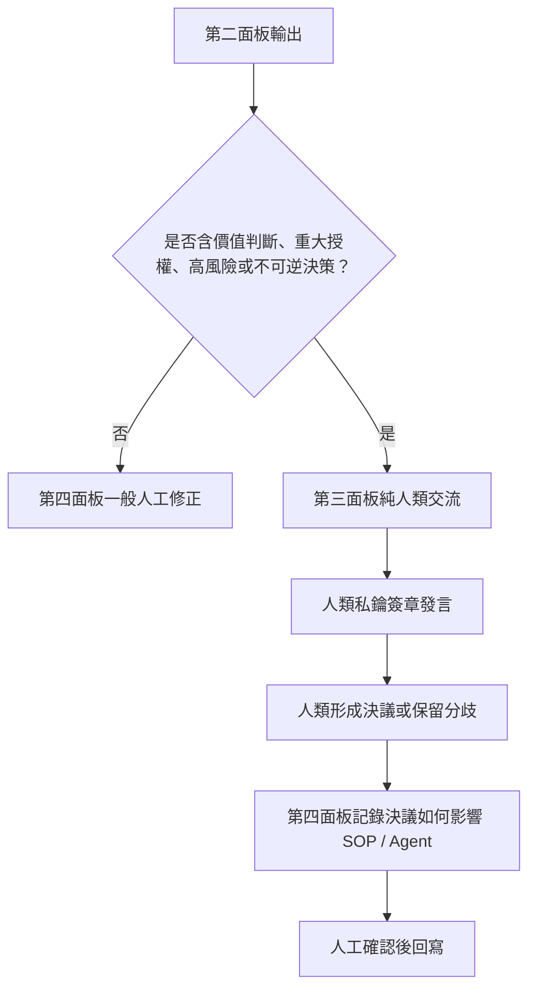

## 4. 差分回寫流程

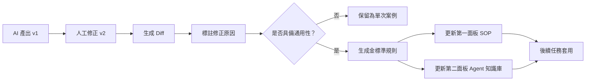

## 5. 人機邊界流程

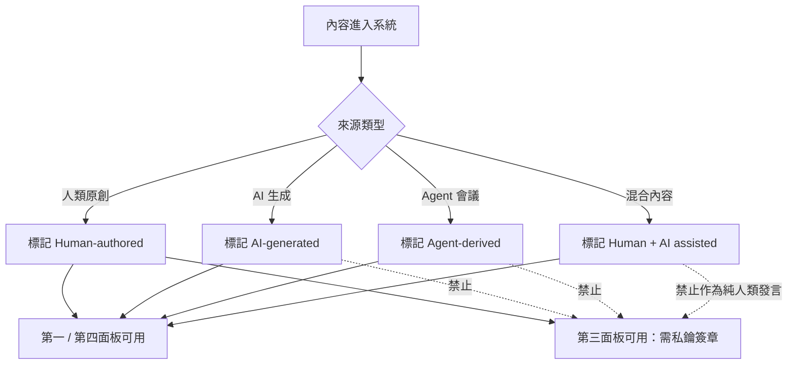

---

# 九、資料與信任模型

## 所有內容都應有來源標記

如果湛箴想建立可信協作，就不能只保存最終文字，還要保存來源與生成過程。

每一個重要物件應帶有：

```text
id
建立時間
修改時間
建立者
來源類型：人類 / AI / Agent / 匯入資料
原始來源連結或文件
權限範圍
版本號
父子關係
是否經人工確認
是否被回寫為金標準
```

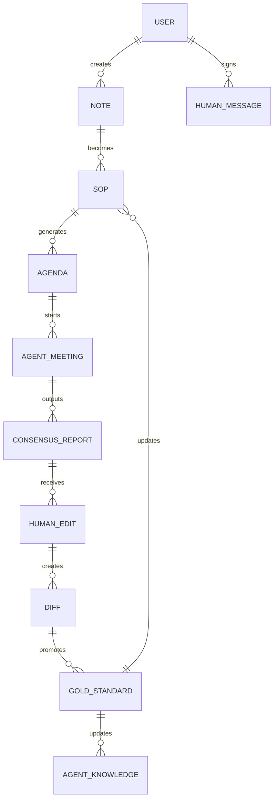

## 版本不是負擔

我不應只保存「最後一版」，因為最後一版會抹掉我為什麼改、改掉了什麼、以前錯在哪裡。

版本與差分是注意力資產的重要部分：它能保存思考演化，而不是只保存結論。

```mermaid
flowchart LR
    V1[草稿 v1] --> V2[AI 推演 v2]
    V2 --> V3[人工修正 v3]
    V3 --> V4[人類決議 v4]
    V4 --> V5[金標準模板 v5]
    V5 --> V6[下一次自動套用]
```

---

# 十、第一版 MVP

## 不要一開始做完宇宙

我想做的系統很大，但第一版不能同時完成：個人 OS、多 Agent 自治、私鑰簽章社交、RWA、知識圖譜、審計系統、完整協作平台和極致 UI。

MVP 必須優先保護「我每天的注意力不再丟失」。

### MVP-1：ya-mic-os Capture

目標：每天所有重要內容有地方進來。

```text
快速收件匣。
支援文字、網址、圖片、檔案、貼上 AI 對話。
自動記錄時間、來源和基本標籤。
每日筆記。
全文搜尋。
最簡單的任務與專題關聯。
```

### MVP-2：第一與第四面板

目標：讓捕捉內容能變成 SOP，並能從人工修正中累積。

```text
人 + AI 整理工作區。
SOP Markdown 模板。
Mermaid 流程圖產生與預覽。
人工修正介面。
Diff 記錄。
金標準規則庫。
```

### MVP-3：第二面板最小自治會議

目標：驗證「一人一句」Agent 會議是否真的有價值。

```text
只支援 3 到 5 個固定角色。
固定輪流順序。
每個角色每輪只允許一句。
輸出共識、分歧、假設、風險與待辦。
會議記錄可回到第四面板修改。
```

### MVP-4：第三面板最小可信原型

目標：先證明純人類區域的來源邊界。

```text
只支援人類帳號。
簽章訊息。
明確禁止 AI 補全。
完整訊息來源標記。
決議記錄與匯出。
```

```mermaid
flowchart TB
    A[MVP-1：捕捉] --> B[MVP-2：SOP + Diff]
    B --> C[MVP-3：最小自治會議]
    C --> D[MVP-4：純人類簽章空間]
    D --> E[再做統一搜索、權限、插件與高級協作]
```

---

# 十一、我必須保留的原始想法

以下內容不是要被濃縮掉，而是要作為我的原始主心骨被保存：

> 我每天都會弄很多東西、寫很多記錄，但是我並不會存下來。這對我的專注是一種損失。注意力是寶貴的資產，我必須保留好。

> 湛箴（Zhanzhen Expert OS）平台有四大核心面板：第一面板是人 + AI 商量，將領域知識和數據素材轉成可重用 SOP、作業流程圖與文字初稿；第一面板的 SOP 是第二面板會議議程來源。

> 第二面板是 AI × AI 自治會議，由用戶本地安裝的 Hermes 智能體代表用戶參會，人類不直接參與。會議執行一人一句鐵律、禁止套話與跨領域越界，會議後生成結構化共識報告和 AI 產出物，例如 Excel。

> 第三面板是純人類交流空間，嚴禁任何 AI 注入，包括發言、自動補全和機器人轉發；僅限人類進行跨領域碰撞、重大判斷與價值觀拍板，訊息需經私鑰簽章發出。

> 第四面板是人工修正與反哺，人類修正第二面板成果，系統自動記錄修正差分並建立金標準範本；差分自動回寫至第一面板 SOP 與第二面板智能體知識庫，形成越用越聰明的數據閉環。

> 我差不多是想做兩個產品，但是它們雜糅在一起了。需要分清 ya-mic-os 與湛箴的邊界，但也要讓它們形成資料與能力的閉環。

> Proton 的 Excel + Docs 足夠清爽和簡潔，這就是我期待的感覺：審美要足夠好，UI 要足夠清晰。

---

# 十二、最終結論

1. 我每天產生的記錄、想法、研究、對話和判斷，都是由注意力換來的資產；不保存就是讓資產流失。
2. ya-mic-os 的首要責任，是用極低摩擦把原始注意力保存下來，讓「先收進來、再整理」成為可能。
3. 湛箴的首要責任，是把高價值內容帶入有明確人機邊界的協作流程，形成 SOP、自治推演、人類決斷、人工修正與知識回寫。
4. 第一面板負責人 + AI 商量與 SOP 草稿；第二面板負責 AI × AI 自治會議；第三面板負責純人類重大判斷；第四面板負責人工修正、差分與金標準。
5. 第二面板的價值不在於讓 Agent 說更多話，而在於以一人一句、角色邊界、證據與分歧保留，形成可審核的自治推演。
6. 第三面板的價值不在效率，而在保護人類原創判斷、責任歸屬與價值拍板；AI 必須被嚴格隔離。
7. 第四面板是系統越用越聰明的核心，因為只有被人類確認的修正差分，才能成為 SOP 和 Agent 的金標準。
8. 兩個產品不必切斷，但必須分層：ya-mic-os 是個人注意力 OS，湛箴是可追溯的專家協作與反饋系統。
9. UI 不應追求花哨；應追求像 Proton 一樣清爽、安靜、可信、清晰，並把內容、來源、狀態與人機邊界放在第一位。
10. 我的下一步不是先做一個很大的平台，而是先讓每一天投入的注意力不再消失，然後逐步把它們變成可重用、可驗證、可反哺的資產。

> 注意力去過的地方，必須留下可被再次調用的痕跡。
>
> 我不只是要記錄生活和工作；我要讓每一次認真思考，都能成為未來的自己、未來的 SOP、未來的 Agent 和未來的產品可以再次使用的力量。

#業務 #zhanzhen #日記 #ya-mic-os #attention #knowledge-management #ai-agents
